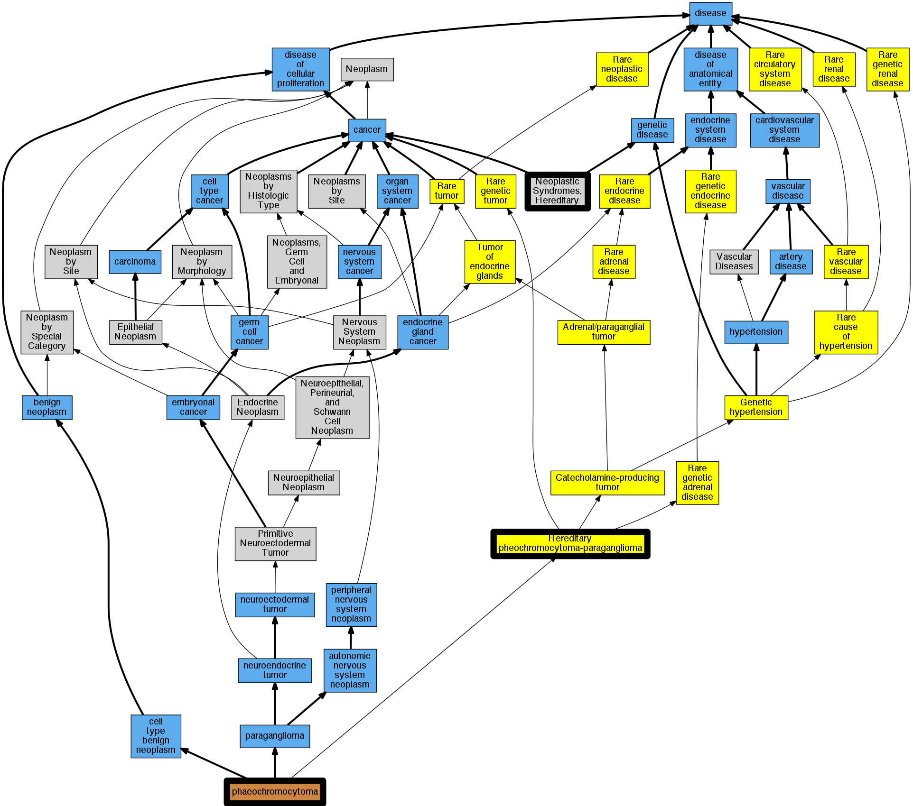

## GENE: TMEM127

[matched diseases visual](TMEM127.png)  <-- click on raw to zoom

### Neoplastic Syndromes, Hereditary
 * [MESH:D009386 Neoplastic Syndromes, Hereditary](http://beta.monarchinitiative.org/disease/MESH:D009386) Confidence: high

### Phaeochromocytoma
 * [DOID:0050771 phaeochromocytoma](http://beta.monarchinitiative.org/disease/DOID:0050771) Confidence: high

### Hereditary Paragangliomas and Pheochromocytomas
 * [Orphanet:29072 Hereditary pheochromocytoma-paraganglioma](http://beta.monarchinitiative.org/disease/Orphanet:29072) Confidence: low/0.1953125

### PHEOCHROMOCYTOMA, SUSCEPTIBILITY TO
 * [OMIM:171300 Pheochromocytoma](http://beta.monarchinitiative.org/disease/OMIM:171300) Confidence: high
    * Equiv:[MESH:D010673 Pheochromocytoma](http://beta.monarchinitiative.org/disease/MESH:D010673)
    * Syn: "PHEOCHROMOCYTOMA"
    * Syn: "Pheochromocytoma, Susceptibility to"
