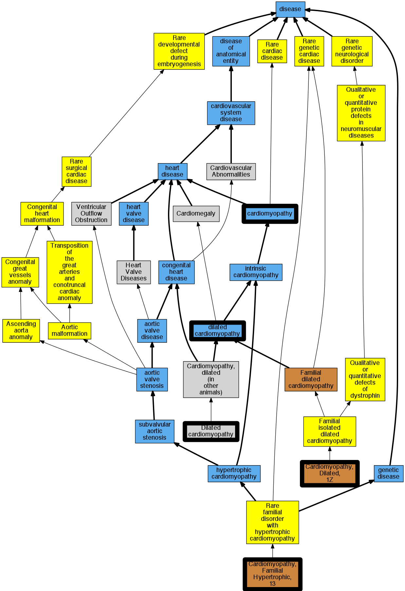

## GENE: TNNC1

[matched diseases visual](TNNC1.png)  <-- click on raw to zoom

### CARDIOMYOPATHY, DILATED, 1Z
 * [OMIM:611879 Cardiomyopathy, Dilated, 1z](http://beta.monarchinitiative.org/disease/OMIM:611879) Confidence: high
    * Equiv:[MESH:C567506 Cardiomyopathy, Dilated, 1z](http://beta.monarchinitiative.org/disease/MESH:C567506)
    * Syn: "CARDIOMYOPATHY, DILATED, 1Z; CMD1Z"
    * Syn: "CMD1Z"

### Cardiomyopathy
 * [DOID:0050700 cardiomyopathy](http://beta.monarchinitiative.org/disease/DOID:0050700) Confidence: high
    * Equiv:[MESH:D009202 Cardiomyopathies](http://beta.monarchinitiative.org/disease/MESH:D009202)
    * Syn: "Cardiomyopathies"

### Primary dilated cardiomyopathy
 * [DOID:12930 dilated cardiomyopathy](http://beta.monarchinitiative.org/disease/DOID:12930) Confidence: high
    * Syn: "Congestive cardiomyopathy"
    * Syn: "Familial dilated cardiomyopathy"
    * Syn: "Idiopathic dilation cardiomyopathy"
    * Syn: "primary dilated cardiomyopathy"

### Cardiomyopathy
 * [DOID:0050700 cardiomyopathy](http://beta.monarchinitiative.org/disease/DOID:0050700) Confidence: high
    * Equiv:[MESH:D009202 Cardiomyopathies](http://beta.monarchinitiative.org/disease/MESH:D009202)
    * Syn: "Cardiomyopathies"

### Primary dilated cardiomyopathy
 * [DOID:12930 dilated cardiomyopathy](http://beta.monarchinitiative.org/disease/DOID:12930) Confidence: high
    * Syn: "Congestive cardiomyopathy"
    * Syn: "Familial dilated cardiomyopathy"
    * Syn: "Idiopathic dilation cardiomyopathy"
    * Syn: "primary dilated cardiomyopathy"

### CARDIOMYOPATHY, FAMILIAL HYPERTROPHIC, 13
 * [OMIM:613243 Cardiomyopathy, Familial Hypertrophic, 13](http://beta.monarchinitiative.org/disease/OMIM:613243) Confidence: high
    * Equiv:[MESH:C567686 Cardiomyopathy, Familial Hypertrophic, 13](http://beta.monarchinitiative.org/disease/MESH:C567686)
    * Syn: "CARDIOMYOPATHY, FAMILIAL HYPERTROPHIC, 13; CMH13"
    * Syn: "CMH13"

### Cardiomyopathy, dilated ?
 * [MESH:D002311 Cardiomyopathy, Dilated](http://beta.monarchinitiative.org/disease/MESH:D002311) Confidence: low/0.18055555555555555

### Primary dilated cardiomyopathy
 * [DOID:12930 dilated cardiomyopathy](http://beta.monarchinitiative.org/disease/DOID:12930) Confidence: high
    * Syn: "Congestive cardiomyopathy"
    * Syn: "Familial dilated cardiomyopathy"
    * Syn: "Idiopathic dilation cardiomyopathy"
    * Syn: "primary dilated cardiomyopathy"

### Primary dilated cardiomyopathy
 * [DOID:12930 dilated cardiomyopathy](http://beta.monarchinitiative.org/disease/DOID:12930) Confidence: high
    * Syn: "Congestive cardiomyopathy"
    * Syn: "Familial dilated cardiomyopathy"
    * Syn: "Idiopathic dilation cardiomyopathy"
    * Syn: "primary dilated cardiomyopathy"
