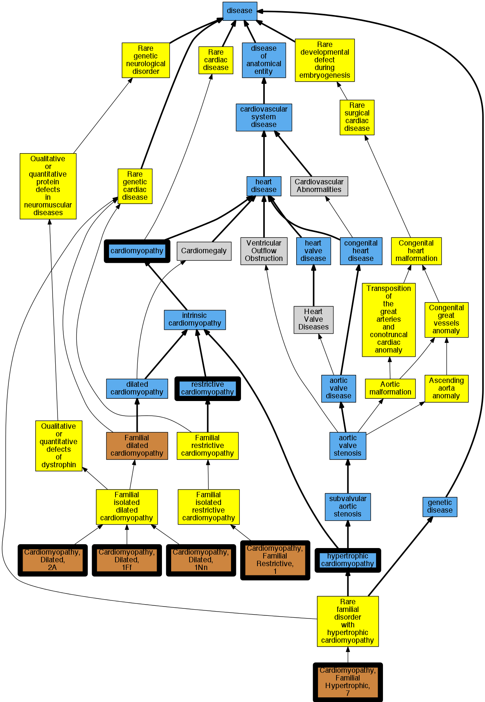

## GENE: TNNI3

[matched diseases visual](TNNI3.png)  <-- click on raw to zoom

### CARDIOMYOPATHY, DILATED, 1FF
 * [OMIM:613286 Cardiomyopathy, Dilated, 1FF](http://beta.monarchinitiative.org/disease/OMIM:613286) Confidence: high
    * Equiv:[MESH:C567654 Cardiomyopathy, Dilated, 1FF](http://beta.monarchinitiative.org/disease/MESH:C567654)
    * Syn: "CARDIOMYOPATHY, DILATED, 1FF; CMD1FF"
    * Syn: "CMD1FF"

### CARDIOMYOPATHY, DILATED, 2A (1 family)
 * [OMIM:611880 Cardiomyopathy, Dilated, 2a](http://beta.monarchinitiative.org/disease/OMIM:611880) Confidence: low/0.15625
    * Equiv:[MESH:C567505 Cardiomyopathy, Dilated, 2a](http://beta.monarchinitiative.org/disease/MESH:C567505)
    * Syn: "Cardiomyopathy, Congestive, Autosomal Recessive"
    * Syn: "CARDIOMYOPATHY, DILATED, 2A; CMD2A"
    * Syn: "Cardiomyopathy, Dilated, Autosomal Recessive"
    * Syn: "CMD2A"

### CARDIOMYOPATHY, FAMILIAL HYPERTROPHIC, 7
 * [OMIM:613690 Cardiomyopathy, Familial Hypertrophic, 7](http://beta.monarchinitiative.org/disease/OMIM:613690) Confidence: high
    * Syn: "CARDIOMYOPATHY, FAMILIAL HYPERTROPHIC, 7; CMH7"
    * Syn: "CMH7"

### CARDIOMYOPATHY, FAMILIAL RESTRICTIVE, 1
 * [OMIM:115210 Cardiomyopathy, Familial Restrictive, 1](http://beta.monarchinitiative.org/disease/OMIM:115210) Confidence: high
    * Equiv:[MESH:C566168 Cardiomyopathy, Familial Restrictive, 1](http://beta.monarchinitiative.org/disease/MESH:C566168)
    * Syn: "CARDIOMYOPATHY, FAMILIAL RESTRICTIVE, 1; RCM1"
    * Syn: "Rcm"
    * Syn: "RCM1"

### Cardiomyopathy
 * [DOID:0050700 cardiomyopathy](http://beta.monarchinitiative.org/disease/DOID:0050700) Confidence: high
    * Equiv:[MESH:D009202 Cardiomyopathies](http://beta.monarchinitiative.org/disease/MESH:D009202)
    * Syn: "Cardiomyopathies"

### Cardiomyopathy, dilated, 1N
 * [OMIM:607487 Cardiomyopathy, Dilated, 1N](http://beta.monarchinitiative.org/disease/OMIM:607487) Confidence: high
    * Equiv:[MESH:C564388 Cardiomyopathy, Dilated, 1N](http://beta.monarchinitiative.org/disease/MESH:C564388)
    * Syn: "CARDIOMYOPATHY, FAMILIAL HYPERTROPHIC, 25; CMH25"
    * Syn: "CMH25"

### Cardiomyopathy, familial hypertrophic, 7
 * [OMIM:613690 Cardiomyopathy, Familial Hypertrophic, 7](http://beta.monarchinitiative.org/disease/OMIM:613690) Confidence: high
    * Syn: "CARDIOMYOPATHY, FAMILIAL HYPERTROPHIC, 7; CMH7"
    * Syn: "CMH7"

### Cardiomyopathy, hypertrophic
 * [DOID:11984 hypertrophic cardiomyopathy](http://beta.monarchinitiative.org/disease/DOID:11984) Confidence: high
    * Equiv:[MESH:D002312 Cardiomyopathy, Hypertrophic](http://beta.monarchinitiative.org/disease/MESH:D002312)
    * Equiv:[MESH:D024741 Cardiomyopathy, Hypertrophic, Familial](http://beta.monarchinitiative.org/disease/MESH:D024741)
    * Syn: "familial hypertrophic cardiomyopathy"
    * Syn: "hypertrophic obstructive cardiomyopathy"

### Cardiomyopathy, restrictive
 * [DOID:397 restrictive cardiomyopathy](http://beta.monarchinitiative.org/disease/DOID:397) Confidence: high
    * Equiv:[MESH:D002313 Cardiomyopathy, Restrictive](http://beta.monarchinitiative.org/disease/MESH:D002313)
    * Syn: "Cardiomyopathy, constrictive"
    * Syn: "Familial restrictive cardiomyopathy"
    * Syn: "primary restrictive cardiomyopathy (disorder)"
    * Syn: "Restrictive cardiomyopathy"
    * Syn: "Restrictive cardiomyopathy (disorder)"

### Familial hypertrophic cardiomyopathy 7
 * [OMIM:613690 Cardiomyopathy, Familial Hypertrophic, 7](http://beta.monarchinitiative.org/disease/OMIM:613690) Confidence: high
    * Syn: "CARDIOMYOPATHY, FAMILIAL HYPERTROPHIC, 7; CMH7"
    * Syn: "CMH7"

### Familial restrictive cardiomyopathy 1
 * [OMIM:115210 Cardiomyopathy, Familial Restrictive, 1](http://beta.monarchinitiative.org/disease/OMIM:115210) Confidence: high
    * Equiv:[MESH:C566168 Cardiomyopathy, Familial Restrictive, 1](http://beta.monarchinitiative.org/disease/MESH:C566168)
    * Syn: "CARDIOMYOPATHY, FAMILIAL RESTRICTIVE, 1; RCM1"
    * Syn: "Rcm"
    * Syn: "RCM1"

### Hypertrophic Cardiomyopathy
 * [DOID:11984 hypertrophic cardiomyopathy](http://beta.monarchinitiative.org/disease/DOID:11984) Confidence: high
    * Equiv:[MESH:D002312 Cardiomyopathy, Hypertrophic](http://beta.monarchinitiative.org/disease/MESH:D002312)
    * Equiv:[MESH:D024741 Cardiomyopathy, Hypertrophic, Familial](http://beta.monarchinitiative.org/disease/MESH:D024741)
    * Syn: "familial hypertrophic cardiomyopathy"
    * Syn: "hypertrophic obstructive cardiomyopathy"

### Hypertrophic cardiomyopathy
 * [DOID:11984 hypertrophic cardiomyopathy](http://beta.monarchinitiative.org/disease/DOID:11984) Confidence: high
    * Equiv:[MESH:D002312 Cardiomyopathy, Hypertrophic](http://beta.monarchinitiative.org/disease/MESH:D002312)
    * Equiv:[MESH:D024741 Cardiomyopathy, Hypertrophic, Familial](http://beta.monarchinitiative.org/disease/MESH:D024741)
    * Syn: "familial hypertrophic cardiomyopathy"
    * Syn: "hypertrophic obstructive cardiomyopathy"

### Primary familial hypertrophic cardiomyopathy
 * [DOID:11984 hypertrophic cardiomyopathy](http://beta.monarchinitiative.org/disease/DOID:11984) Confidence: low/0.1953125
    * Equiv:[MESH:D002312 Cardiomyopathy, Hypertrophic](http://beta.monarchinitiative.org/disease/MESH:D002312)
    * Equiv:[MESH:D024741 Cardiomyopathy, Hypertrophic, Familial](http://beta.monarchinitiative.org/disease/MESH:D024741)
    * Syn: "familial hypertrophic cardiomyopathy"
    * Syn: "hypertrophic obstructive cardiomyopathy"
