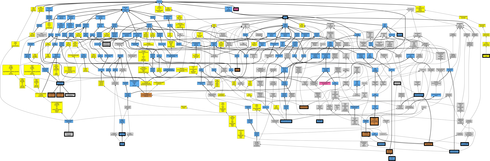

## GENE: TP53

[matched diseases visual](TP53.png)  <-- click on raw to zoom

### ADRENOCORTICAL CARCINOMA, PEDIATRIC
 * [OMIM:202300 Adrenocortical Carcinoma, Hereditary](http://beta.monarchinitiative.org/disease/OMIM:202300) Confidence: high
    * Equiv:[MESH:C565972 Adrenocortical Carcinoma, Hereditary](http://beta.monarchinitiative.org/disease/MESH:C565972)
    * Equiv:[MESH:C565973 Adrenocortical Carcinoma, Pediatric](http://beta.monarchinitiative.org/disease/MESH:C565973)
    * Syn: "ADCC"
    * Syn: "ADRENOCORTICAL CARCINOMA, HEREDITARY; ADCC"
    * Syn: "Adrenocortical Carcinoma, Pediatric"

### Adenocarcinoma
 * [DOID:299 adenocarcinoma](http://beta.monarchinitiative.org/disease/DOID:299) Confidence: high
    * Syn: "adenocarcinoma NOS (morphologic abnormality)"
    * Syn: "adenocarcinoma, no subtype (morphologic abnormality)"
    * Syn: "adenocarcinomas"

### Astrocytoma
 * [DOID:3069 astrocytoma](http://beta.monarchinitiative.org/disease/DOID:3069) Confidence: high
    * Syn: "Astrocytic tumor"
    * Syn: "astrocytoma of brain (disorder)"
    * Syn: "astrocytoma of Cerebrum"
    * Syn: "astrocytoma, no ICD-O subtype (morphologic abnormality)"
    * Syn: "astroglioma"
    * Syn: "cerebral astrocytoma"

### BASAL CELL CARCINOMA, SUSCEPTIBILITY TO, 7
 * [OMIM:614740 Basal Cell Carcinoma, Susceptibility To, 7](http://beta.monarchinitiative.org/disease/OMIM:614740) Confidence: high
    * Syn: "BASAL CELL CARCINOMA, SUSCEPTIBILITY TO, 7; BCC7"
    * Syn: "BCC7"

### BREAST CANCER, SOMATIC
 * [OMIM:114480 Breast Cancer, Familial](http://beta.monarchinitiative.org/disease/OMIM:114480) Confidence: low/0.18055555555555555
    * Equiv:[MESH:C562840 Breast Cancer, Familial](http://beta.monarchinitiative.org/disease/MESH:C562840)
    * Syn: "BREAST CANCER"
    * Syn: "Breast Cancer, Familial"
    * Syn: "Breast Cancer, Familial Male"

### CERVICAL CANCER, SOMATIC
 * [DOID:162 cancer](http://beta.monarchinitiative.org/disease/DOID:162) Confidence: low/0.1388888888888889
    * Syn: "malignant neoplasm"
    * Syn: "malignant tumor "
    * Syn: "primary cancer"

### CHOROID PLEXUS CARCINOMA
 * [DOID:5648 choroid plexus carcinoma](http://beta.monarchinitiative.org/disease/DOID:5648) Confidence: high
    * Equiv:[MESH:D016545 Choroid Plexus Neoplasms](http://beta.monarchinitiative.org/disease/MESH:D016545)
    * Syn: "cancer of Choroid Plexus"
    * Syn: "Choroid plexus carcinoma (morphologic abnormality)"
    * Syn: "malignant neoplasm of choroid plexus"
    * Syn: "malignant neoplasm of the Choroid Plexus"
    * Syn: "malignant tumor of choroid plexus"
    * Syn: "malignant tumor of choroid plexus (disorder)"

### CHOROID PLEXUS PAPILLOMA
 * [DOID:2626 choroid plexus papilloma](http://beta.monarchinitiative.org/disease/DOID:2626) Confidence: high
    * Syn: "childhood choroid plexus papilloma"
    * Syn: "childhood papilloma of choroid plexus"
    * Syn: "Choroid plexus papilloma NOS (morphologic abnormality)"
    * Syn: "Choroid plexus papilloma, no ICD-O subtype (morphologic abnormality)"
    * Syn: "papilloma of the Choroid Plexus"
    * Syn: "pediatric papilloma of Choroid Plexus"

### CODON 72 POLYMORPHISM, (rs1042522)
 * [OMIM:615557 melioidosis](http://beta.monarchinitiative.org/disease/OMIM:615557) Confidence: low/0.0763888888888889
    * Equiv:[DOID:5052 melioidosis](http://beta.monarchinitiative.org/disease/DOID:5052)
    * Equiv:[MESH:D008554 Melioidosis](http://beta.monarchinitiative.org/disease/MESH:D008554)
    * Syn: "acute and fulminating melioidosis"
    * Syn: "Melioidosis, Resistance to"
    * Syn: "MELIOIDOSIS, SUSCEPTIBILITY TO"
    * Syn: "Melioidosis, unspecified (disorder)"
    * Syn: "Nightcliff gardener's disease"
    * Syn: "Pseudoglanders"
    * Syn: "Pseudoglanders (disorder)"
    * Syn: "subacute and chronic melioidosis"
    * Syn: "Whitmore's disease"

### COLON CANCER
 * [DOID:219 colon cancer](http://beta.monarchinitiative.org/disease/DOID:219) Confidence: high

### COLORECTAL CANCER
 * [DOID:9256 colorectal cancer](http://beta.monarchinitiative.org/disease/DOID:9256) Confidence: high

### GLIOMA SUSCEPTIBILITY 1
 * [OMIM:137800 Glioma Susceptibility 1](http://beta.monarchinitiative.org/disease/OMIM:137800) Confidence: high
    * Syn: "Astrocytoma"
    * Syn: "Ependymoma"
    * Syn: "Glioblastoma Multiforme"
    * Syn: "Glioma of Brain, Familial"
    * Syn: "GLIOMA SUSCEPTIBILITY 1; GLM1"
    * Syn: "GLM1"
    * Syn: "Oligodendroglioma"
    * Syn: "Subependymoma"

### Gastric cancer
 * [DC:0000523 Gastric Cancer](http://beta.monarchinitiative.org/disease/DC:0000523) Confidence: high

### HEPATOBLASTOMA
 * [DOID:687 hepatoblastoma](http://beta.monarchinitiative.org/disease/DOID:687) Confidence: high
    * Syn: "HBL"

### HEPATOCELLULAR CARCINOMA, SOMATIC
 * [OMIM:114550 Hepatoblastoma Caused By Somatic Mutation](http://beta.monarchinitiative.org/disease/OMIM:114550) Confidence: low/0.18055555555555555
    * Equiv:[MESH:C567299 Hepatoblastoma Caused By Somatic Mutation](http://beta.monarchinitiative.org/disease/MESH:C567299)
    * Syn: "Cancer, Hepatocellular"
    * Syn: "Hcc"
    * Syn: "Hepatoblastoma"
    * Syn: "Hepatoblastoma Caused by Somatic Mutation"
    * Syn: "HEPATOCELLULAR CARCINOMA"
    * Syn: "Hepatoma"
    * Syn: "Liver Cancer"
    * Syn: "Liver Cell Carcinoma"

### LI-FRAUMENI SYNDROME 1
 * [OMIM:151623 Li-Fraumeni-Like Syndrome](http://beta.monarchinitiative.org/disease/OMIM:151623) Confidence: low/0.18000000000000002
    * Equiv:[MESH:C538639 Sarcoma family syndrome of Li and Fraumeni](http://beta.monarchinitiative.org/disease/MESH:C538639)
    * Equiv:[MESH:C567189 Li-Fraumeni-Like Syndrome](http://beta.monarchinitiative.org/disease/MESH:C567189)
    * Syn: "LFS1"
    * Syn: "LI-FRAUMENI SYNDROME 1; LFS1"
    * Syn: "Li-Fraumeni-Like Syndrome"
    * Syn: "Sarcoma Family Syndrome of 51 and Fraumeni"
    * Syn: "Sbla Syndrome"

### LI-FRAUMENI-LIKE SYNDROME
 * [OMIM:151623 Li-Fraumeni-Like Syndrome](http://beta.monarchinitiative.org/disease/OMIM:151623) Confidence: high
    * Equiv:[MESH:C538639 Sarcoma family syndrome of Li and Fraumeni](http://beta.monarchinitiative.org/disease/MESH:C538639)
    * Equiv:[MESH:C567189 Li-Fraumeni-Like Syndrome](http://beta.monarchinitiative.org/disease/MESH:C567189)
    * Syn: "LFS1"
    * Syn: "LI-FRAUMENI SYNDROME 1; LFS1"
    * Syn: "Li-Fraumeni-Like Syndrome"
    * Syn: "Sarcoma Family Syndrome of 51 and Fraumeni"
    * Syn: "Sbla Syndrome"

### Li Fraumeni syndrome
 * [DOID:3012 Li-Fraumeni syndrome](http://beta.monarchinitiative.org/disease/DOID:3012) Confidence: high
    * Equiv:[MESH:D016864 Li-Fraumeni Syndrome](http://beta.monarchinitiative.org/disease/MESH:D016864)
    * Syn: "Li-Fraumeni Familiar cancer Susceptibility syndrome"
    * Syn: "sarcoma, breast, leukaemia and adrenal gland syndrome"
    * Syn: "SBLA syndrome"

### Li-Fraumeni syndrome
 * [DOID:3012 Li-Fraumeni syndrome](http://beta.monarchinitiative.org/disease/DOID:3012) Confidence: high
    * Equiv:[MESH:D016864 Li-Fraumeni Syndrome](http://beta.monarchinitiative.org/disease/MESH:D016864)
    * Syn: "Li-Fraumeni Familiar cancer Susceptibility syndrome"
    * Syn: "sarcoma, breast, leukaemia and adrenal gland syndrome"
    * Syn: "SBLA syndrome"

### Li-Fraumeni syndrome 1
 * [DOID:3012 Li-Fraumeni syndrome](http://beta.monarchinitiative.org/disease/DOID:3012) Confidence: low/0.1953125
    * Equiv:[MESH:D016864 Li-Fraumeni Syndrome](http://beta.monarchinitiative.org/disease/MESH:D016864)
    * Syn: "Li-Fraumeni Familiar cancer Susceptibility syndrome"
    * Syn: "sarcoma, breast, leukaemia and adrenal gland syndrome"
    * Syn: "SBLA syndrome"

### NASOPHARYNGEAL CARCINOMA, SOMATIC
 * [OMIM:607107 Nasopharyngeal carcinoma](http://beta.monarchinitiative.org/disease/OMIM:607107) Confidence: low/0.18055555555555555
    * Equiv:[MESH:C538339 Nasopharyngeal carcinoma](http://beta.monarchinitiative.org/disease/MESH:C538339)
    * Syn: "Nasopharyngeal Cancer"
    * Syn: "NASOPHARYNGEAL CARCINOMA"
    * Syn: "Nasopharyngeal Carcinoma, Susceptibility To, 1"
    * Syn: "Npc"
    * Syn: "Npca"

### NON-HODGKIN LYMPHOMA
 * [DOID:0060060 non-Hodgkin lymphoma](http://beta.monarchinitiative.org/disease/DOID:0060060) Confidence: high

### Neoplastic Syndromes, Hereditary
 * [MESH:D009386 Neoplastic Syndromes, Hereditary](http://beta.monarchinitiative.org/disease/MESH:D009386) Confidence: high

### OSTEOSARCOMA
 * [DOID:3347 osteosarcoma](http://beta.monarchinitiative.org/disease/DOID:3347) Confidence: high
    * Equiv:[MESH:D018213 Neoplasms, Bone Tissue](http://beta.monarchinitiative.org/disease/MESH:D018213)
    * Syn: "bone tissue neoplasm"
    * Syn: "Osteogenic sarcoma"
    * Syn: "osteoid sarcoma"
    * Syn: "Skeletal sarcoma"

### Osteosarcoma
 * [DOID:3347 osteosarcoma](http://beta.monarchinitiative.org/disease/DOID:3347) Confidence: high
    * Equiv:[MESH:D018213 Neoplasms, Bone Tissue](http://beta.monarchinitiative.org/disease/MESH:D018213)
    * Syn: "bone tissue neoplasm"
    * Syn: "Osteogenic sarcoma"
    * Syn: "osteoid sarcoma"
    * Syn: "Skeletal sarcoma"

### PANCREATIC CANCER, SOMATIC
 * [OMIM:260350 Pancreatic Carcinoma](http://beta.monarchinitiative.org/disease/OMIM:260350) Confidence: low/0.18055555555555555
    * Equiv:[MESH:C535837 Pancreatic carcinoma, familial](http://beta.monarchinitiative.org/disease/MESH:C535837)
    * Equiv:[MESH:C562463 Pancreatic Carcinoma](http://beta.monarchinitiative.org/disease/MESH:C562463)
    * Syn: "Pancreatic Acinar Carcinoma"
    * Syn: "PANCREATIC CANCER"
    * Syn: "Pancreatic Carcinoma"

### Rhabdomyosarcoma
 * [DOID:3247 rhabdomyosarcoma](http://beta.monarchinitiative.org/disease/DOID:3247) Confidence: high
    * Equiv:[MESH:D012208 Rhabdomyosarcoma](http://beta.monarchinitiative.org/disease/MESH:D012208)

### Sarcoma
 * [DOID:1115 sarcoma](http://beta.monarchinitiative.org/disease/DOID:1115) Confidence: high
    * Equiv:[MESH:D018204 Neoplasms, Connective and Soft Tissue](http://beta.monarchinitiative.org/disease/MESH:D018204)
    * Syn: "connective and soft tissue neoplasm"
    * Syn: "tumor of soft tissue and skeleton"

### THYROID CARCINOMA, ANAPLASTIC, SOMATIC
 * [DOID:3963 thyroid carcinoma](http://beta.monarchinitiative.org/disease/DOID:3963) Confidence: low/0.15625
    * Syn: "head and neck cancer, Thyroid"
