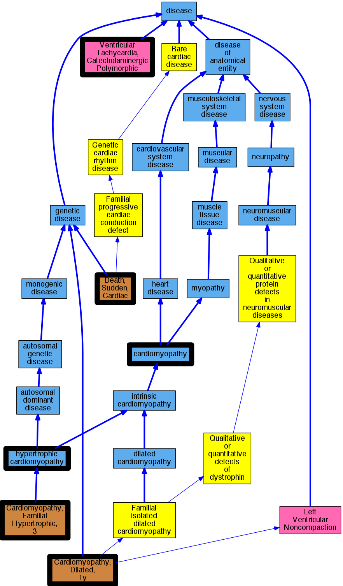

## GENE: TPM1

[matched diseases visual](TPM1.png)  <-- click on raw to zoom

### Hypertrophic Cardiomyopathy
 * [DOID:11984 hypertrophic cardiomyopathy](http://beta.monarchinitiative.org/disease/DOID:11984) Confidence: high
    * Equiv:[MESH:D002312 Cardiomyopathy, Hypertrophic](http://beta.monarchinitiative.org/disease/MESH:D002312)
    * Equiv:[MESH:D024741 Cardiomyopathy, Hypertrophic, Familial](http://beta.monarchinitiative.org/disease/MESH:D024741)
    * Syn: "familial hypertrophic cardiomyopathy"
    * Syn: "hypertrophic obstructive cardiomyopathy"

### Hypertrophic Cardiomyopathy with Sudden Cardiac Death
 * [OMIM:115080 Death, Sudden, Cardiac](http://beta.monarchinitiative.org/disease/OMIM:115080) Confidence: low/0.15625
    * Equiv:[MESH:C562490 Cardiac Conduction Defect](http://beta.monarchinitiative.org/disease/MESH:C562490)
    * Equiv:[MESH:C566172 Familial Sudden Death](http://beta.monarchinitiative.org/disease/MESH:C566172)
    * Equiv:[MESH:D003645 Death, Sudden](http://beta.monarchinitiative.org/disease/MESH:D003645)
    * Equiv:[MESH:D016757 Death, Sudden, Cardiac](http://beta.monarchinitiative.org/disease/MESH:D016757)
    * Syn: "CARDIAC CONDUCTION DEFECT"
    * Syn: "Familial Sudden Death"
    * Syn: "Sudden Cardiac Death"

### Primary familial hypertrophic cardiomyopathy
 * [DOID:11984 hypertrophic cardiomyopathy](http://beta.monarchinitiative.org/disease/DOID:11984) Confidence: low/0.1953125
    * Equiv:[MESH:D002312 Cardiomyopathy, Hypertrophic](http://beta.monarchinitiative.org/disease/MESH:D002312)
    * Equiv:[MESH:D024741 Cardiomyopathy, Hypertrophic, Familial](http://beta.monarchinitiative.org/disease/MESH:D024741)
    * Syn: "familial hypertrophic cardiomyopathy"
    * Syn: "hypertrophic obstructive cardiomyopathy"

### CARDIOMYOPATHY, FAMILIAL HYPERTROPHIC, 3
 * [OMIM:115196 Cardiomyopathy, Familial Hypertrophic, 3](http://beta.monarchinitiative.org/disease/OMIM:115196) Confidence: high
    * Equiv:[MESH:C566170 Cardiomyopathy, Familial Hypertrophic, 3](http://beta.monarchinitiative.org/disease/MESH:C566170)
    * Syn: "CARDIOMYOPATHY, FAMILIAL HYPERTROPHIC, 3; CMH3"
    * Syn: "CMH3"

### Hypertrophic cardiomyopathy
 * [DOID:11984 hypertrophic cardiomyopathy](http://beta.monarchinitiative.org/disease/DOID:11984) Confidence: high
    * Equiv:[MESH:D002312 Cardiomyopathy, Hypertrophic](http://beta.monarchinitiative.org/disease/MESH:D002312)
    * Equiv:[MESH:D024741 Cardiomyopathy, Hypertrophic, Familial](http://beta.monarchinitiative.org/disease/MESH:D024741)
    * Syn: "familial hypertrophic cardiomyopathy"
    * Syn: "hypertrophic obstructive cardiomyopathy"

### Primary familial hypertrophic cardiomyopathy
 * [DOID:11984 hypertrophic cardiomyopathy](http://beta.monarchinitiative.org/disease/DOID:11984) Confidence: low/0.1953125
    * Equiv:[MESH:D002312 Cardiomyopathy, Hypertrophic](http://beta.monarchinitiative.org/disease/MESH:D002312)
    * Equiv:[MESH:D024741 Cardiomyopathy, Hypertrophic, Familial](http://beta.monarchinitiative.org/disease/MESH:D024741)
    * Syn: "familial hypertrophic cardiomyopathy"
    * Syn: "hypertrophic obstructive cardiomyopathy"

### Primary familial hypertrophic cardiomyopathy
 * [DOID:11984 hypertrophic cardiomyopathy](http://beta.monarchinitiative.org/disease/DOID:11984) Confidence: low/0.1953125
    * Equiv:[MESH:D002312 Cardiomyopathy, Hypertrophic](http://beta.monarchinitiative.org/disease/MESH:D002312)
    * Equiv:[MESH:D024741 Cardiomyopathy, Hypertrophic, Familial](http://beta.monarchinitiative.org/disease/MESH:D024741)
    * Syn: "familial hypertrophic cardiomyopathy"
    * Syn: "hypertrophic obstructive cardiomyopathy"

### Cardiomyopathy
 * [DOID:0050700 cardiomyopathy](http://beta.monarchinitiative.org/disease/DOID:0050700) Confidence: high
    * Equiv:[MESH:D009202 Cardiomyopathies](http://beta.monarchinitiative.org/disease/MESH:D009202)
    * Syn: "Cardiomyopathies"

### Cardiomyopathy, hypertrophic
 * [DOID:11984 hypertrophic cardiomyopathy](http://beta.monarchinitiative.org/disease/DOID:11984) Confidence: high
    * Equiv:[MESH:D002312 Cardiomyopathy, Hypertrophic](http://beta.monarchinitiative.org/disease/MESH:D002312)
    * Equiv:[MESH:D024741 Cardiomyopathy, Hypertrophic, Familial](http://beta.monarchinitiative.org/disease/MESH:D024741)
    * Syn: "familial hypertrophic cardiomyopathy"
    * Syn: "hypertrophic obstructive cardiomyopathy"

### Hypertrophic cardiomyopathy
 * [DOID:11984 hypertrophic cardiomyopathy](http://beta.monarchinitiative.org/disease/DOID:11984) Confidence: high
    * Equiv:[MESH:D002312 Cardiomyopathy, Hypertrophic](http://beta.monarchinitiative.org/disease/MESH:D002312)
    * Equiv:[MESH:D024741 Cardiomyopathy, Hypertrophic, Familial](http://beta.monarchinitiative.org/disease/MESH:D024741)
    * Syn: "familial hypertrophic cardiomyopathy"
    * Syn: "hypertrophic obstructive cardiomyopathy"

### CARDIOMYOPATHY, DILATED, 1Y
 * [OMIM:611878 Cardiomyopathy, Dilated, 1y](http://beta.monarchinitiative.org/disease/OMIM:611878) Confidence: high
    * Equiv:[MESH:C567507 Cardiomyopathy, Dilated, 1y](http://beta.monarchinitiative.org/disease/MESH:C567507)
    * Syn: "CARDIOMYOPATHY, DILATED, 1Y; CMD1Y"
    * Syn: "CMD1Y"
    * Syn: "Left Ventricular Noncompaction 9"

### Cardiomyopathy
 * [DOID:0050700 cardiomyopathy](http://beta.monarchinitiative.org/disease/DOID:0050700) Confidence: high
    * Equiv:[MESH:D009202 Cardiomyopathies](http://beta.monarchinitiative.org/disease/MESH:D009202)
    * Syn: "Cardiomyopathies"

### Cardiomyopathy, dilated, 1Y
 * [OMIM:611878 Cardiomyopathy, Dilated, 1y](http://beta.monarchinitiative.org/disease/OMIM:611878) Confidence: high
    * Equiv:[MESH:C567507 Cardiomyopathy, Dilated, 1y](http://beta.monarchinitiative.org/disease/MESH:C567507)
    * Syn: "CARDIOMYOPATHY, DILATED, 1Y; CMD1Y"
    * Syn: "CMD1Y"
    * Syn: "Left Ventricular Noncompaction 9"

### Cardiomyopathy, familial hypertrophic, 3
 * [OMIM:115196 Cardiomyopathy, Familial Hypertrophic, 3](http://beta.monarchinitiative.org/disease/OMIM:115196) Confidence: high
    * Equiv:[MESH:C566170 Cardiomyopathy, Familial Hypertrophic, 3](http://beta.monarchinitiative.org/disease/MESH:C566170)
    * Syn: "CARDIOMYOPATHY, FAMILIAL HYPERTROPHIC, 3; CMH3"
    * Syn: "CMH3"

### Catecholaminergic polymorphic ventricular tachycardia
 * [DC:0000665 Ventricular Tachycardia, Catecholaminergic Polymorphic](http://beta.monarchinitiative.org/disease/DC:0000665) Confidence: high

### Familial hypertrophic cardiomyopathy 3
 * [OMIM:115196 Cardiomyopathy, Familial Hypertrophic, 3](http://beta.monarchinitiative.org/disease/OMIM:115196) Confidence: high
    * Equiv:[MESH:C566170 Cardiomyopathy, Familial Hypertrophic, 3](http://beta.monarchinitiative.org/disease/MESH:C566170)
    * Syn: "CARDIOMYOPATHY, FAMILIAL HYPERTROPHIC, 3; CMH3"
    * Syn: "CMH3"

### Hypertrophic Cardiomyopathy
 * [DOID:11984 hypertrophic cardiomyopathy](http://beta.monarchinitiative.org/disease/DOID:11984) Confidence: high
    * Equiv:[MESH:D002312 Cardiomyopathy, Hypertrophic](http://beta.monarchinitiative.org/disease/MESH:D002312)
    * Equiv:[MESH:D024741 Cardiomyopathy, Hypertrophic, Familial](http://beta.monarchinitiative.org/disease/MESH:D024741)
    * Syn: "familial hypertrophic cardiomyopathy"
    * Syn: "hypertrophic obstructive cardiomyopathy"

### Hypertrophic Cardiomyopathy with Sudden Cardiac Death
 * [OMIM:115080 Death, Sudden, Cardiac](http://beta.monarchinitiative.org/disease/OMIM:115080) Confidence: low/0.15625
    * Equiv:[MESH:C562490 Cardiac Conduction Defect](http://beta.monarchinitiative.org/disease/MESH:C562490)
    * Equiv:[MESH:C566172 Familial Sudden Death](http://beta.monarchinitiative.org/disease/MESH:C566172)
    * Equiv:[MESH:D003645 Death, Sudden](http://beta.monarchinitiative.org/disease/MESH:D003645)
    * Equiv:[MESH:D016757 Death, Sudden, Cardiac](http://beta.monarchinitiative.org/disease/MESH:D016757)
    * Syn: "CARDIAC CONDUCTION DEFECT"
    * Syn: "Familial Sudden Death"
    * Syn: "Sudden Cardiac Death"

### LEFT VENTRICULAR NONCOMPACTION 9
 * [OMIM:611878 Cardiomyopathy, Dilated, 1y](http://beta.monarchinitiative.org/disease/OMIM:611878) Confidence: high
    * Equiv:[MESH:C567507 Cardiomyopathy, Dilated, 1y](http://beta.monarchinitiative.org/disease/MESH:C567507)
    * Syn: "CARDIOMYOPATHY, DILATED, 1Y; CMD1Y"
    * Syn: "CMD1Y"
    * Syn: "Left Ventricular Noncompaction 9"
