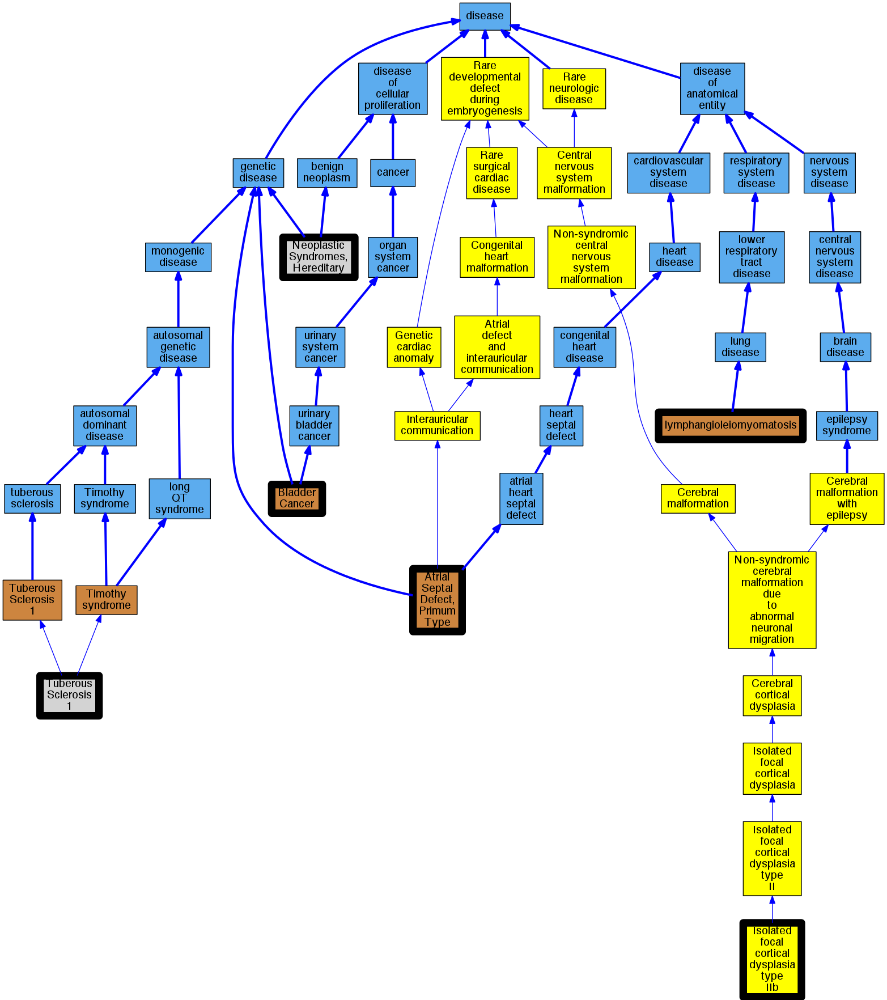

## GENE: TSC1

[matched diseases visual](TSC1.png)  <-- click on raw to zoom

### ASD
 * [OMIM:108800 Atrial Septal Defect, Primum Type](http://beta.monarchinitiative.org/disease/OMIM:108800) Confidence: low/0.09375
    * Equiv:[MESH:C566239 Atrial Septal Defect 1](http://beta.monarchinitiative.org/disease/MESH:C566239)
    * Equiv:[MESH:C566240 Atrial Septal Defect, Primum Type](http://beta.monarchinitiative.org/disease/MESH:C566240)
    * Equiv:[MESH:C566241 Atrial Septal Defect, Secundum Type](http://beta.monarchinitiative.org/disease/MESH:C566241)
    * Syn: "Asd 1"
    * Syn: "Asd 2"
    * Syn: "ASD1"
    * Syn: "ATRIAL SEPTAL DEFECT 1; ASD1"
    * Syn: "Atrial Septal Defect, Primum Type"
    * Syn: "Atrial Septal Defect, Secundum Type"

### Bladder cancer
 * [OMIM:109800 Bladder Cancer](http://beta.monarchinitiative.org/disease/OMIM:109800) Confidence: high
    * Syn: "BLADDER CANCER"

### FOCAL CORTICAL DYSPLASIA OF TAYLOR, TYPE IIB
 * [Orphanet:269008 Isolated focal cortical dysplasia type IIb](http://beta.monarchinitiative.org/disease/Orphanet:269008) Confidence: low/0.12414965986394558

### LAM
 * [OMIM:606690 lymphangioleiomyomatosis](http://beta.monarchinitiative.org/disease/OMIM:606690) Confidence: high
    * Equiv:[DOID:3319 lymphangioleiomyomatosis](http://beta.monarchinitiative.org/disease/DOID:3319)
    * Equiv:[MESH:D018192 Lymphangioleiomyomatosis](http://beta.monarchinitiative.org/disease/MESH:D018192)
    * Syn: "LAM"
    * Syn: "lung lymphangioleiomyomatosis"
    * Syn: "LYMPHANGIOLEIOMYOMATOSIS; LAM"
    * Syn: "Lymphangiomyomatosis"
    * Syn: "lymphangiomyomatosis"
    * Syn: "Lymphangiomyomatosis (morphologic abnormality)"
    * Syn: "pulmonary lymphangioleiomyomatosis (disorder)"

### LYMPHANGIOLEIOMYOMATOSIS
 * [OMIM:606690 lymphangioleiomyomatosis](http://beta.monarchinitiative.org/disease/OMIM:606690) Confidence: high
    * Equiv:[DOID:3319 lymphangioleiomyomatosis](http://beta.monarchinitiative.org/disease/DOID:3319)
    * Equiv:[MESH:D018192 Lymphangioleiomyomatosis](http://beta.monarchinitiative.org/disease/MESH:D018192)
    * Syn: "LAM"
    * Syn: "lung lymphangioleiomyomatosis"
    * Syn: "LYMPHANGIOLEIOMYOMATOSIS; LAM"
    * Syn: "Lymphangiomyomatosis"
    * Syn: "lymphangiomyomatosis"
    * Syn: "Lymphangiomyomatosis (morphologic abnormality)"
    * Syn: "pulmonary lymphangioleiomyomatosis (disorder)"

### Neoplastic Syndromes, Hereditary
 * [MESH:D009386 Neoplastic Syndromes, Hereditary](http://beta.monarchinitiative.org/disease/MESH:D009386) Confidence: high

### TSC

### TUBEROUS SCLEROSIS 1
 * [MESH:C565346 Tuberous Sclerosis 1](http://beta.monarchinitiative.org/disease/MESH:C565346) Confidence: high
