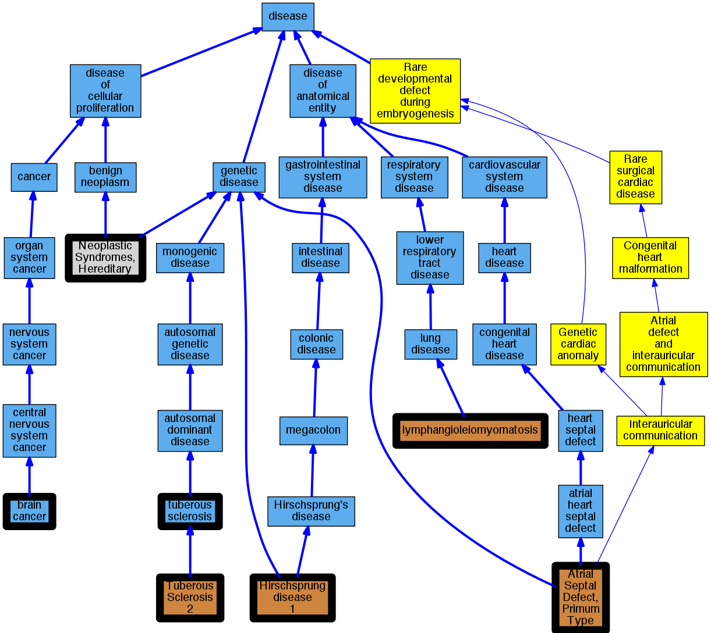

## GENE: TSC2

[matched diseases visual](TSC2.png)  <-- click on raw to zoom

### ASD
 * [DOID:1882 atrial heart septal defect](http://beta.monarchinitiative.org/disease/DOID:1882) Confidence: high
    * Equiv:[MESH:D006344 Heart Septal Defects, Atrial](http://beta.monarchinitiative.org/disease/MESH:D006344)
    * Equiv:[Orphanet:1478 Interauricular communication](http://beta.monarchinitiative.org/disease/Orphanet:1478)
    * Syn: "ASD"
    * Syn: "Atrial Septal Defect"
    * Syn: "Atrial septal defect"
    * Syn: "atrial septal defect"
    * Syn: "Atrial Septal Defects"
    * Syn: "atrioseptal defect"
    * Syn: "auricular septal defect"
    * Syn: "congenital atrial septal defect"
    * Syn: "Defect, Atrial Septal"
    * Syn: "Defects, Atrial Septal"
    * Syn: "interatrial septal defect"
    * Syn: "Interauricular communication"
    * Syn: "interauricular septal defect"
    * Syn: "Ostium Primum, Persistent"
    * Syn: "Ostium Secundum Atrial Septal Defect"
    * Syn: "Persistent Ostium Primum"
    * Syn: "Primum, Persistent Ostium"
    * Syn: "Septal Defect, Atrial"
    * Syn: "Septal Defects, Atrial"

### LYMPHANGIOLEIOMYOMATOSIS, SOMATIC
 * [OMIM:606690 lymphangioleiomyomatosis](http://beta.monarchinitiative.org/disease/OMIM:606690) Confidence: low/0.046875
    * Equiv:[Orphanet:538 Lymphangioleiomyomatosis](http://beta.monarchinitiative.org/disease/Orphanet:538)
    * Equiv:[MESH:D018192 Lymphangioleiomyomatosis](http://beta.monarchinitiative.org/disease/MESH:D018192)
    * Syn: "LAM"
    * Syn: "LAM"
    * Syn: "lung lymphangioleiomyomatosis"
    * Syn: "Lymphangioleiomyomatoses"
    * Syn: "LYMPHANGIOLEIOMYOMATOSIS; LAM"
    * Syn: "Lymphangiomyomatoses"
    * Syn: "Lymphangiomyomatosis"
    * Syn: "lymphangiomyomatosis"
    * Syn: "pulmonary lymphangioleiomyomatosis"

### Brain tumour
 * [DOID:1319 brain cancer](http://beta.monarchinitiative.org/disease/DOID:1319) Confidence: low/0.1388888888888889
    * Equiv:[MESH:D001932 Brain Neoplasms](http://beta.monarchinitiative.org/disease/MESH:D001932)
    * Syn: "adult brain tumor"
    * Syn: "adult malignant brain neoplasm"
    * Syn: "Benign Brain Neoplasm"
    * Syn: "Benign Brain Neoplasms"
    * Syn: "Benign Neoplasm, Brain"
    * Syn: "Benign Neoplasms, Brain"
    * Syn: "Brain Benign Neoplasm"
    * Syn: "Brain Benign Neoplasms"
    * Syn: "Brain Cancer"
    * Syn: "Brain Cancers"
    * Syn: "Brain Malignant Neoplasm"
    * Syn: "Brain Malignant Neoplasms"
    * Syn: "Brain Neoplasm"
    * Syn: "brain neoplasm"
    * Syn: "brain neoplasm, adult"
    * Syn: "Brain Neoplasm, Benign"
    * Syn: "Brain Neoplasm, Malignant"
    * Syn: "Brain Neoplasm, Primary"
    * Syn: "Brain Neoplasms, Benign"
    * Syn: "Brain Neoplasms, Malignant"
    * Syn: "Brain Neoplasms, Malignant, Primary"
    * Syn: "Brain Neoplasms, Primary"
    * Syn: "Brain Neoplasms, Primary Malignant"
    * Syn: "Brain Tumor"
    * Syn: "Brain Tumor, Primary"
    * Syn: "Brain Tumor, Recurrent"
    * Syn: "Brain Tumors"
    * Syn: "Brain Tumors, Primary"
    * Syn: "Brain Tumors, Recurrent"
    * Syn: "BT - Brain tumour"
    * Syn: "Cancer of Brain"
    * Syn: "Cancer of the Brain"
    * Syn: "Cancer, Brain"
    * Syn: "Cancers, Brain"
    * Syn: "Intracranial Neoplasm"
    * Syn: "Intracranial Neoplasms"
    * Syn: "Malignant Brain Neoplasm"
    * Syn: "Malignant Brain Neoplasms"
    * Syn: "malignant brain tumour"
    * Syn: "Malignant Neoplasm, Brain"
    * Syn: "Malignant Neoplasms, Brain"
    * Syn: "malignant primary brain neoplasm"
    * Syn: "Malignant Primary Brain Neoplasms"
    * Syn: "malignant primary brain tumor"
    * Syn: "Malignant Primary Brain Tumors"
    * Syn: "malignant tumor of adult brain"
    * Syn: "malignant tumor of Brain"
    * Syn: "neoplasm of brain (disorder)"
    * Syn: "neoplasm of unspecified nature of brain"
    * Syn: "neoplasm of unspecified nature of brain (disorder)"
    * Syn: "Neoplasm, Brain"
    * Syn: "Neoplasm, Intracranial"
    * Syn: "Neoplasms, Brain"
    * Syn: "Neoplasms, Brain, Benign"
    * Syn: "Neoplasms, Brain, Malignant"
    * Syn: "Neoplasms, Brain, Primary"
    * Syn: "Neoplasms, Intracranial"
    * Syn: "Primary Brain Neoplasm"
    * Syn: "primary brain neoplasm"
    * Syn: "Primary Brain Neoplasms"
    * Syn: "Primary Brain Tumor"
    * Syn: "primary brain tumor"
    * Syn: "Primary Brain Tumors"
    * Syn: "Primary Malignant Brain Neoplasms"
    * Syn: "Primary Malignant Brain Tumors"
    * Syn: "primary malignant neoplasm of brain (disorder)"
    * Syn: "Recurrent Brain Tumor"
    * Syn: "Recurrent Brain Tumors"
    * Syn: "tumor of the Brain"
    * Syn: "Tumor, Brain"
    * Syn: "Tumors, Brain"

### LAM
 * [OMIM:606690 lymphangioleiomyomatosis](http://beta.monarchinitiative.org/disease/OMIM:606690) Confidence: high
    * Equiv:[Orphanet:538 Lymphangioleiomyomatosis](http://beta.monarchinitiative.org/disease/Orphanet:538)
    * Equiv:[MESH:D018192 Lymphangioleiomyomatosis](http://beta.monarchinitiative.org/disease/MESH:D018192)
    * Syn: "LAM"
    * Syn: "LAM"
    * Syn: "lung lymphangioleiomyomatosis"
    * Syn: "Lymphangioleiomyomatoses"
    * Syn: "LYMPHANGIOLEIOMYOMATOSIS; LAM"
    * Syn: "Lymphangiomyomatoses"
    * Syn: "Lymphangiomyomatosis"
    * Syn: "lymphangiomyomatosis"
    * Syn: "pulmonary lymphangioleiomyomatosis"

### Neoplastic Syndromes, Hereditary
 * [MESH:D009386 Neoplastic Syndromes, Hereditary](http://beta.monarchinitiative.org/disease/MESH:D009386) Confidence: high
    * Syn: "Cancer Syndrome, Hereditary"
    * Syn: "Cancer Syndromes, Hereditary"
    * Syn: "Hereditary Cancer Syndrome"
    * Syn: "Hereditary Cancer Syndromes"
    * Syn: "Hereditary Neoplastic Syndrome"
    * Syn: "Hereditary Neoplastic Syndromes"
    * Syn: "Neoplastic Syndrome, Hereditary"
    * Syn: "Syndrome, Hereditary Cancer"
    * Syn: "Syndrome, Hereditary Neoplastic"
    * Syn: "Syndromes, Hereditary Cancer"
    * Syn: "Syndromes, Hereditary Neoplastic"

### TSC

### TUBEROUS SCLEROSIS 2
 * [OMIM:613254 Tuberous Sclerosis 2](http://beta.monarchinitiative.org/disease/OMIM:613254) Confidence: high
    * Equiv:[MESH:C566021 Tuberous Sclerosis 2](http://beta.monarchinitiative.org/disease/MESH:C566021)
    * Syn: "TSC2"
    * Syn: "Tsc2 Angiomyolipomas, Renal, Modifier of"
    * Syn: "TUBEROUS SCLEROSIS 2; TSC2"

### Tuberous sclerosis and lymphangiomyomatosis
 * [DOID:13515 tuberous sclerosis](http://beta.monarchinitiative.org/disease/DOID:13515) Confidence: low/0.15625
    * Equiv:[MESH:D014402 Tuberous Sclerosis](http://beta.monarchinitiative.org/disease/MESH:D014402)
    * Equiv:[Orphanet:805 Tuberous sclerosis](http://beta.monarchinitiative.org/disease/Orphanet:805)
    * Syn: "Adenoma Sebaceum"
    * Syn: "Bourneville Disease"
    * Syn: "Bourneville Phacomatosis"
    * Syn: "Bourneville Phakomatosis"
    * Syn: "Bourneville Pringle Disease"
    * Syn: "Bourneville Pringle's Disease"
    * Syn: "Bourneville Syndrome"
    * Syn: "Bourneville syndrome"
    * Syn: "Bourneville's Disease"
    * Syn: "Bourneville's disease"
    * Syn: "Bourneville's Syndrome"
    * Syn: "Bourneville-Pringle Disease"
    * Syn: "Bourneville-Pringle's Disease"
    * Syn: "Bourneville-Pringles Disease"
    * Syn: "Cerebral Scleroses"
    * Syn: "Cerebral Sclerosis"
    * Syn: "cerebral sclerosis"
    * Syn: "Disease, Bourneville-Pringle"
    * Syn: "Disease, Bourneville-Pringle's"
    * Syn: "Epiloia"
    * Syn: "Epiloia"
    * Syn: "Phacomatosis, Bourneville"
    * Syn: "Phakomatosis, Bourneville"
    * Syn: "Sclerosis Tuberosa"
    * Syn: "Sclerosis, Cerebral"
    * Syn: "Sclerosis, Tuberose"
    * Syn: "Sclerosis, Tuberous"
    * Syn: "Syndrome, Bourneville"
    * Syn: "Syndrome, Bourneville's"
    * Syn: "Tuberose Sclerosis"
    * Syn: "Tuberose sclerosis"
    * Syn: "Tuberose sclerosis"
    * Syn: "Tuberous sclerosis"
    * Syn: "Tuberous sclerosis"
    * Syn: "Tuberous Sclerosis Complex"
    * Syn: "Tuberous sclerosis syndrome (disorder)"

### Hirschsprung disease 1
 * [MESH:C538540 Hirschsprung disease 1](http://beta.monarchinitiative.org/disease/MESH:C538540) Confidence: high
    * Syn: "Hirschsprung disease type 1"

### LAM
 * [OMIM:606690 lymphangioleiomyomatosis](http://beta.monarchinitiative.org/disease/OMIM:606690) Confidence: high
    * Equiv:[Orphanet:538 Lymphangioleiomyomatosis](http://beta.monarchinitiative.org/disease/Orphanet:538)
    * Equiv:[MESH:D018192 Lymphangioleiomyomatosis](http://beta.monarchinitiative.org/disease/MESH:D018192)
    * Syn: "LAM"
    * Syn: "LAM"
    * Syn: "lung lymphangioleiomyomatosis"
    * Syn: "Lymphangioleiomyomatoses"
    * Syn: "LYMPHANGIOLEIOMYOMATOSIS; LAM"
    * Syn: "Lymphangiomyomatoses"
    * Syn: "Lymphangiomyomatosis"
    * Syn: "lymphangiomyomatosis"
    * Syn: "pulmonary lymphangioleiomyomatosis"

### TSC

### Tuberous sclerosis
 * [DOID:13515 tuberous sclerosis](http://beta.monarchinitiative.org/disease/DOID:13515) Confidence: high
    * Equiv:[MESH:D014402 Tuberous Sclerosis](http://beta.monarchinitiative.org/disease/MESH:D014402)
    * Equiv:[Orphanet:805 Tuberous sclerosis](http://beta.monarchinitiative.org/disease/Orphanet:805)
    * Syn: "Adenoma Sebaceum"
    * Syn: "Bourneville Disease"
    * Syn: "Bourneville Phacomatosis"
    * Syn: "Bourneville Phakomatosis"
    * Syn: "Bourneville Pringle Disease"
    * Syn: "Bourneville Pringle's Disease"
    * Syn: "Bourneville Syndrome"
    * Syn: "Bourneville syndrome"
    * Syn: "Bourneville's Disease"
    * Syn: "Bourneville's disease"
    * Syn: "Bourneville's Syndrome"
    * Syn: "Bourneville-Pringle Disease"
    * Syn: "Bourneville-Pringle's Disease"
    * Syn: "Bourneville-Pringles Disease"
    * Syn: "Cerebral Scleroses"
    * Syn: "Cerebral Sclerosis"
    * Syn: "cerebral sclerosis"
    * Syn: "Disease, Bourneville-Pringle"
    * Syn: "Disease, Bourneville-Pringle's"
    * Syn: "Epiloia"
    * Syn: "Epiloia"
    * Syn: "Phacomatosis, Bourneville"
    * Syn: "Phakomatosis, Bourneville"
    * Syn: "Sclerosis Tuberosa"
    * Syn: "Sclerosis, Cerebral"
    * Syn: "Sclerosis, Tuberose"
    * Syn: "Sclerosis, Tuberous"
    * Syn: "Syndrome, Bourneville"
    * Syn: "Syndrome, Bourneville's"
    * Syn: "Tuberose Sclerosis"
    * Syn: "Tuberose sclerosis"
    * Syn: "Tuberose sclerosis"
    * Syn: "Tuberous sclerosis"
    * Syn: "Tuberous sclerosis"
    * Syn: "Tuberous Sclerosis Complex"
    * Syn: "Tuberous sclerosis syndrome (disorder)"

### Tuberous sclerosis 2
 * [OMIM:613254 Tuberous Sclerosis 2](http://beta.monarchinitiative.org/disease/OMIM:613254) Confidence: high
    * Equiv:[MESH:C566021 Tuberous Sclerosis 2](http://beta.monarchinitiative.org/disease/MESH:C566021)
    * Syn: "TSC2"
    * Syn: "Tsc2 Angiomyolipomas, Renal, Modifier of"
    * Syn: "TUBEROUS SCLEROSIS 2; TSC2"
