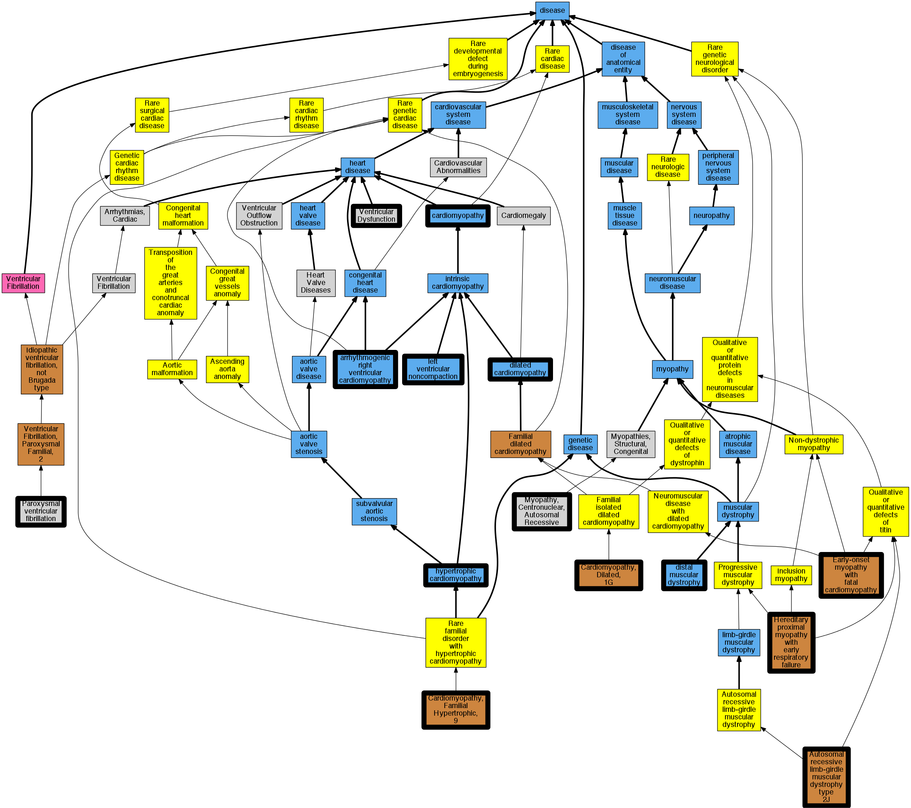

## GENE: TTN

[matched diseases visual](TTN.png)  <-- click on raw to zoom

### Cardiomyopathy
 * [DOID:0050700 cardiomyopathy](http://beta.monarchinitiative.org/disease/DOID:0050700) Confidence: high
    * Equiv:[MESH:D009202 Cardiomyopathies](http://beta.monarchinitiative.org/disease/MESH:D009202)
    * Syn: "Cardiomyopathies"

### Cardiomyopathy, dilated
 * [DOID:12930 dilated cardiomyopathy](http://beta.monarchinitiative.org/disease/DOID:12930) Confidence: high
    * Syn: "Congestive cardiomyopathy"
    * Syn: "Familial dilated cardiomyopathy"
    * Syn: "Idiopathic dilation cardiomyopathy"
    * Syn: "primary dilated cardiomyopathy"

### MUSCULAR DYSTROPHY, LIMB-GIRDLE, TYPE 2J
 * [OMIM:608807 Muscular Dystrophy, Limb-Girdle, Type 2J](http://beta.monarchinitiative.org/disease/OMIM:608807) Confidence: high
    * Equiv:[MESH:C563854 Muscular Dystrophy, Limb-Girdle, Type 2J](http://beta.monarchinitiative.org/disease/MESH:C563854)
    * Syn: "LGMD2J"
    * Syn: "MUSCULAR DYSTROPHY, LIMB-GIRDLE, TYPE 2J; LGMD2J"

### MYOPATHY, EARLY-ONSET, WITH FATAL CARDIOMYOPATHY
 * [OMIM:611705 Early-onset myopathy with fatal cardiomyopathy](http://beta.monarchinitiative.org/disease/OMIM:611705) Confidence: high
    * Equiv:[Orphanet:289377 Early-onset myopathy with fatal cardiomyopathy](http://beta.monarchinitiative.org/disease/Orphanet:289377)
    * Equiv:[MESH:C567129 Myopathy, Early-Onset, with Fatal Cardiomyopathy](http://beta.monarchinitiative.org/disease/MESH:C567129)
    * Syn: "Eomfc"
    * Syn: "MYOPATHY, EARLY-ONSET, WITH FATAL CARDIOMYOPATHY"

### Primary dilated cardiomyopathy
 * [DOID:12930 dilated cardiomyopathy](http://beta.monarchinitiative.org/disease/DOID:12930) Confidence: high
    * Syn: "Congestive cardiomyopathy"
    * Syn: "Familial dilated cardiomyopathy"
    * Syn: "Idiopathic dilation cardiomyopathy"
    * Syn: "primary dilated cardiomyopathy"

### Primary dilated cardiomyopathy
 * [DOID:12930 dilated cardiomyopathy](http://beta.monarchinitiative.org/disease/DOID:12930) Confidence: high
    * Syn: "Congestive cardiomyopathy"
    * Syn: "Familial dilated cardiomyopathy"
    * Syn: "Idiopathic dilation cardiomyopathy"
    * Syn: "primary dilated cardiomyopathy"

### Primary familial hypertrophic cardiomyopathy
 * [DOID:11984 hypertrophic cardiomyopathy](http://beta.monarchinitiative.org/disease/DOID:11984) Confidence: low/0.1953125
    * Equiv:[MESH:D002312 Cardiomyopathy, Hypertrophic](http://beta.monarchinitiative.org/disease/MESH:D002312)
    * Equiv:[MESH:D024741 Cardiomyopathy, Hypertrophic, Familial](http://beta.monarchinitiative.org/disease/MESH:D024741)
    * Syn: "familial hypertrophic cardiomyopathy"
    * Syn: "hypertrophic obstructive cardiomyopathy"

### Tibial muscular dystrophy, tardive
 * [OMIM:600334 Tibial Muscular Dystrophy, Tardive](http://beta.monarchinitiative.org/disease/OMIM:600334) Confidence: high
    * Syn: "Tardive Tibial Muscular Dystrophy"
    * Syn: "TIBIAL MUSCULAR DYSTROPHY, TARDIVE"
    * Syn: "Tmd"
    * Syn: "Udd Myopathy"

### CARDIOMYOPATHY, FAMILIAL HYPERTROPHIC, 9
 * [OMIM:613765 Cardiomyopathy, Familial Hypertrophic, 9](http://beta.monarchinitiative.org/disease/OMIM:613765) Confidence: high
    * Equiv:[MESH:C566044 Cardiomyopathy, Familial Hypertrophic, 9](http://beta.monarchinitiative.org/disease/MESH:C566044)
    * Syn: "CARDIOMYOPATHY, FAMILIAL HYPERTROPHIC, 9; CMH9"
    * Syn: "CMH9"

### Cardiomyopathy
 * [DOID:0050700 cardiomyopathy](http://beta.monarchinitiative.org/disease/DOID:0050700) Confidence: high
    * Equiv:[MESH:D009202 Cardiomyopathies](http://beta.monarchinitiative.org/disease/MESH:D009202)
    * Syn: "Cardiomyopathies"

### Cardiomyopathy, dilated, 1G
 * [OMIM:604145 Cardiomyopathy, Dilated, 1g](http://beta.monarchinitiative.org/disease/OMIM:604145) Confidence: high
    * Equiv:[MESH:C565824 Cardiomyopathy, Dilated, 1g](http://beta.monarchinitiative.org/disease/MESH:C565824)
    * Syn: "CARDIOMYOPATHY, DILATED, 1G; CMD1G"
    * Syn: "CMD1G"

### Diastolic dysfunction
 * [MESH:D018754 Ventricular Dysfunction](http://beta.monarchinitiative.org/disease/MESH:D018754) Confidence: low/0.09375

### HEREDITARY MYOPATHY WITH EARLY RESPIRATORY FAILURE
 * [OMIM:603689 Hereditary Myopathy with Early Respiratory Failure](http://beta.monarchinitiative.org/disease/OMIM:603689) Confidence: high
    * Equiv:[MESH:C566343 Hereditary Myopathy with Early Respiratory Failure](http://beta.monarchinitiative.org/disease/MESH:C566343)
    * Syn: "Edstrom Myopathy"
    * Syn: "HEREDITARY MYOPATHY WITH EARLY RESPIRATORY FAILURE; HMERF"
    * Syn: "HMERF"
    * Syn: "Myopathy, Proximal, With Early Respiratory Muscle Involvement"

### Myopathy, early-onset, with fatal cardiomyopathy
 * [OMIM:611705 Early-onset myopathy with fatal cardiomyopathy](http://beta.monarchinitiative.org/disease/OMIM:611705) Confidence: high
    * Equiv:[Orphanet:289377 Early-onset myopathy with fatal cardiomyopathy](http://beta.monarchinitiative.org/disease/Orphanet:289377)
    * Equiv:[MESH:C567129 Myopathy, Early-Onset, with Fatal Cardiomyopathy](http://beta.monarchinitiative.org/disease/MESH:C567129)
    * Syn: "Eomfc"
    * Syn: "MYOPATHY, EARLY-ONSET, WITH FATAL CARDIOMYOPATHY"

### Autosomal recessive centronuclear myopathy
 * [OMIM:255200 Myopathy, Centronuclear, Autosomal Recessive](http://beta.monarchinitiative.org/disease/OMIM:255200) Confidence: high
    * Equiv:[MESH:C562934 Myopathy, Centronuclear, Autosomal Recessive](http://beta.monarchinitiative.org/disease/MESH:C562934)
    * Syn: "CNM2"
    * Syn: "MYOPATHY, CENTRONUCLEAR, 2; CNM2"
    * Syn: "Myopathy, Centronuclear, Autosomal Recessive"
    * Syn: "Myotubular Myopathy, Autosomal Recessive"

### Dilated cardiomyopathy 1G
 * [OMIM:604145 Cardiomyopathy, Dilated, 1g](http://beta.monarchinitiative.org/disease/OMIM:604145) Confidence: high
    * Equiv:[MESH:C565824 Cardiomyopathy, Dilated, 1g](http://beta.monarchinitiative.org/disease/MESH:C565824)
    * Syn: "CARDIOMYOPATHY, DILATED, 1G; CMD1G"
    * Syn: "CMD1G"

### Distal myopathy Markesbery-Griggs type
 * [Orphanet:98912 Late-onset distal myopathy, Markesbery-Griggs type](http://beta.monarchinitiative.org/disease/Orphanet:98912) Confidence: low/0.15306122448979592

### Hereditary myopathy with early respiratory failure
 * [OMIM:603689 Hereditary Myopathy with Early Respiratory Failure](http://beta.monarchinitiative.org/disease/OMIM:603689) Confidence: high
    * Equiv:[MESH:C566343 Hereditary Myopathy with Early Respiratory Failure](http://beta.monarchinitiative.org/disease/MESH:C566343)
    * Syn: "Edstrom Myopathy"
    * Syn: "HEREDITARY MYOPATHY WITH EARLY RESPIRATORY FAILURE; HMERF"
    * Syn: "HMERF"
    * Syn: "Myopathy, Proximal, With Early Respiratory Muscle Involvement"

### Paroxysmal familial ventricular fibrillation
 * [OMIM:612956 Paroxysmal ventricular fibrillation](http://beta.monarchinitiative.org/disease/OMIM:612956) Confidence: low/0.1953125
    * Equiv:[MESH:C537182 Paroxysmal ventricular fibrillation](http://beta.monarchinitiative.org/disease/MESH:C537182)
    * Equiv:[MESH:C567841 Ventricular Fibrillation, Paroxysmal Familial, 2](http://beta.monarchinitiative.org/disease/MESH:C567841)
    * Syn: "VENTRICULAR FIBRILLATION, PAROXYSMAL FAMILIAL, 2; VF2"
    * Syn: "VF2"

### TIBIAL MUSCULAR DYSTROPHY, TARDIVE
 * [OMIM:600334 Tibial Muscular Dystrophy, Tardive](http://beta.monarchinitiative.org/disease/OMIM:600334) Confidence: high
    * Syn: "Tardive Tibial Muscular Dystrophy"
    * Syn: "TIBIAL MUSCULAR DYSTROPHY, TARDIVE"
    * Syn: "Tmd"
    * Syn: "Udd Myopathy"

### Arrhythmogenic right ventricular cardiomyopathy
 * [DOID:0050431 arrhythmogenic right ventricular cardiomyopathy](http://beta.monarchinitiative.org/disease/DOID:0050431) Confidence: high
    * Equiv:[MESH:D019571 Arrhythmogenic Right Ventricular Dysplasia](http://beta.monarchinitiative.org/disease/MESH:D019571)
    * Syn: "arrhythmogenic right ventricular dysplasia"
    * Syn: "arrhythmogenic right ventricular dysplasia/cardiomyopathy"
    * Syn: "ARVC"
    * Syn: "ARVC cardiomyopathy"
    * Syn: "ARVD"

### CARDIOMYOPATHY, DILATED, 1G
 * [OMIM:604145 Cardiomyopathy, Dilated, 1g](http://beta.monarchinitiative.org/disease/OMIM:604145) Confidence: high
    * Equiv:[MESH:C565824 Cardiomyopathy, Dilated, 1g](http://beta.monarchinitiative.org/disease/MESH:C565824)
    * Syn: "CARDIOMYOPATHY, DILATED, 1G; CMD1G"
    * Syn: "CMD1G"

### Cardiomyopathy, dilated
 * [DOID:12930 dilated cardiomyopathy](http://beta.monarchinitiative.org/disease/DOID:12930) Confidence: high
    * Syn: "Congestive cardiomyopathy"
    * Syn: "Familial dilated cardiomyopathy"
    * Syn: "Idiopathic dilation cardiomyopathy"
    * Syn: "primary dilated cardiomyopathy"

### Left ventricular noncompaction cardiomyopathy
 * [DC:0000237 Left Ventricular Noncompaction](http://beta.monarchinitiative.org/disease/DC:0000237) Confidence: low/0.1953125

### Paroxysmal familial ventricular fibrillation
 * [OMIM:612956 Paroxysmal ventricular fibrillation](http://beta.monarchinitiative.org/disease/OMIM:612956) Confidence: low/0.1953125
    * Equiv:[MESH:C537182 Paroxysmal ventricular fibrillation](http://beta.monarchinitiative.org/disease/MESH:C537182)
    * Equiv:[MESH:C567841 Ventricular Fibrillation, Paroxysmal Familial, 2](http://beta.monarchinitiative.org/disease/MESH:C567841)
    * Syn: "VENTRICULAR FIBRILLATION, PAROXYSMAL FAMILIAL, 2; VF2"
    * Syn: "VF2"

### Primary dilated cardiomyopathy
 * [DOID:12930 dilated cardiomyopathy](http://beta.monarchinitiative.org/disease/DOID:12930) Confidence: high
    * Syn: "Congestive cardiomyopathy"
    * Syn: "Familial dilated cardiomyopathy"
    * Syn: "Idiopathic dilation cardiomyopathy"
    * Syn: "primary dilated cardiomyopathy"

### Primary dilated cardiomyopathy
 * [DOID:12930 dilated cardiomyopathy](http://beta.monarchinitiative.org/disease/DOID:12930) Confidence: high
    * Syn: "Congestive cardiomyopathy"
    * Syn: "Familial dilated cardiomyopathy"
    * Syn: "Idiopathic dilation cardiomyopathy"
    * Syn: "primary dilated cardiomyopathy"

### Primary familial hypertrophic cardiomyopathy
 * [DOID:11984 hypertrophic cardiomyopathy](http://beta.monarchinitiative.org/disease/DOID:11984) Confidence: low/0.1953125
    * Equiv:[MESH:D002312 Cardiomyopathy, Hypertrophic](http://beta.monarchinitiative.org/disease/MESH:D002312)
    * Equiv:[MESH:D024741 Cardiomyopathy, Hypertrophic, Familial](http://beta.monarchinitiative.org/disease/MESH:D024741)
    * Syn: "familial hypertrophic cardiomyopathy"
    * Syn: "hypertrophic obstructive cardiomyopathy"

### Primary familial hypertrophic cardiomyopathy
 * [DOID:11984 hypertrophic cardiomyopathy](http://beta.monarchinitiative.org/disease/DOID:11984) Confidence: low/0.1953125
    * Equiv:[MESH:D002312 Cardiomyopathy, Hypertrophic](http://beta.monarchinitiative.org/disease/MESH:D002312)
    * Equiv:[MESH:D024741 Cardiomyopathy, Hypertrophic, Familial](http://beta.monarchinitiative.org/disease/MESH:D024741)
    * Syn: "familial hypertrophic cardiomyopathy"
    * Syn: "hypertrophic obstructive cardiomyopathy"
