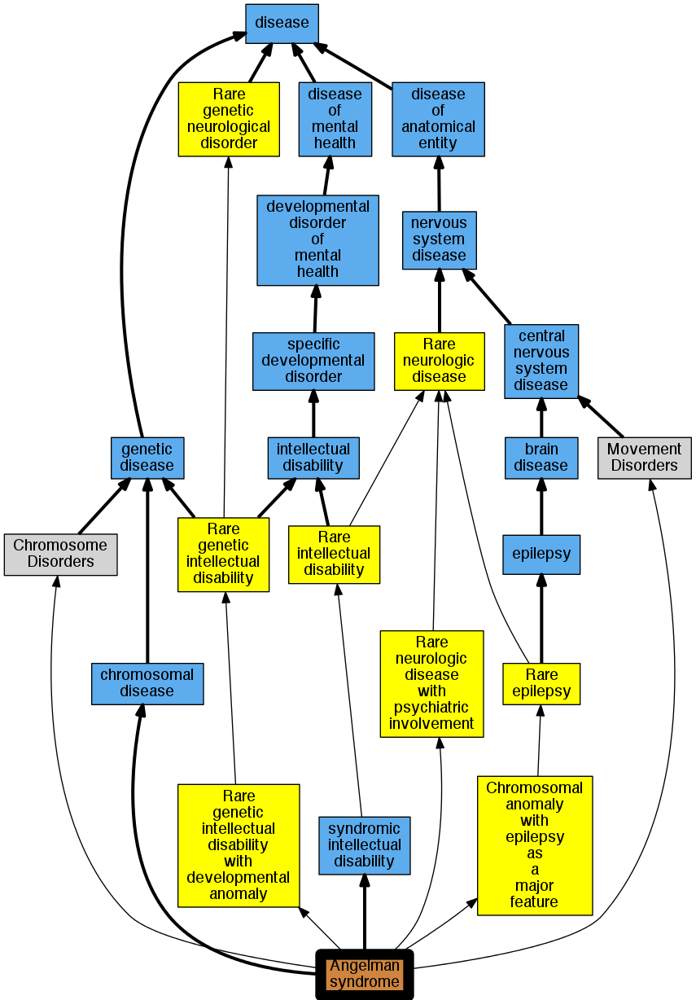

## GENE: UBE3A

[matched diseases visual](UBE3A.png)  <-- click on raw to zoom

### Angelman Syndrome
 * [OMIM:105830 Angelman syndrome](http://beta.monarchinitiative.org/disease/OMIM:105830) Confidence: high
    * Equiv:[DOID:1932 Angelman syndrome](http://beta.monarchinitiative.org/disease/DOID:1932)
    * Equiv:[MESH:D017204 Angelman Syndrome](http://beta.monarchinitiative.org/disease/MESH:D017204)
    * Syn: "Angelman Syndrome Chromosome Region"
    * Syn: "ANGELMAN SYNDROME; AS"
    * Syn: "AS"
    * Syn: "happy puppet syndrome"
    * Syn: "Happy Puppet Syndrome, Formerly"
    * Syn: "puppetlike syndrome"

### ANGELMAN SYNDROME
 * [OMIM:105830 Angelman syndrome](http://beta.monarchinitiative.org/disease/OMIM:105830) Confidence: high
    * Equiv:[DOID:1932 Angelman syndrome](http://beta.monarchinitiative.org/disease/DOID:1932)
    * Equiv:[MESH:D017204 Angelman Syndrome](http://beta.monarchinitiative.org/disease/MESH:D017204)
    * Syn: "Angelman Syndrome Chromosome Region"
    * Syn: "ANGELMAN SYNDROME; AS"
    * Syn: "AS"
    * Syn: "happy puppet syndrome"
    * Syn: "Happy Puppet Syndrome, Formerly"
    * Syn: "puppetlike syndrome"

### Angelman syndrome
 * [OMIM:105830 Angelman syndrome](http://beta.monarchinitiative.org/disease/OMIM:105830) Confidence: high
    * Equiv:[DOID:1932 Angelman syndrome](http://beta.monarchinitiative.org/disease/DOID:1932)
    * Equiv:[MESH:D017204 Angelman Syndrome](http://beta.monarchinitiative.org/disease/MESH:D017204)
    * Syn: "Angelman Syndrome Chromosome Region"
    * Syn: "ANGELMAN SYNDROME; AS"
    * Syn: "AS"
    * Syn: "happy puppet syndrome"
    * Syn: "Happy Puppet Syndrome, Formerly"
    * Syn: "puppetlike syndrome"
