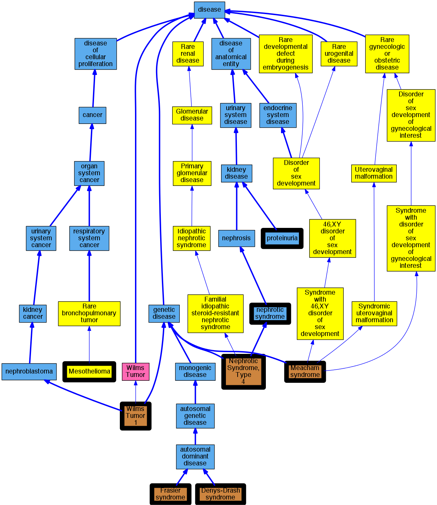

## GENE: WT1

[matched diseases visual](WT1.png)  <-- click on raw to zoom

### DENYS-DRASH SYNDROME
 * [OMIM:194080 Denys-Drash syndrome](http://beta.monarchinitiative.org/disease/OMIM:194080) Confidence: high
    * Equiv:[Orphanet:220 Denys-Drash syndrome](http://beta.monarchinitiative.org/disease/Orphanet:220)
    * Equiv:[DOID:3764 Denys-Drash syndrome](http://beta.monarchinitiative.org/disease/DOID:3764)
    * Equiv:[MESH:D030321 Denys-Drash Syndrome](http://beta.monarchinitiative.org/disease/MESH:D030321)
    * Syn: "DDS"
    * Syn: "Denys Drash Syndrome"
    * Syn: "DENYS-DRASH SYNDROME; DDS"
    * Syn: "Drash Syndrome"
    * Syn: "Drash syndrome"
    * Syn: "Nephropathy, Wilms Tumor, and Genital Anomalies"
    * Syn: "Pseudohermaphroditism, Nephron Disorder and Wilms' Tumor"
    * Syn: "Syndrome, Denys-Drash"
    * Syn: "Syndrome, Drash"
    * Syn: "Wilms Tumor and Pseudo- or True Hermaphroditism"
    * Syn: "Wilms Tumor and Pseudohermaphroditism"
    * Syn: "Wilms tumor and pseudohermaphroditism"

### Hereditary Nephrotic Syndromes
 * [DOID:1184 nephrotic syndrome](http://beta.monarchinitiative.org/disease/DOID:1184) Confidence: low/0.18055555555555555
    * Equiv:[MESH:D009404 Nephrotic Syndrome](http://beta.monarchinitiative.org/disease/MESH:D009404)
    * Syn: "finnish congenital nephrosis"
    * Syn: "Nephrotic Syndromes"
    * Syn: "Syndrome, Nephrotic"
    * Syn: "Syndromes, Nephrotic"

### MEACHAM SYNDROME
 * [MESH:C563821 Meacham Syndrome](http://beta.monarchinitiative.org/disease/MESH:C563821) Confidence: high

### FRASIER SYNDROME
 * [OMIM:136680 Frasier syndrome](http://beta.monarchinitiative.org/disease/OMIM:136680) Confidence: high
    * Equiv:[Orphanet:347 Frasier syndrome](http://beta.monarchinitiative.org/disease/Orphanet:347)
    * Equiv:[DOID:0050438 Frasier syndrome](http://beta.monarchinitiative.org/disease/DOID:0050438)
    * Equiv:[MESH:D052159 Frasier Syndrome](http://beta.monarchinitiative.org/disease/MESH:D052159)
    * Syn: "FRASIER SYNDROME"
    * Syn: "Syndrome, Frasier"

### MESOTHELIOMA, SOMATIC
 * [Orphanet:168816 Peritoneal cystic mesothelioma](http://beta.monarchinitiative.org/disease/Orphanet:168816) Confidence: low/0.09375
    * Syn: "Benign multicystic peritoneal mesothelioma"
    * Syn: "Multicystic mesothelioma"
    * Syn: "Multilocular peritoneal inclusion cyst"

### NEPHROTIC SYNDROME TYPE 4
 * [OMIM:256370 Nephrotic Syndrome, Type 4](http://beta.monarchinitiative.org/disease/OMIM:256370) Confidence: high
    * Syn: "NEPHROTIC SYNDROME, TYPE 4; NPHS4"
    * Syn: "NPHS4"

### NEPHROTIC SYNDROME, TYPE 4
 * [OMIM:256370 Nephrotic Syndrome, Type 4](http://beta.monarchinitiative.org/disease/OMIM:256370) Confidence: high
    * Syn: "NEPHROTIC SYNDROME, TYPE 4; NPHS4"
    * Syn: "NPHS4"

### WILMS TUMOR 1
 * [OMIM:194070 Wilms Tumor 1](http://beta.monarchinitiative.org/disease/OMIM:194070) Confidence: high
    * Syn: "Nephroblastoma"
    * Syn: "WILMS TUMOR 1; WT1"
    * Syn: "WT1"

### Proteinuria
 * [DOID:576 proteinuria](http://beta.monarchinitiative.org/disease/DOID:576) Confidence: high
    * Equiv:[MESH:D011507 Proteinuria](http://beta.monarchinitiative.org/disease/MESH:D011507)
    * Syn: "Proteinurias"
