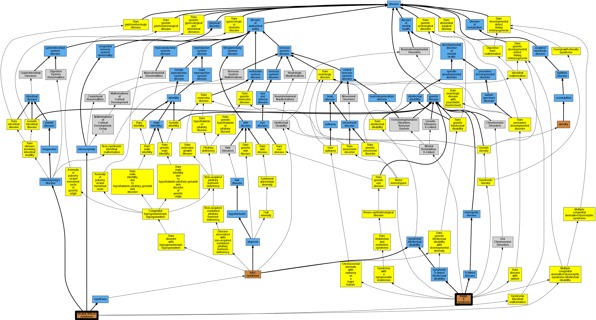

## GENE: ZEB2

[matched diseases visual](ZEB2.png)  <-- click on raw to zoom

### HIRSCHSPRUNG DISEASE-MENTAL RETARDATION SYNDROME, LATE INFANTILE
 * [OMIM:606851 Cree Mental Retardation Syndrome](http://beta.monarchinitiative.org/disease/OMIM:606851) Confidence: low/0.11670918367346939
    * Equiv:[MESH:C564654 Cree Mental Retardation Syndrome](http://beta.monarchinitiative.org/disease/MESH:C564654)
    * Syn: "CREE MENTAL RETARDATION SYNDROME"

### Mowat-Wilson Syndrome: Autosomal dominant inheritence
 * [OMIM:235730 Mowat-Wilson syndrome](http://beta.monarchinitiative.org/disease/OMIM:235730) Confidence: low/0.15625
    * Equiv:[Orphanet:2152 Mowat-Wilson syndrome](http://beta.monarchinitiative.org/disease/Orphanet:2152)
    * Equiv:[MESH:C536990 Mowat-Wilson syndrome](http://beta.monarchinitiative.org/disease/MESH:C536990)
    * Syn: "Hirschsprung Disease-Mental Retardation Syndrome"
    * Syn: "Microcephaly, Mental Retardation, and Distinct Facial Features, With or Without Hirschsprung Disease"
    * Syn: "MOWAT-WILSON SYNDROME; MOWS"
    * Syn: "MOWS"

### MOWAT-WILSON SYNDROME
 * [OMIM:235730 Mowat-Wilson syndrome](http://beta.monarchinitiative.org/disease/OMIM:235730) Confidence: high
    * Equiv:[Orphanet:2152 Mowat-Wilson syndrome](http://beta.monarchinitiative.org/disease/Orphanet:2152)
    * Equiv:[MESH:C536990 Mowat-Wilson syndrome](http://beta.monarchinitiative.org/disease/MESH:C536990)
    * Syn: "Hirschsprung Disease-Mental Retardation Syndrome"
    * Syn: "Microcephaly, Mental Retardation, and Distinct Facial Features, With or Without Hirschsprung Disease"
    * Syn: "MOWAT-WILSON SYNDROME; MOWS"
    * Syn: "MOWS"

### Mowat-Wilson syndrome
 * [OMIM:235730 Mowat-Wilson syndrome](http://beta.monarchinitiative.org/disease/OMIM:235730) Confidence: high
    * Equiv:[Orphanet:2152 Mowat-Wilson syndrome](http://beta.monarchinitiative.org/disease/Orphanet:2152)
    * Equiv:[MESH:C536990 Mowat-Wilson syndrome](http://beta.monarchinitiative.org/disease/MESH:C536990)
    * Syn: "Hirschsprung Disease-Mental Retardation Syndrome"
    * Syn: "Microcephaly, Mental Retardation, and Distinct Facial Features, With or Without Hirschsprung Disease"
    * Syn: "MOWAT-WILSON SYNDROME; MOWS"
    * Syn: "MOWS"
