## Ligneous conjunctivitis -> Hypoplasminogenemia

 * [Ligneous conjunctivitis](http://purl.obolibrary.org/obo/Orphanet_97231) __SubClassOf__ [Hypoplasminogenemia](http://purl.obolibrary.org/obo/Orphanet_722)

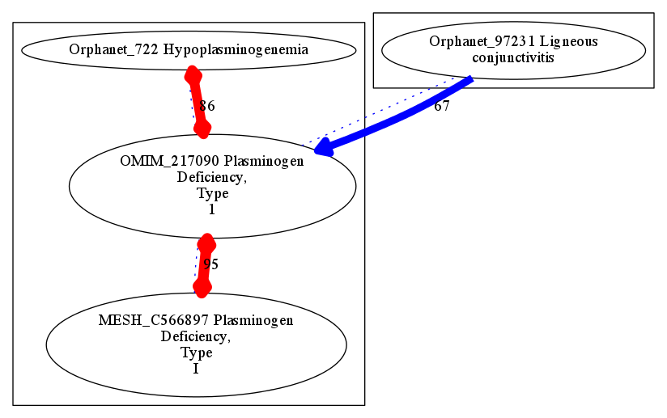

## Shprintzen-Goldberg syndrome -> Goldberg-Shprintzen megacolon syndrome

 * [Shprintzen-Goldberg syndrome](http://purl.obolibrary.org/obo/Orphanet_2462) __SubClassOf__ [Goldberg-Shprintzen megacolon syndrome](http://purl.obolibrary.org/obo/Orphanet_66629)

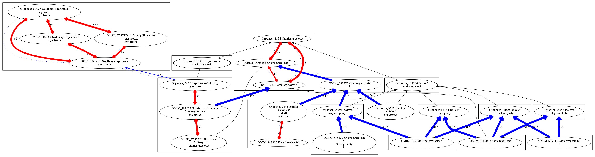

## Immunodeficiency by defective expression of HLA class 2 -> Severe combined immunodeficiency

 * [Immunodeficiency by defective expression of HLA class 2](http://purl.obolibrary.org/obo/Orphanet_572) __SubClassOf__ [Severe combined immunodeficiency](http://purl.obolibrary.org/obo/Orphanet_183660)

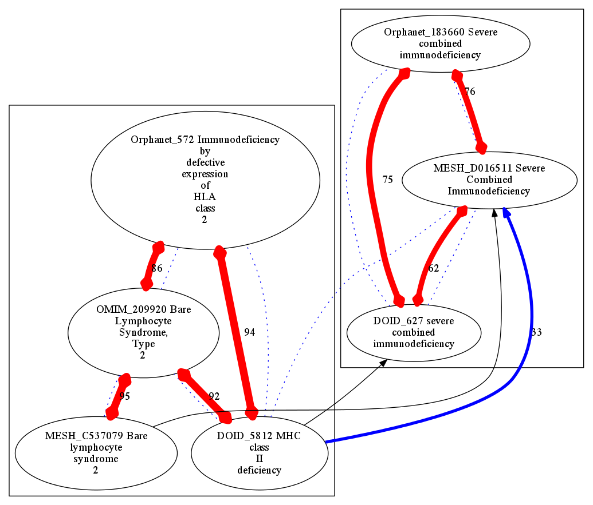

## Oculoauriculovertebral spectrum with radial defects -> Goldenhar syndrome

 * [Oculoauriculovertebral spectrum with radial defects](http://purl.obolibrary.org/obo/Orphanet_2549) __SubClassOf__ [Goldenhar syndrome](http://purl.obolibrary.org/obo/Orphanet_374)

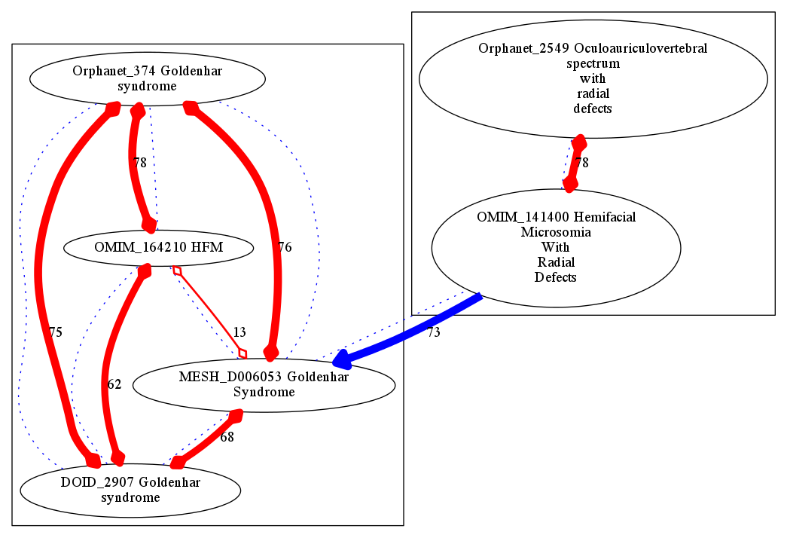

## Subcortical band heterotopia -> Lissencephaly due to LIS1 mutation

 * [Subcortical band heterotopia](http://purl.obolibrary.org/obo/Orphanet_99796) __SubClassOf__ [Lissencephaly due to LIS1 mutation](http://purl.obolibrary.org/obo/Orphanet_95232)

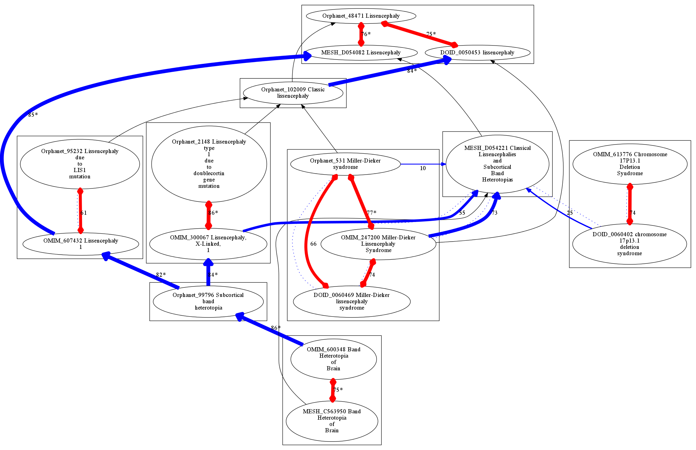

## Transgrediens et progrediens palmoplantar keratoderma -> Erythrokeratodermia variabilis

 * [Transgrediens et progrediens palmoplantar keratoderma](http://purl.obolibrary.org/obo/Orphanet_495) __SubClassOf__ [Erythrokeratodermia variabilis](http://purl.obolibrary.org/obo/Orphanet_317)

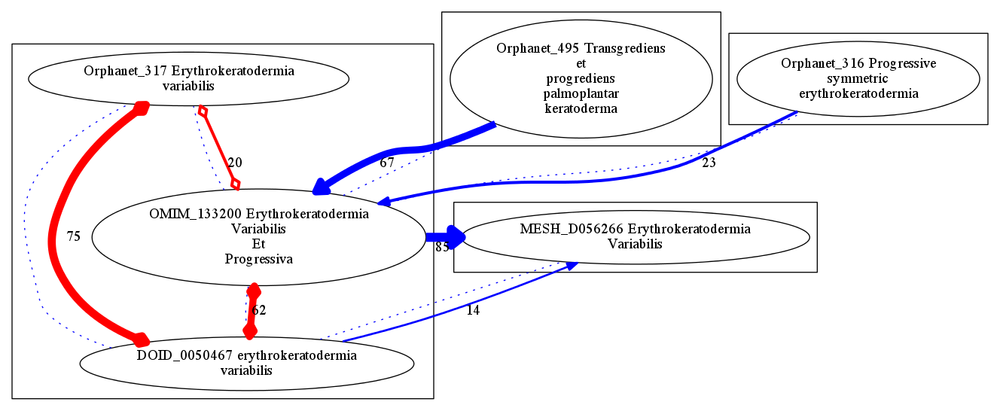

## Progressive symmetric erythrokeratodermia -> Erythrokeratodermia variabilis

 * [Progressive symmetric erythrokeratodermia](http://purl.obolibrary.org/obo/Orphanet_316) __SubClassOf__ [Erythrokeratodermia variabilis](http://purl.obolibrary.org/obo/Orphanet_317)

## Autosomal recessive limb-girdle muscular dystrophy type 2S -> Intellectual disability-hyperkinetic movement-truncal ataxia syndrome

 * [Autosomal recessive limb-girdle muscular dystrophy type 2S](http://purl.obolibrary.org/obo/Orphanet_369840) __SubClassOf__ [Intellectual disability-hyperkinetic movement-truncal ataxia syndrome](http://purl.obolibrary.org/obo/Orphanet_369847)

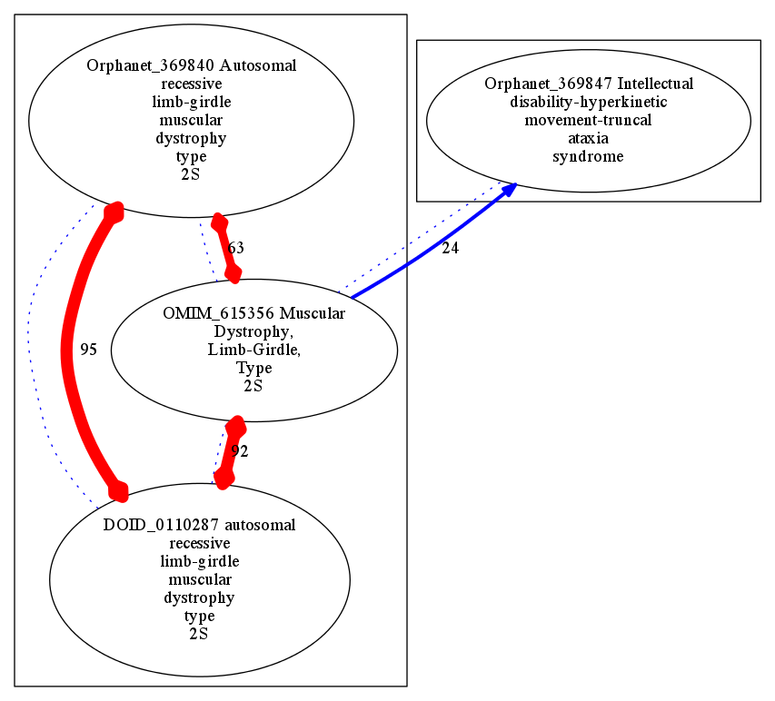

## MC<llerian aplasia and hyperandrogenism -> Mayer-Rokitansky-KC<ster-Hauser syndrome

 * [MC<llerian aplasia and hyperandrogenism](http://purl.obolibrary.org/obo/Orphanet_247768) __SubClassOf__ [Mayer-Rokitansky-KC<ster-Hauser syndrome](http://purl.obolibrary.org/obo/Orphanet_3109)

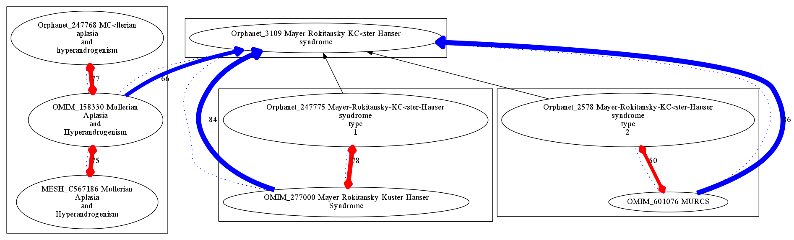

## PEHO-like syndrome -> PEHO syndrome

 * [PEHO-like syndrome](http://purl.obolibrary.org/obo/Orphanet_99807) __SubClassOf__ [PEHO syndrome](http://purl.obolibrary.org/obo/Orphanet_2836)

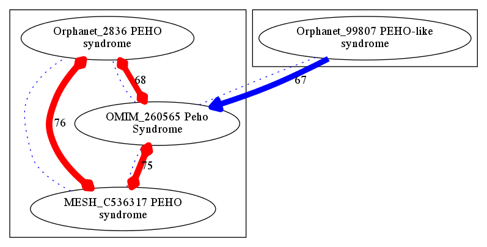

## Southeast Asian ovalocytosis -> Hereditary elliptocytosis

 * [Southeast Asian ovalocytosis](http://purl.obolibrary.org/obo/Orphanet_98868) __SubClassOf__ [Hereditary elliptocytosis](http://purl.obolibrary.org/obo/Orphanet_288)

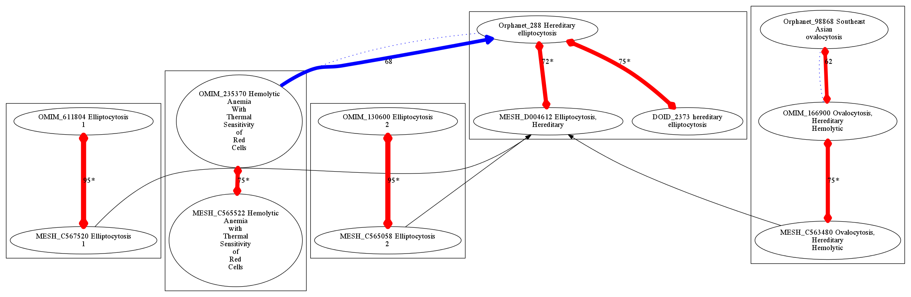

## Glaucoma-ectopia-microspherophakia-stiff joints-short stature syndrome -> Weill-Marchesani syndrome

 * [Glaucoma-ectopia-microspherophakia-stiff joints-short stature syndrome](http://purl.obolibrary.org/obo/Orphanet_2084) __SubClassOf__ [Weill-Marchesani syndrome](http://purl.obolibrary.org/obo/Orphanet_3449)

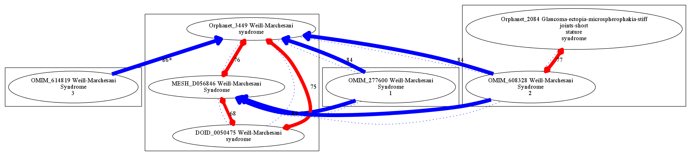

## Parkinsonism due to ATP13A2 deficiency -> Kufor-Rakeb syndrome

 * [Parkinsonism due to ATP13A2 deficiency](http://purl.obolibrary.org/obo/Orphanet_314632) __SubClassOf__ [Kufor-Rakeb syndrome](http://purl.obolibrary.org/obo/Orphanet_306674)

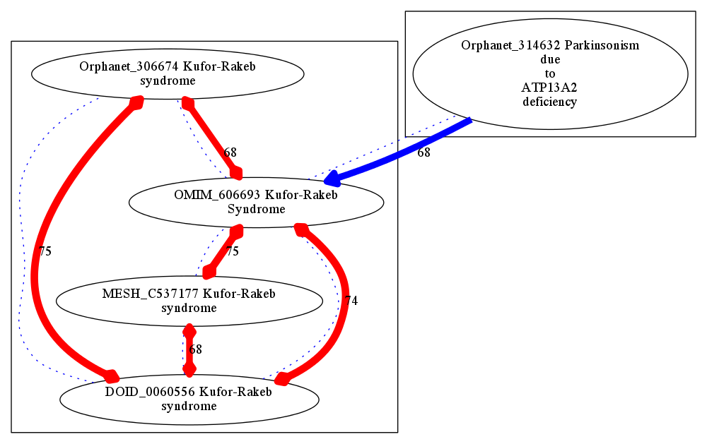

## Severe early-onset pulmonary alveolar proteinosis due to MARS deficiency -> Acute infantile liver failure-multisystemic involvement syndrome

 * [Severe early-onset pulmonary alveolar proteinosis due to MARS deficiency](http://purl.obolibrary.org/obo/Orphanet_440427) __SubClassOf__ [Acute infantile liver failure-multisystemic involvement syndrome](http://purl.obolibrary.org/obo/Orphanet_370088)

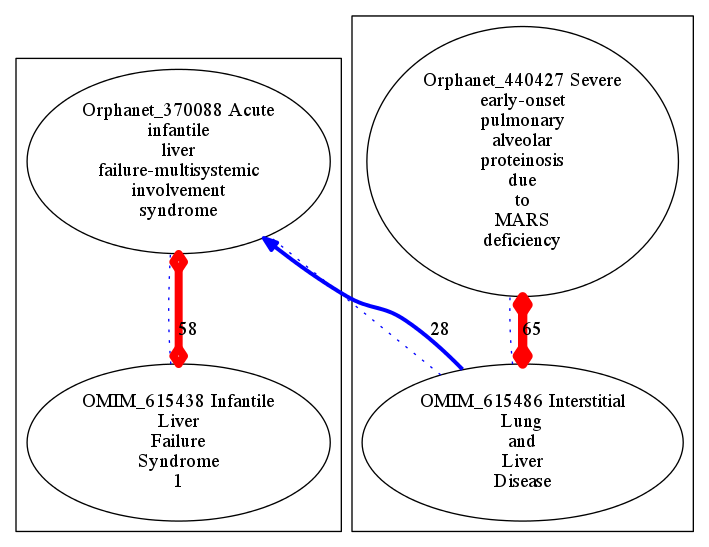

## Nodular lymphocyte predominant Hodgkin lymphoma -> Classic Hodgkin lymphoma

 * [Nodular lymphocyte predominant Hodgkin lymphoma](http://purl.obolibrary.org/obo/Orphanet_86893) __SubClassOf__ [Classic Hodgkin lymphoma](http://purl.obolibrary.org/obo/Orphanet_391)

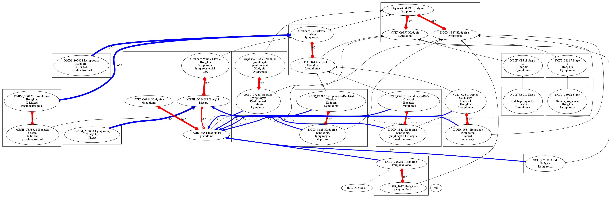

## Nodular lymphocyte predominant Hodgkin lymphoma -> Classic Hodgkin lymphoma, lymphocyte-rich type

 * [Nodular lymphocyte predominant Hodgkin lymphoma](http://purl.obolibrary.org/obo/Orphanet_86893) __SubClassOf__ [Classic Hodgkin lymphoma, lymphocyte-rich type](http://purl.obolibrary.org/obo/Orphanet_98845)

## Isolated congenital digital clubbing -> Primary hypertrophic osteoarthropathy

 * [Isolated congenital digital clubbing](http://purl.obolibrary.org/obo/Orphanet_217059) __SubClassOf__ [Primary hypertrophic osteoarthropathy](http://purl.obolibrary.org/obo/Orphanet_248095)

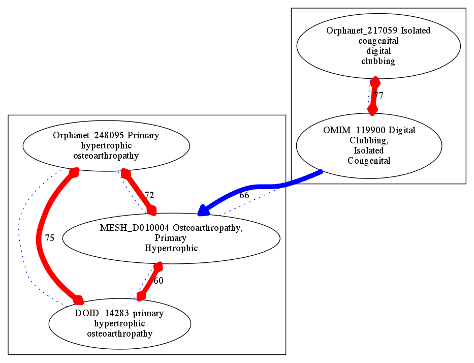

## Progressive epilepsy-intellectual disability syndrome, Finnish type -> Late infantile neuronal ceroid lipofuscinosis

 * [Progressive epilepsy-intellectual disability syndrome, Finnish type](http://purl.obolibrary.org/obo/Orphanet_1947) __SubClassOf__ [Late infantile neuronal ceroid lipofuscinosis](http://purl.obolibrary.org/obo/Orphanet_168491)

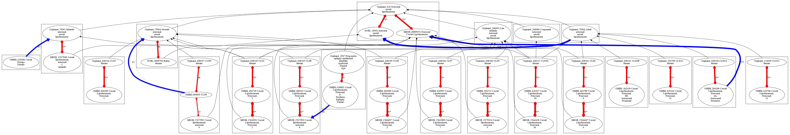

## Progressive epilepsy-intellectual disability syndrome, Finnish type -> CLN8 disease

 * [Progressive epilepsy-intellectual disability syndrome, Finnish type](http://purl.obolibrary.org/obo/Orphanet_1947) __SubClassOf__ [CLN8 disease](http://purl.obolibrary.org/obo/Orphanet_228354)

## Progressive epilepsy-intellectual disability syndrome, Finnish type -> Juvenile neuronal ceroid lipofuscinosis

 * [Progressive epilepsy-intellectual disability syndrome, Finnish type](http://purl.obolibrary.org/obo/Orphanet_1947) __SubClassOf__ [Juvenile neuronal ceroid lipofuscinosis](http://purl.obolibrary.org/obo/Orphanet_79264)

## Classic multiminicore myopathy -> Central core disease

 * [Classic multiminicore myopathy](http://purl.obolibrary.org/obo/Orphanet_324604) __SubClassOf__ [Central core disease](http://purl.obolibrary.org/obo/Orphanet_597)

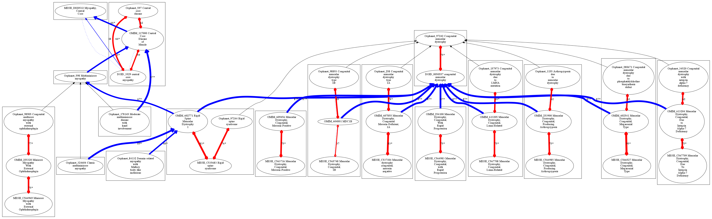

## Rigid spine syndrome -> Central core disease

 * [Rigid spine syndrome](http://purl.obolibrary.org/obo/Orphanet_97244) __SubClassOf__ [Central core disease](http://purl.obolibrary.org/obo/Orphanet_597)

## Multiminicore myopathy -> Central core disease

 * [Multiminicore myopathy](http://purl.obolibrary.org/obo/Orphanet_598) __SubClassOf__ [Central core disease](http://purl.obolibrary.org/obo/Orphanet_597)

## Moderate multiminicore disease with hand involvement -> Central core disease

 * [Moderate multiminicore disease with hand involvement](http://purl.obolibrary.org/obo/Orphanet_178145) __SubClassOf__ [Central core disease](http://purl.obolibrary.org/obo/Orphanet_597)

## Desmin-related myopathy with Mallory body-like inclusions -> Central core disease

 * [Desmin-related myopathy with Mallory body-like inclusions](http://purl.obolibrary.org/obo/Orphanet_84132) __SubClassOf__ [Central core disease](http://purl.obolibrary.org/obo/Orphanet_597)

## Congenital multicore myopathy with external ophthalmoplegia -> Central core disease

 * [Congenital multicore myopathy with external ophthalmoplegia](http://purl.obolibrary.org/obo/Orphanet_98905) __SubClassOf__ [Central core disease](http://purl.obolibrary.org/obo/Orphanet_597)

## Juvenile dermatomyositis -> Dermatomyositis

 * [Juvenile dermatomyositis](http://purl.obolibrary.org/obo/Orphanet_93672) __SubClassOf__ [Dermatomyositis](http://purl.obolibrary.org/obo/Orphanet_221)

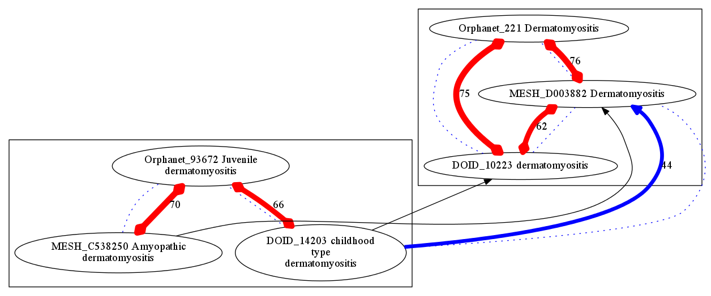

## Pseudohypoparathyroidism type 1B -> Pseudohypoaldosteronism

 * [Pseudohypoparathyroidism type 1B](http://purl.obolibrary.org/obo/Orphanet_94089) __SubClassOf__ [Pseudohypoaldosteronism](http://purl.obolibrary.org/obo/Orphanet_444916)

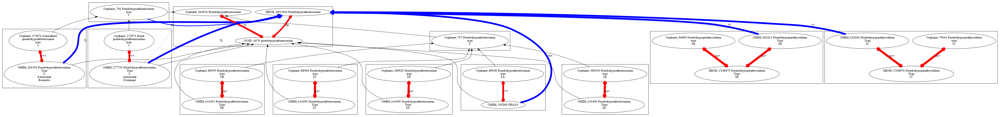

## Pseudohypoparathyroidism type 1C -> Pseudohypoaldosteronism

 * [Pseudohypoparathyroidism type 1C](http://purl.obolibrary.org/obo/Orphanet_79444) __SubClassOf__ [Pseudohypoaldosteronism](http://purl.obolibrary.org/obo/Orphanet_444916)

## Cranio-osteoarthropathy -> Pachydermoperiostosis

 * [Cranio-osteoarthropathy](http://purl.obolibrary.org/obo/Orphanet_1525) __SubClassOf__ [Pachydermoperiostosis](http://purl.obolibrary.org/obo/Orphanet_2796)

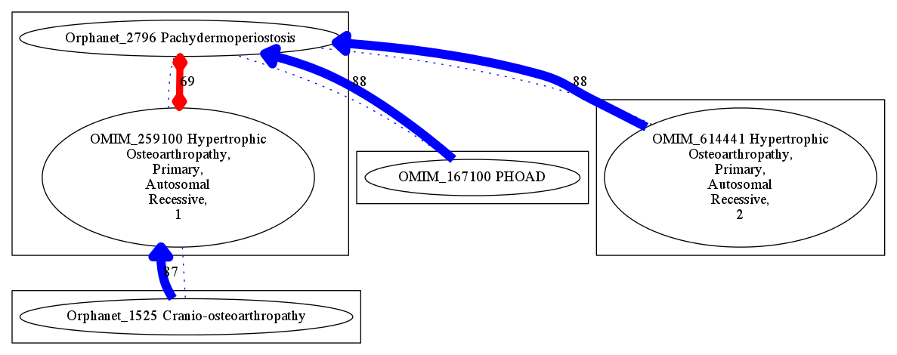

## Non-Langerhans cell histiocytosis -> Systemic non-Langerhans cell histiocytosis

 * [Non-Langerhans cell histiocytosis](http://purl.obolibrary.org/obo/Orphanet_157987) __SubClassOf__ [Systemic non-Langerhans cell histiocytosis](http://purl.obolibrary.org/obo/Orphanet_240266)

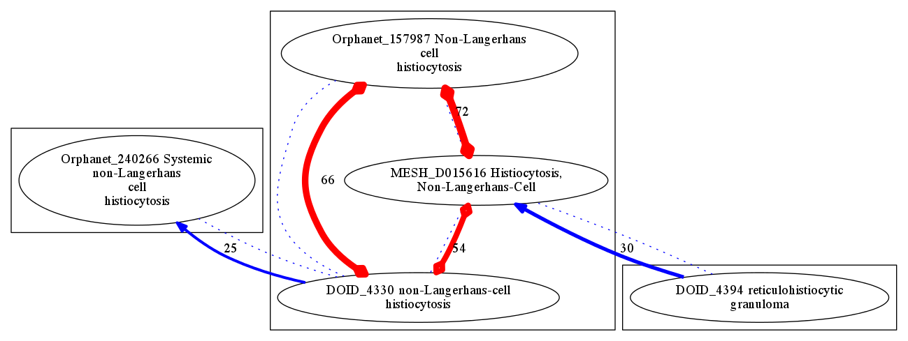

## Alpha-N-acetylgalactosaminidase deficiency type 2 -> Alpha-N-acetylgalactosaminidase deficiency type 1

 * [Alpha-N-acetylgalactosaminidase deficiency type 2](http://purl.obolibrary.org/obo/Orphanet_79280) __SubClassOf__ [Alpha-N-acetylgalactosaminidase deficiency type 1](http://purl.obolibrary.org/obo/Orphanet_79279)

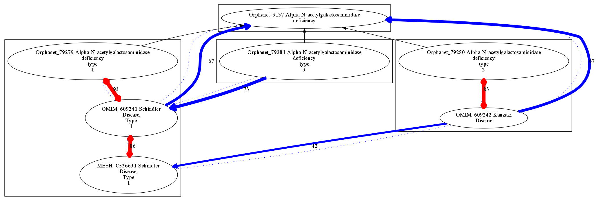

## Alpha-N-acetylgalactosaminidase deficiency type 3 -> Alpha-N-acetylgalactosaminidase deficiency type 1

 * [Alpha-N-acetylgalactosaminidase deficiency type 3](http://purl.obolibrary.org/obo/Orphanet_79281) __SubClassOf__ [Alpha-N-acetylgalactosaminidase deficiency type 1](http://purl.obolibrary.org/obo/Orphanet_79279)

## Hb Bart's hydrops fetalis -> Hydrops fetalis

 * [Hb Bart's hydrops fetalis](http://purl.obolibrary.org/obo/Orphanet_163596) __SubClassOf__ [Hydrops fetalis](http://purl.obolibrary.org/obo/Orphanet_1041)

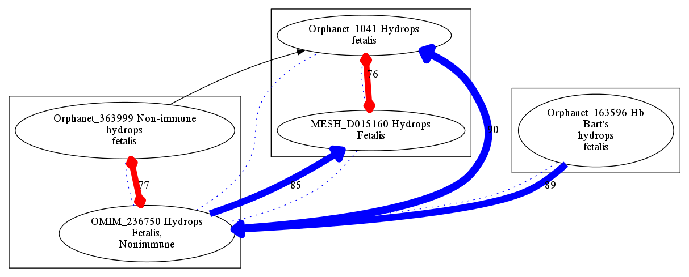

## Hb Bart's hydrops fetalis -> Non-immune hydrops fetalis

 * [Hb Bart's hydrops fetalis](http://purl.obolibrary.org/obo/Orphanet_163596) __SubClassOf__ [Non-immune hydrops fetalis](http://purl.obolibrary.org/obo/Orphanet_363999)

## Rare renal tumor -> Genetic renal tumor

 * [Rare renal tumor](http://purl.obolibrary.org/obo/Orphanet_93619) __SubClassOf__ [Genetic renal tumor](http://purl.obolibrary.org/obo/Orphanet_183595)

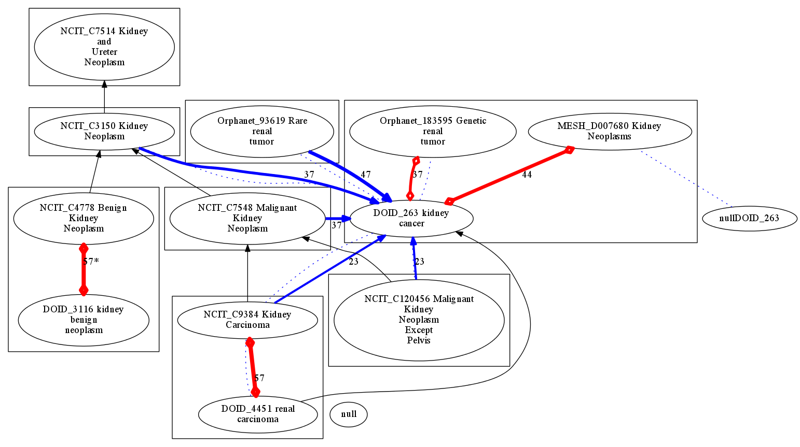

## Adult T-cell leukemia/lymphoma -> Precursor T-cell acute lymphoblastic leukemia

 * [Adult T-cell leukemia/lymphoma](http://purl.obolibrary.org/obo/Orphanet_86875) __SubClassOf__ [Precursor T-cell acute lymphoblastic leukemia](http://purl.obolibrary.org/obo/Orphanet_99861)

## Sialidosis type 1 -> Sialidosis type 2

 * [Sialidosis type 1](http://purl.obolibrary.org/obo/Orphanet_812) __SubClassOf__ [Sialidosis type 2](http://purl.obolibrary.org/obo/Orphanet_87876)

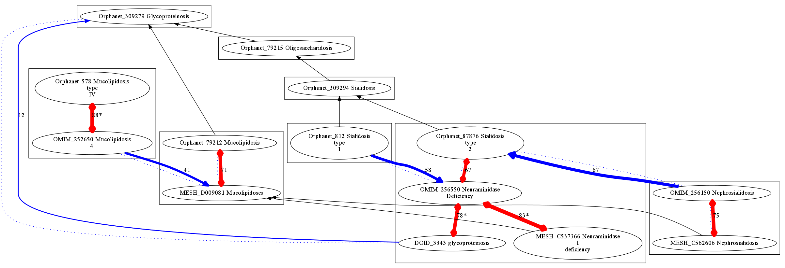

## Sialidosis type 1 -> Mucolipidosis

 * [Sialidosis type 1](http://purl.obolibrary.org/obo/Orphanet_812) __SubClassOf__ [Mucolipidosis](http://purl.obolibrary.org/obo/Orphanet_79212)

## Mucolipidosis type IV -> Glycoproteinosis

 * [Mucolipidosis type IV](http://purl.obolibrary.org/obo/Orphanet_578) __SubClassOf__ [Glycoproteinosis](http://purl.obolibrary.org/obo/Orphanet_309279)

## Mucolipidosis type IV -> Mucolipidosis

 * [Mucolipidosis type IV](http://purl.obolibrary.org/obo/Orphanet_578) __SubClassOf__ [Mucolipidosis](http://purl.obolibrary.org/obo/Orphanet_79212)

## Sialidosis type 2 -> Mucolipidosis

 * [Sialidosis type 2](http://purl.obolibrary.org/obo/Orphanet_87876) __SubClassOf__ [Mucolipidosis](http://purl.obolibrary.org/obo/Orphanet_79212)

## Haddad syndrome -> Ondine syndrome

 * [Haddad syndrome](http://purl.obolibrary.org/obo/Orphanet_99803) __SubClassOf__ [Ondine syndrome](http://purl.obolibrary.org/obo/Orphanet_661)

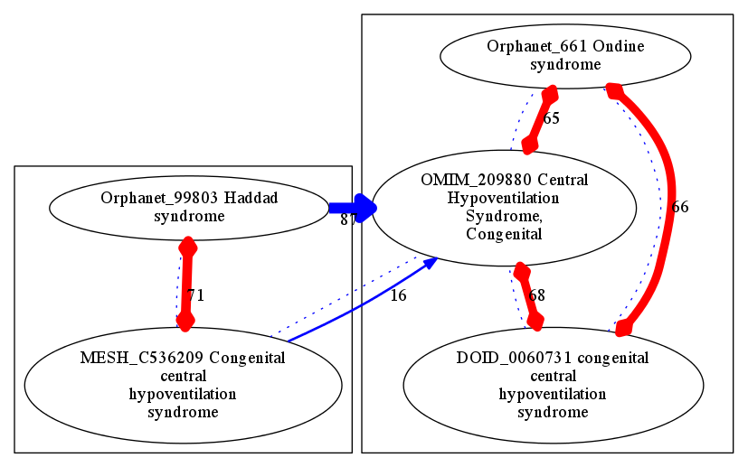

## Constitutional mismatch repair deficiency syndrome -> Non-polyposis Turcot syndrome

 * [Constitutional mismatch repair deficiency syndrome](http://purl.obolibrary.org/obo/Orphanet_252202) __SubClassOf__ [Non-polyposis Turcot syndrome](http://purl.obolibrary.org/obo/Orphanet_99817)

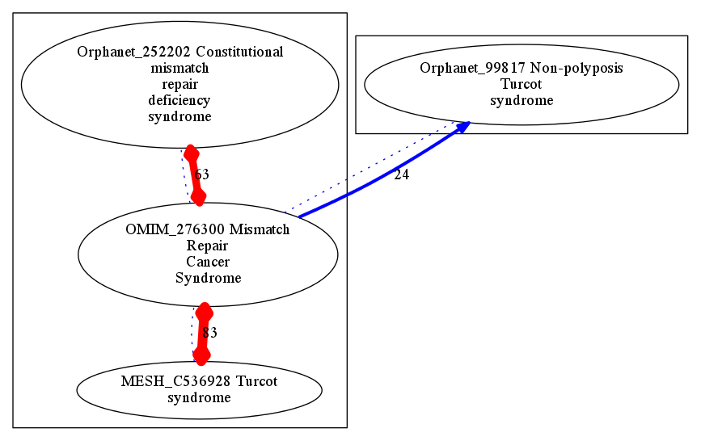

## Oguchi disease -> Congenital stationary night blindness

 * [Oguchi disease](http://purl.obolibrary.org/obo/Orphanet_75382) __SubClassOf__ [Congenital stationary night blindness](http://purl.obolibrary.org/obo/Orphanet_215)

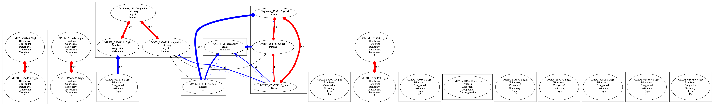

## Benign familial chorea -> Paroxysmal dyskinesia

 * [Benign familial chorea](http://purl.obolibrary.org/obo/Orphanet_1429) __SubClassOf__ [Paroxysmal dyskinesia](http://purl.obolibrary.org/obo/Orphanet_1431)

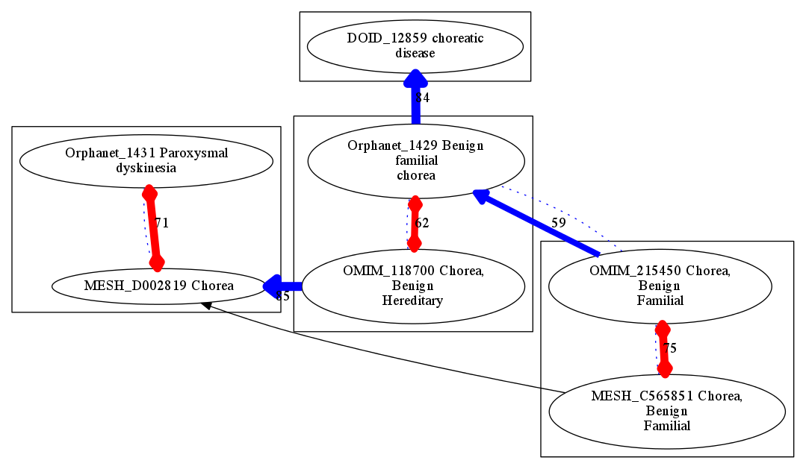

## Non-syndromic pontocerebellar hypoplasia -> Paroxysmal cold hemoglobinuria

 * [Non-syndromic pontocerebellar hypoplasia](http://purl.obolibrary.org/obo/Orphanet_98523) __SubClassOf__ [Paroxysmal cold hemoglobinuria](http://purl.obolibrary.org/obo/Orphanet_90035)

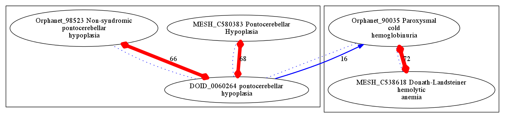

## Ito hypomelanosis -> Incontinentia pigmenti

 * [Ito hypomelanosis](http://purl.obolibrary.org/obo/Orphanet_435) __SubClassOf__ [Incontinentia pigmenti](http://purl.obolibrary.org/obo/Orphanet_464)

## Odontoleukodystrophy -> Hypomyelination-cerebellar atrophy-hypoplasia of the corpus callosum syndrome

 * [Odontoleukodystrophy](http://purl.obolibrary.org/obo/Orphanet_77295) __SubClassOf__ [Hypomyelination-cerebellar atrophy-hypoplasia of the corpus callosum syndrome](http://purl.obolibrary.org/obo/Orphanet_447893)

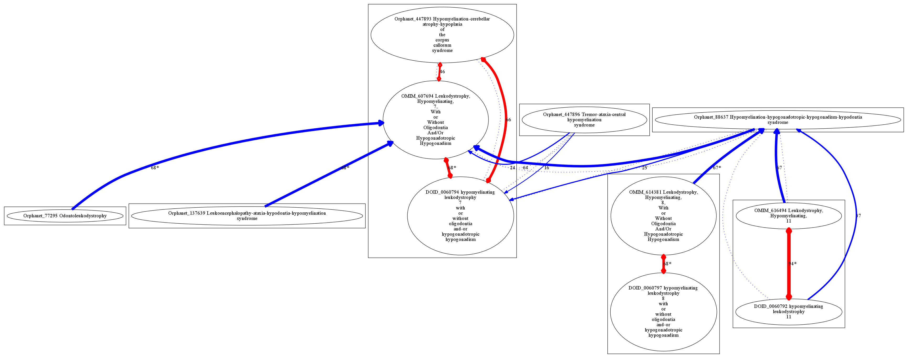

## Leukoencephalopathy-ataxia-hypodontia-hypomyelination syndrome -> Hypomyelination-cerebellar atrophy-hypoplasia of the corpus callosum syndrome

 * [Leukoencephalopathy-ataxia-hypodontia-hypomyelination syndrome](http://purl.obolibrary.org/obo/Orphanet_137639) __SubClassOf__ [Hypomyelination-cerebellar atrophy-hypoplasia of the corpus callosum syndrome](http://purl.obolibrary.org/obo/Orphanet_447893)

## Tremor-ataxia-central hypomyelination syndrome -> Hypomyelination-cerebellar atrophy-hypoplasia of the corpus callosum syndrome

 * [Tremor-ataxia-central hypomyelination syndrome](http://purl.obolibrary.org/obo/Orphanet_447896) __SubClassOf__ [Hypomyelination-cerebellar atrophy-hypoplasia of the corpus callosum syndrome](http://purl.obolibrary.org/obo/Orphanet_447893)

## Hypomyelination-hypogonadotropic-hypogonadism-hypodontia syndrome -> Hypomyelination-cerebellar atrophy-hypoplasia of the corpus callosum syndrome

 * [Hypomyelination-hypogonadotropic-hypogonadism-hypodontia syndrome](http://purl.obolibrary.org/obo/Orphanet_88637) __SubClassOf__ [Hypomyelination-cerebellar atrophy-hypoplasia of the corpus callosum syndrome](http://purl.obolibrary.org/obo/Orphanet_447893)

## Carnosinemia -> Homocarnosinosis

 * [Carnosinemia](http://purl.obolibrary.org/obo/Orphanet_1361) __SubClassOf__ [Homocarnosinosis](http://purl.obolibrary.org/obo/Orphanet_2168)

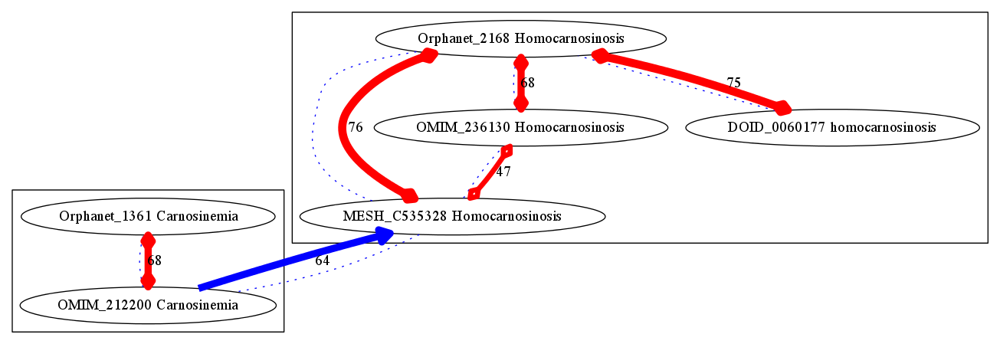

## Autosomal dominant limb-girdle muscular dystrophy type 1E -> Autosomal dominant limb-girdle muscular dystrophy type 1D

 * [Autosomal dominant limb-girdle muscular dystrophy type 1E](http://purl.obolibrary.org/obo/Orphanet_34517) __SubClassOf__ [Autosomal dominant limb-girdle muscular dystrophy type 1D](http://purl.obolibrary.org/obo/Orphanet_34516)

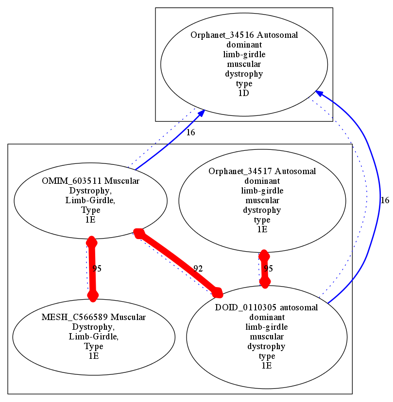

## Narcolepsy-cataplexy -> Narcolepsy without cataplexy

 * [Narcolepsy-cataplexy](http://purl.obolibrary.org/obo/Orphanet_2073) __SubClassOf__ [Narcolepsy without cataplexy](http://purl.obolibrary.org/obo/Orphanet_83465)

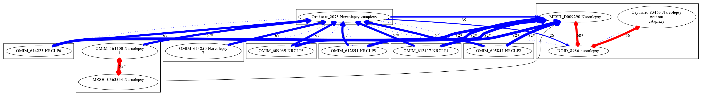

## Hypochondrogenesis -> Achondrogenesis type 2

 * [Hypochondrogenesis](http://purl.obolibrary.org/obo/Orphanet_93297) __SubClassOf__ [Achondrogenesis type 2](http://purl.obolibrary.org/obo/Orphanet_93296)

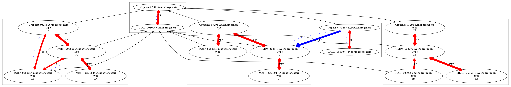

## Autoimmune lymphoproliferative syndrome with recurrent viral infections -> Autoimmune lymphoproliferative syndrome

 * [Autoimmune lymphoproliferative syndrome with recurrent viral infections](http://purl.obolibrary.org/obo/Orphanet_275517) __SubClassOf__ [Autoimmune lymphoproliferative syndrome](http://purl.obolibrary.org/obo/Orphanet_3261)

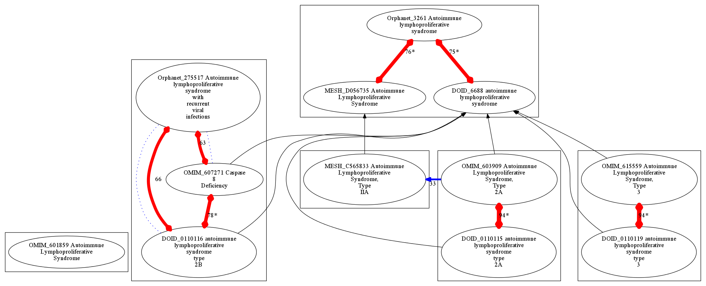

## Autosomal dominant Charcot-Marie-Tooth disease type 2 due to TFG mutation -> Charcot-Marie-Tooth disease type 2S

 * [Autosomal dominant Charcot-Marie-Tooth disease type 2 due to TFG mutation](http://purl.obolibrary.org/obo/Orphanet_435819) __SubClassOf__ [Charcot-Marie-Tooth disease type 2S](http://purl.obolibrary.org/obo/Orphanet_443073)

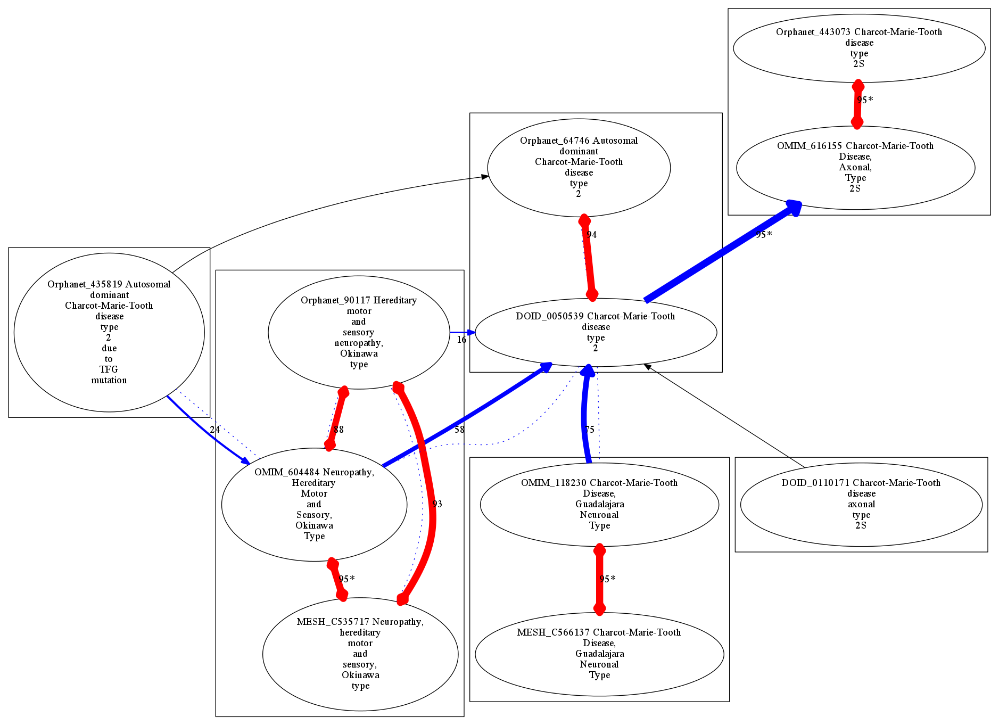

## Autosomal dominant Charcot-Marie-Tooth disease type 2 due to TFG mutation -> Hereditary motor and sensory neuropathy, Okinawa type

 * [Autosomal dominant Charcot-Marie-Tooth disease type 2 due to TFG mutation](http://purl.obolibrary.org/obo/Orphanet_435819) __SubClassOf__ [Hereditary motor and sensory neuropathy, Okinawa type](http://purl.obolibrary.org/obo/Orphanet_90117)

## Hereditary motor and sensory neuropathy, Okinawa type -> Charcot-Marie-Tooth disease type 2S

 * [Hereditary motor and sensory neuropathy, Okinawa type](http://purl.obolibrary.org/obo/Orphanet_90117) __SubClassOf__ [Charcot-Marie-Tooth disease type 2S](http://purl.obolibrary.org/obo/Orphanet_443073)

## Hereditary motor and sensory neuropathy, Okinawa type -> Autosomal dominant Charcot-Marie-Tooth disease type 2

 * [Hereditary motor and sensory neuropathy, Okinawa type](http://purl.obolibrary.org/obo/Orphanet_90117) __SubClassOf__ [Autosomal dominant Charcot-Marie-Tooth disease type 2](http://purl.obolibrary.org/obo/Orphanet_64746)

## Autosomal dominant Charcot-Marie-Tooth disease type 2 -> Charcot-Marie-Tooth disease type 2S

 * [Autosomal dominant Charcot-Marie-Tooth disease type 2](http://purl.obolibrary.org/obo/Orphanet_64746) __SubClassOf__ [Charcot-Marie-Tooth disease type 2S](http://purl.obolibrary.org/obo/Orphanet_443073)

## Renal cysts and diabetes syndrome -> MODY

 * [Renal cysts and diabetes syndrome](http://purl.obolibrary.org/obo/Orphanet_93111) __SubClassOf__ [MODY](http://purl.obolibrary.org/obo/Orphanet_552)

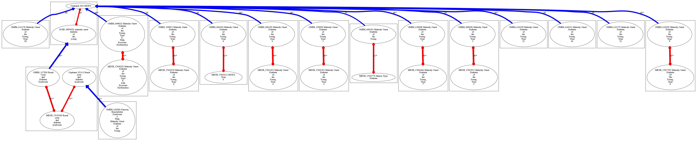

## Hereditary episodic ataxia -> Isaac syndrome

 * [Hereditary episodic ataxia](http://purl.obolibrary.org/obo/Orphanet_211062) __SubClassOf__ [Isaac syndrome](http://purl.obolibrary.org/obo/Orphanet_84142)

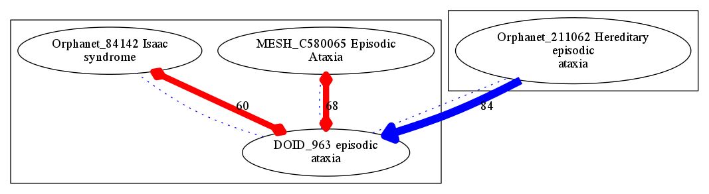

## BRESEK syndrome -> Ichthyosis follicularis-alopecia-photophobia syndrome

 * [BRESEK syndrome](http://purl.obolibrary.org/obo/Orphanet_85284) __SubClassOf__ [Ichthyosis follicularis-alopecia-photophobia syndrome](http://purl.obolibrary.org/obo/Orphanet_2273)

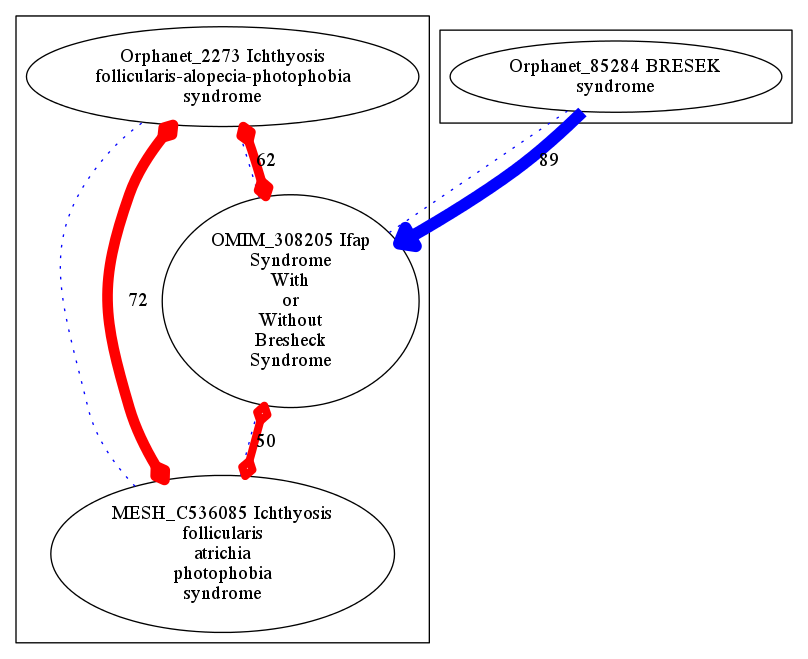

## Congenital total pulmonary venous return anomaly -> Scimitar syndrome

 * [Congenital total pulmonary venous return anomaly](http://purl.obolibrary.org/obo/Orphanet_99125) __SubClassOf__ [Scimitar syndrome](http://purl.obolibrary.org/obo/Orphanet_185)

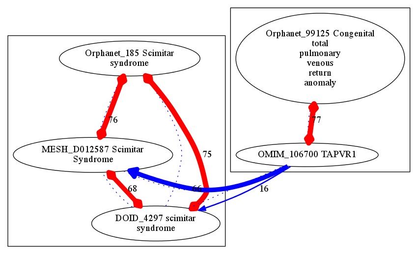

## Anodontia -> Oligodontia

 * [Anodontia](http://purl.obolibrary.org/obo/Orphanet_99797) __SubClassOf__ [Oligodontia](http://purl.obolibrary.org/obo/Orphanet_99798)

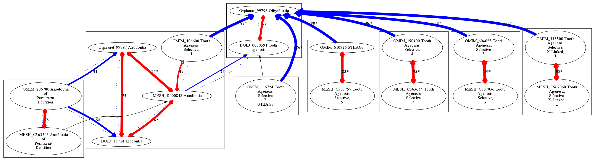

## Familial bicuspid aortic valve -> Congenital aortic valve stenosis

 * [Familial bicuspid aortic valve](http://purl.obolibrary.org/obo/Orphanet_402075) __SubClassOf__ [Congenital aortic valve stenosis](http://purl.obolibrary.org/obo/Orphanet_3093)

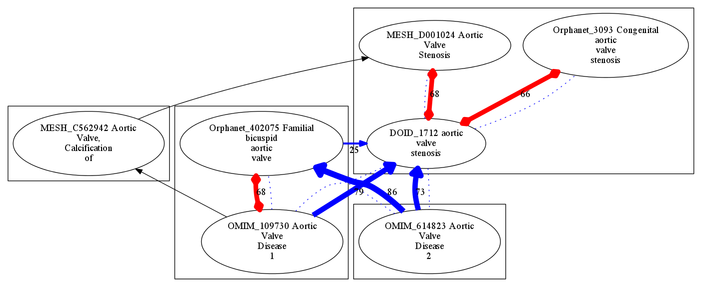

## Distal limb deficiencies-micrognathia syndrome -> Split hand-split foot malformation

 * [Distal limb deficiencies-micrognathia syndrome](http://purl.obolibrary.org/obo/Orphanet_1307) __SubClassOf__ [Split hand-split foot malformation](http://purl.obolibrary.org/obo/Orphanet_2440)

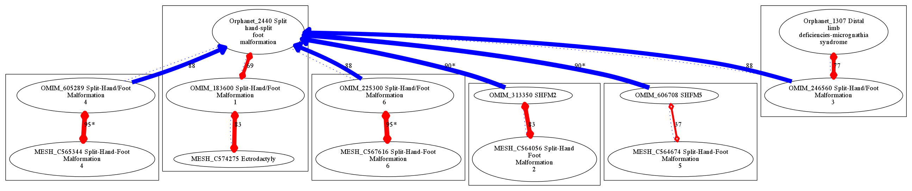

## Sporadic Creutzfeldt-Jakob disease -> Inherited Creutzfeldt-Jakob disease

 * [Sporadic Creutzfeldt-Jakob disease](http://purl.obolibrary.org/obo/Orphanet_204) __SubClassOf__ [Inherited Creutzfeldt-Jakob disease](http://purl.obolibrary.org/obo/Orphanet_282166)

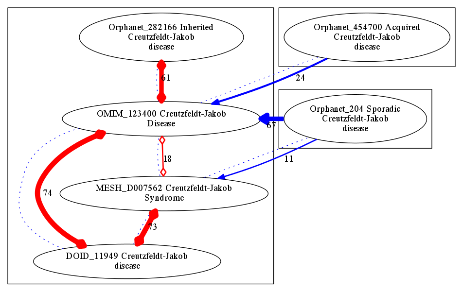

## Acquired Creutzfeldt-Jakob disease -> Inherited Creutzfeldt-Jakob disease

 * [Acquired Creutzfeldt-Jakob disease](http://purl.obolibrary.org/obo/Orphanet_454700) __SubClassOf__ [Inherited Creutzfeldt-Jakob disease](http://purl.obolibrary.org/obo/Orphanet_282166)

## Autosomal dominant hypocalcemia -> Bartter syndrome

 * [Autosomal dominant hypocalcemia](http://purl.obolibrary.org/obo/Orphanet_428) __SubClassOf__ [Bartter syndrome](http://purl.obolibrary.org/obo/Orphanet_112)

## Bartter syndrome with hypocalcemia -> Autosomal dominant hypocalcemia

 * [Bartter syndrome with hypocalcemia](http://purl.obolibrary.org/obo/Orphanet_263417) __SubClassOf__ [Autosomal dominant hypocalcemia](http://purl.obolibrary.org/obo/Orphanet_428)

## Bartter syndrome with hypocalcemia -> Familial isolated hypoparathyroidism

 * [Bartter syndrome with hypocalcemia](http://purl.obolibrary.org/obo/Orphanet_263417) __SubClassOf__ [Familial isolated hypoparathyroidism](http://purl.obolibrary.org/obo/Orphanet_2238)

## NDE1-related microhydranencephaly -> Sporadic fetal brain disruption sequence

 * [NDE1-related microhydranencephaly](http://purl.obolibrary.org/obo/Orphanet_443162) __SubClassOf__ [Sporadic fetal brain disruption sequence](http://purl.obolibrary.org/obo/Orphanet_1665)

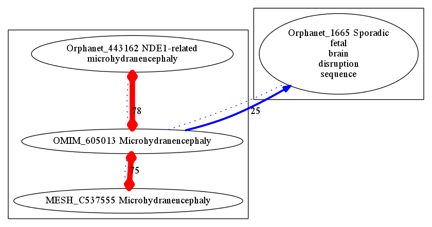

## Juvenile glaucoma -> Congenital glaucoma

 * [Juvenile glaucoma](http://purl.obolibrary.org/obo/Orphanet_98977) __SubClassOf__ [Congenital glaucoma](http://purl.obolibrary.org/obo/Orphanet_98976)

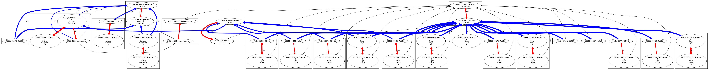

## Rabson-Mendenhall syndrome -> Leprechaunism

 * [Rabson-Mendenhall syndrome](http://purl.obolibrary.org/obo/Orphanet_769) __SubClassOf__ [Leprechaunism](http://purl.obolibrary.org/obo/Orphanet_508)

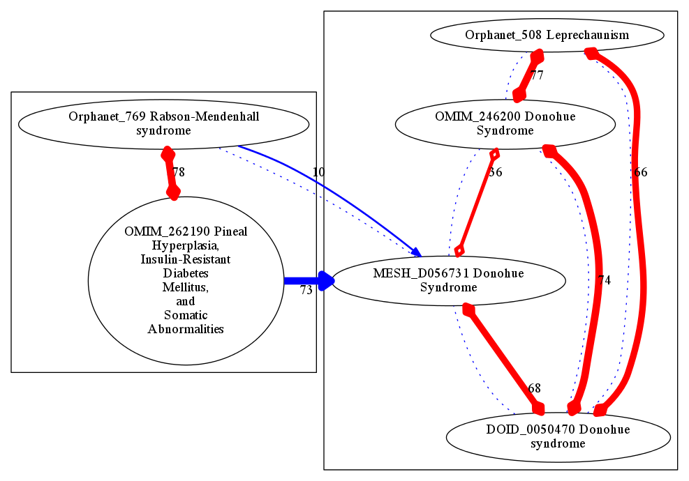

## Muscle-eye-brain disease -> Walker-Warburg syndrome

 * [Muscle-eye-brain disease](http://purl.obolibrary.org/obo/Orphanet_588) __SubClassOf__ [Walker-Warburg syndrome](http://purl.obolibrary.org/obo/Orphanet_899)

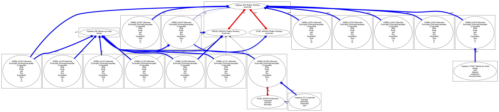

## Chondrodysplasia punctata, tibial-metacarpal type -> Autosomal dominant chondrodysplasia punctata

 * [Chondrodysplasia punctata, tibial-metacarpal type](http://purl.obolibrary.org/obo/Orphanet_79346) __SubClassOf__ [Autosomal dominant chondrodysplasia punctata](http://purl.obolibrary.org/obo/Orphanet_79344)

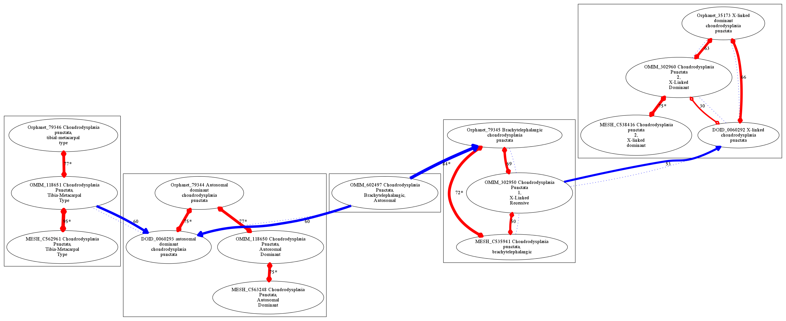

## Brachytelephalangic chondrodysplasia punctata -> X-linked dominant chondrodysplasia punctata

 * [Brachytelephalangic chondrodysplasia punctata](http://purl.obolibrary.org/obo/Orphanet_79345) __SubClassOf__ [X-linked dominant chondrodysplasia punctata](http://purl.obolibrary.org/obo/Orphanet_35173)

## Parkinsonian-pyramidal syndrome -> Hereditary late-onset Parkinson disease

 * [Parkinsonian-pyramidal syndrome](http://purl.obolibrary.org/obo/Orphanet_171695) __SubClassOf__ [Hereditary late-onset Parkinson disease](http://purl.obolibrary.org/obo/Orphanet_411602)

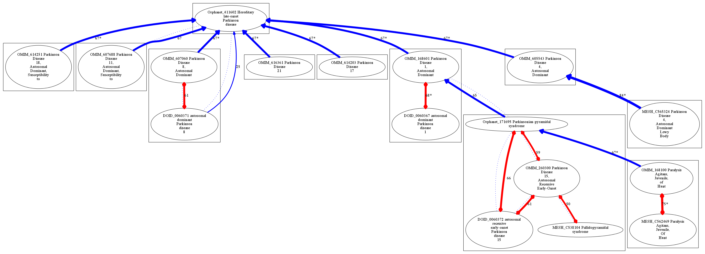

## Lamellar ichthyosis -> Congenital non-bullous ichthyosiform erythroderma

 * [Lamellar ichthyosis](http://purl.obolibrary.org/obo/Orphanet_313) __SubClassOf__ [Congenital non-bullous ichthyosiform erythroderma](http://purl.obolibrary.org/obo/Orphanet_79394)

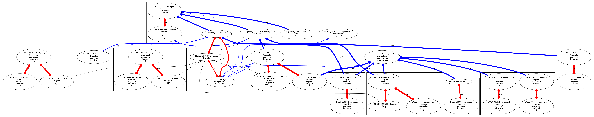

## Branchio-oculo-facial syndrome -> BOR syndrome

 * [Branchio-oculo-facial syndrome](http://purl.obolibrary.org/obo/Orphanet_1297) __SubClassOf__ [BOR syndrome](http://purl.obolibrary.org/obo/Orphanet_107)

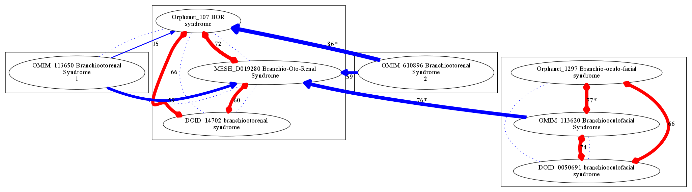

## Familial apolipoprotein C-II deficiency -> Familial lipoprotein lipase deficiency

 * [Familial apolipoprotein C-II deficiency](http://purl.obolibrary.org/obo/Orphanet_309020) __SubClassOf__ [Familial lipoprotein lipase deficiency](http://purl.obolibrary.org/obo/Orphanet_309015)

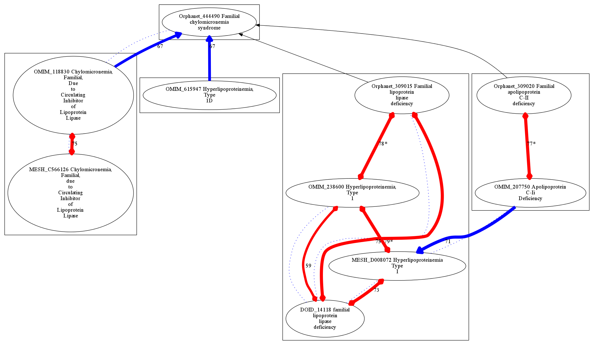

## Wolman disease -> Cholesteryl ester storage disease

 * [Wolman disease](http://purl.obolibrary.org/obo/Orphanet_75233) __SubClassOf__ [Cholesteryl ester storage disease](http://purl.obolibrary.org/obo/Orphanet_75234)

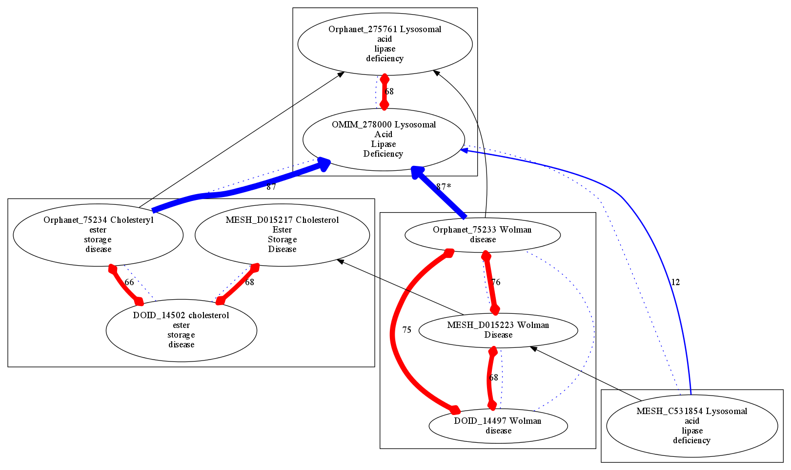

## Familial multiple meningioma -> Meningioma

 * [Familial multiple meningioma](http://purl.obolibrary.org/obo/Orphanet_263662) __SubClassOf__ [Meningioma](http://purl.obolibrary.org/obo/Orphanet_2495)

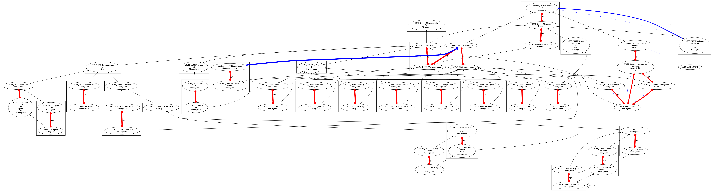

## Juvenile absence epilepsy -> Juvenile myoclonic epilepsy

 * [Juvenile absence epilepsy](http://purl.obolibrary.org/obo/Orphanet_1941) __SubClassOf__ [Juvenile myoclonic epilepsy](http://purl.obolibrary.org/obo/Orphanet_307)

## Familial multiple trichoepithelioma -> Familial cylindromatosis

 * [Familial multiple trichoepithelioma](http://purl.obolibrary.org/obo/Orphanet_867) __SubClassOf__ [Familial cylindromatosis](http://purl.obolibrary.org/obo/Orphanet_211)

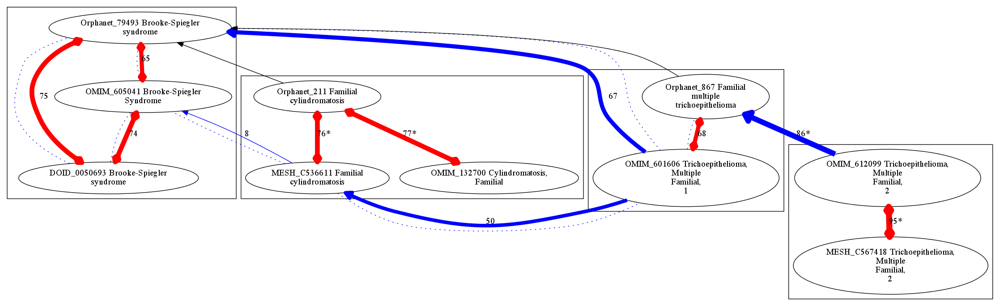

## Idiopathic steroid-sensitive nephrotic syndrome -> Familial idiopathic steroid-resistant nephrotic syndrome

 * [Idiopathic steroid-sensitive nephrotic syndrome](http://purl.obolibrary.org/obo/Orphanet_69061) __SubClassOf__ [Familial idiopathic steroid-resistant nephrotic syndrome](http://purl.obolibrary.org/obo/Orphanet_656)

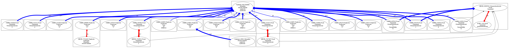

## Williams syndrome -> Supravalvular aortic stenosis

 * [Williams syndrome](http://purl.obolibrary.org/obo/Orphanet_904) __SubClassOf__ [Supravalvular aortic stenosis](http://purl.obolibrary.org/obo/Orphanet_3193)

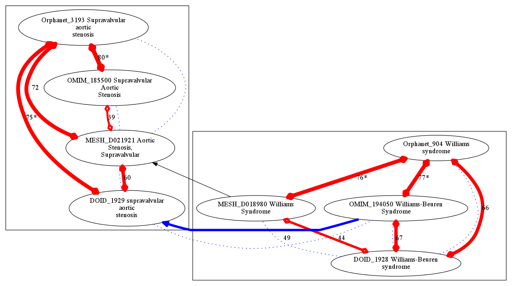

## Focal facial dermal dysplasia type III -> Focal facial dermal dysplasia type I

 * [Focal facial dermal dysplasia type III](http://purl.obolibrary.org/obo/Orphanet_1807) __SubClassOf__ [Focal facial dermal dysplasia type I](http://purl.obolibrary.org/obo/Orphanet_79133)

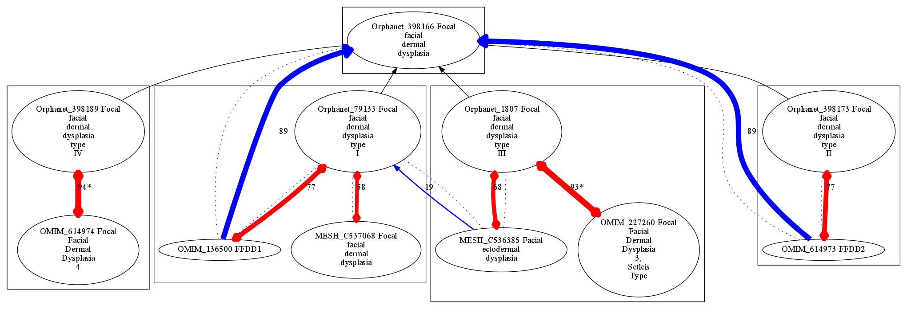

## Renal tubulopathy-encephalopathy-liver failure syndrome -> Isolated CoQ-cytochrome C reductase deficiency

 * [Renal tubulopathy-encephalopathy-liver failure syndrome](http://purl.obolibrary.org/obo/Orphanet_254902) __SubClassOf__ [Isolated CoQ-cytochrome C reductase deficiency](http://purl.obolibrary.org/obo/Orphanet_1460)

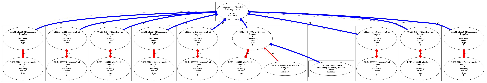

## Temperature-sensitive oculocutaneous albinism type 1 -> Oculocutaneous albinism type 1B

 * [Temperature-sensitive oculocutaneous albinism type 1](http://purl.obolibrary.org/obo/Orphanet_352737) __SubClassOf__ [Oculocutaneous albinism type 1B](http://purl.obolibrary.org/obo/Orphanet_79434)

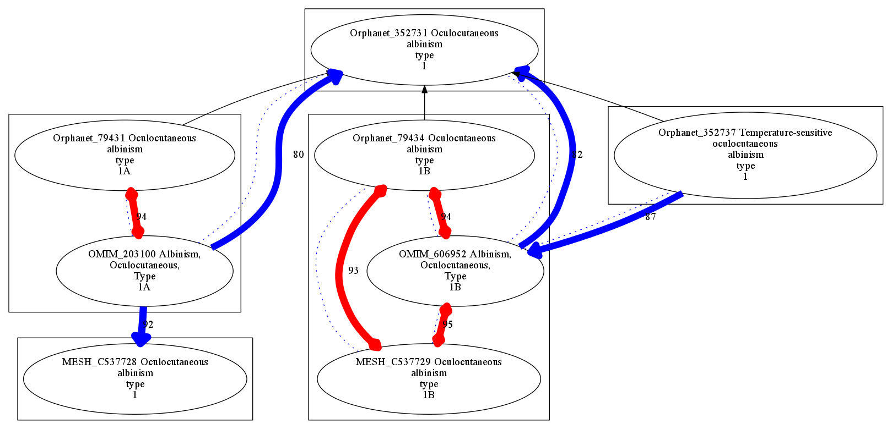

## Familial mesial temporal lobe epilepsy with febrile seizures -> Benign familial mesial temporal lobe epilepsy

 * [Familial mesial temporal lobe epilepsy with febrile seizures](http://purl.obolibrary.org/obo/Orphanet_165805) __SubClassOf__ [Benign familial mesial temporal lobe epilepsy](http://purl.obolibrary.org/obo/Orphanet_163717)

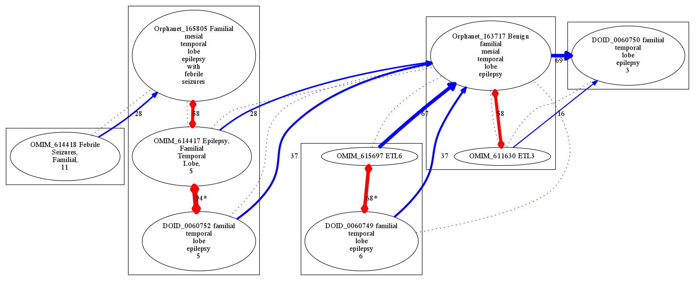

## Joubert syndrome with renal defect -> Joubert syndrome

 * [Joubert syndrome with renal defect](http://purl.obolibrary.org/obo/Orphanet_220497) __SubClassOf__ [Joubert syndrome](http://purl.obolibrary.org/obo/Orphanet_475)

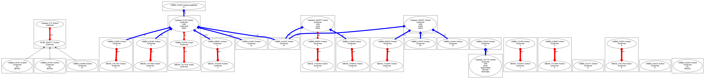

## Acute interstitial pneumonia -> Idiopathic pulmonary fibrosis

 * [Acute interstitial pneumonia](http://purl.obolibrary.org/obo/Orphanet_79126) __SubClassOf__ [Idiopathic pulmonary fibrosis](http://purl.obolibrary.org/obo/Orphanet_2032)

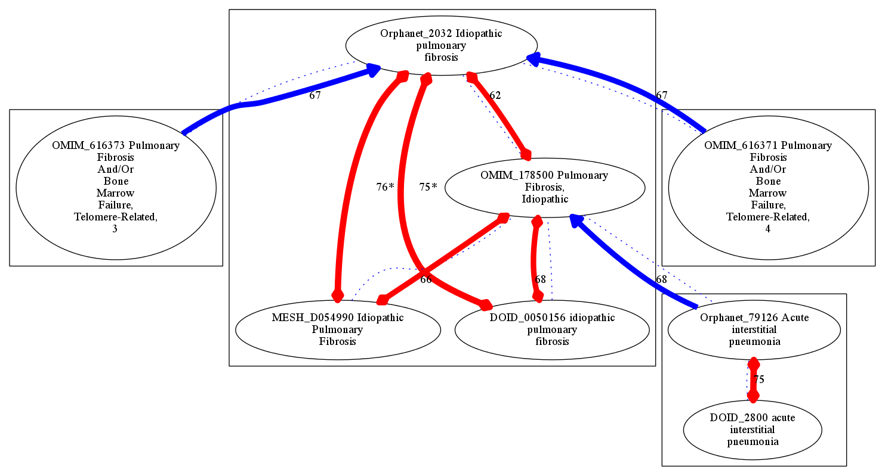

## COASY protein-associated neurodegeneration -> Pantothenate kinase-associated neurodegeneration

 * [COASY protein-associated neurodegeneration](http://purl.obolibrary.org/obo/Orphanet_397725) __SubClassOf__ [Pantothenate kinase-associated neurodegeneration](http://purl.obolibrary.org/obo/Orphanet_157850)

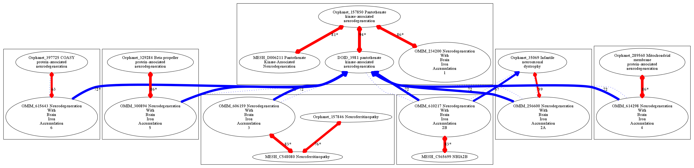

## Neuroferritinopathy -> Pantothenate kinase-associated neurodegeneration

 * [Neuroferritinopathy](http://purl.obolibrary.org/obo/Orphanet_157846) __SubClassOf__ [Pantothenate kinase-associated neurodegeneration](http://purl.obolibrary.org/obo/Orphanet_157850)

## Mitochondrial membrane protein-associated neurodegeneration -> Pantothenate kinase-associated neurodegeneration

 * [Mitochondrial membrane protein-associated neurodegeneration](http://purl.obolibrary.org/obo/Orphanet_289560) __SubClassOf__ [Pantothenate kinase-associated neurodegeneration](http://purl.obolibrary.org/obo/Orphanet_157850)

## Beta-propeller protein-associated neurodegeneration -> Pantothenate kinase-associated neurodegeneration

 * [Beta-propeller protein-associated neurodegeneration](http://purl.obolibrary.org/obo/Orphanet_329284) __SubClassOf__ [Pantothenate kinase-associated neurodegeneration](http://purl.obolibrary.org/obo/Orphanet_157850)

## Infantile neuroaxonal dystrophy -> Pantothenate kinase-associated neurodegeneration

 * [Infantile neuroaxonal dystrophy](http://purl.obolibrary.org/obo/Orphanet_35069) __SubClassOf__ [Pantothenate kinase-associated neurodegeneration](http://purl.obolibrary.org/obo/Orphanet_157850)

## Becker muscular dystrophy -> Duchenne muscular dystrophy

 * [Becker muscular dystrophy](http://purl.obolibrary.org/obo/Orphanet_98895) __SubClassOf__ [Duchenne muscular dystrophy](http://purl.obolibrary.org/obo/Orphanet_98896)

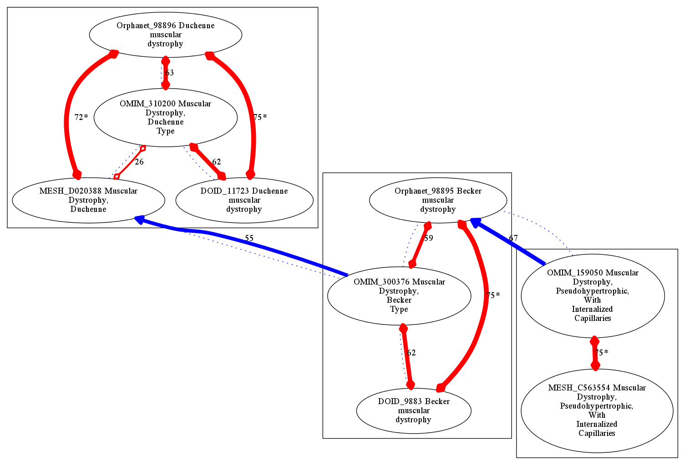

## Neurofibromatosis type 2 -> Vestibular schwannoma

 * [Neurofibromatosis type 2](http://purl.obolibrary.org/obo/Orphanet_637) __SubClassOf__ [Vestibular schwannoma](http://purl.obolibrary.org/obo/Orphanet_252175)

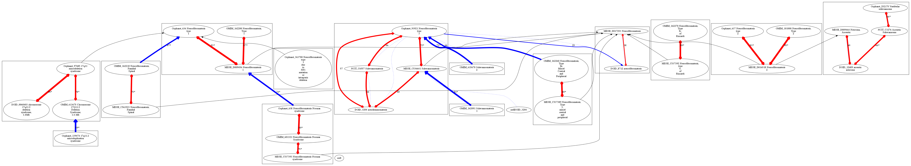

## Acrokeratosis verruciformis of Hopf -> Darier disease

 * [Acrokeratosis verruciformis of Hopf](http://purl.obolibrary.org/obo/Orphanet_79151) __SubClassOf__ [Darier disease](http://purl.obolibrary.org/obo/Orphanet_218)

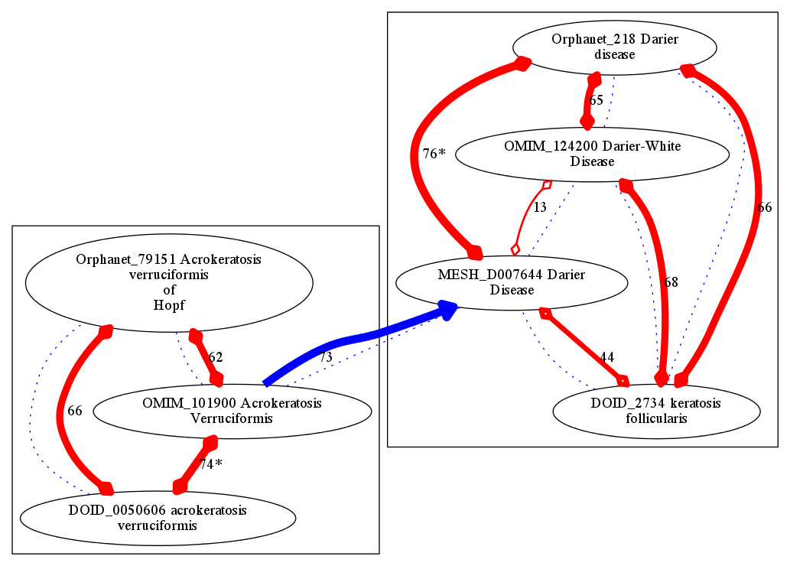

## Developmental and speech delay due to SOX5 deficiency -> 12p12.1 microdeletion syndrome

 * [Developmental and speech delay due to SOX5 deficiency](http://purl.obolibrary.org/obo/Orphanet_313892) __SubClassOf__ [12p12.1 microdeletion syndrome](http://purl.obolibrary.org/obo/Orphanet_313884)

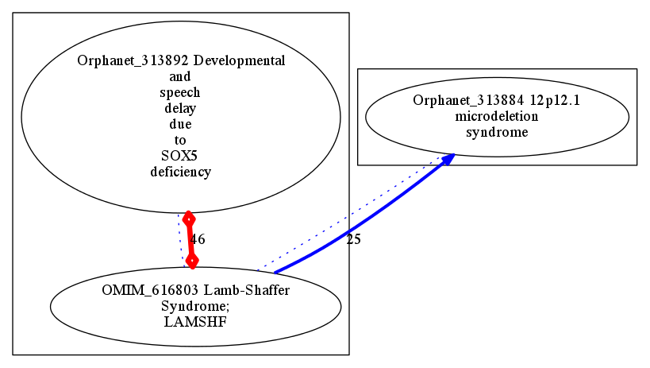

## Uhl anomaly -> Familial isolated arrhythmogenic right ventricular dysplasia

 * [Uhl anomaly](http://purl.obolibrary.org/obo/Orphanet_3403) __SubClassOf__ [Familial isolated arrhythmogenic right ventricular dysplasia](http://purl.obolibrary.org/obo/Orphanet_217656)

## Hyposmia-nasal and ocular hypoplasia-hypogonadotropic hypogonadism syndrome -> Arrhinia-choanal atresia-microphthalmia syndrome

 * [Hyposmia-nasal and ocular hypoplasia-hypogonadotropic hypogonadism syndrome](http://purl.obolibrary.org/obo/Orphanet_2250) __SubClassOf__ [Arrhinia-choanal atresia-microphthalmia syndrome](http://purl.obolibrary.org/obo/Orphanet_1135)

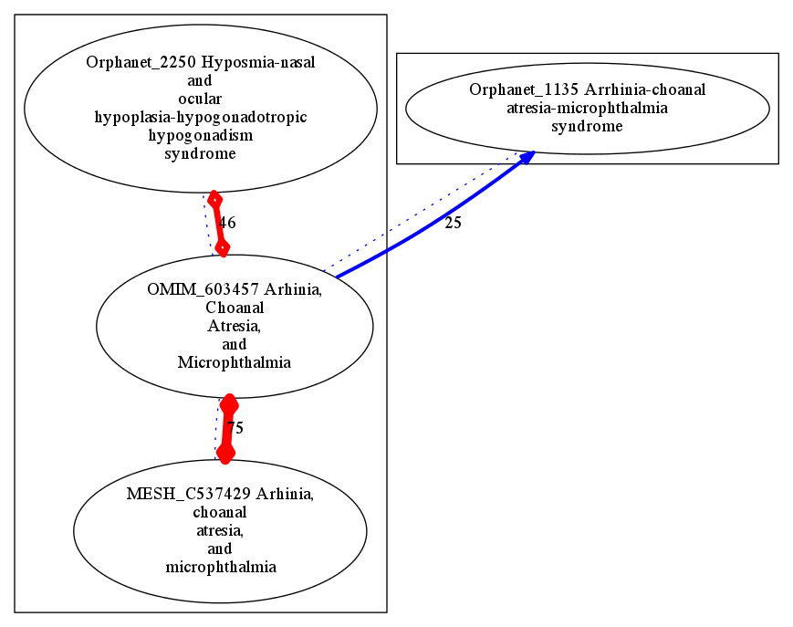

## Niemann-Pick disease type E -> Niemann-Pick disease type B

 * [Niemann-Pick disease type E](http://purl.obolibrary.org/obo/Orphanet_99022) __SubClassOf__ [Niemann-Pick disease type B](http://purl.obolibrary.org/obo/Orphanet_77293)

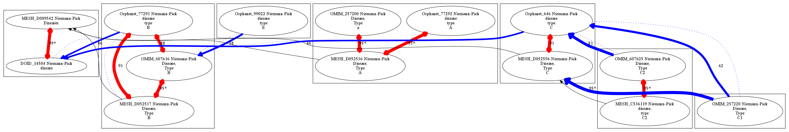

## Congenital ptosis -> Duane retraction syndrome

 * [Congenital ptosis](http://purl.obolibrary.org/obo/Orphanet_91411) __SubClassOf__ [Duane retraction syndrome](http://purl.obolibrary.org/obo/Orphanet_233)

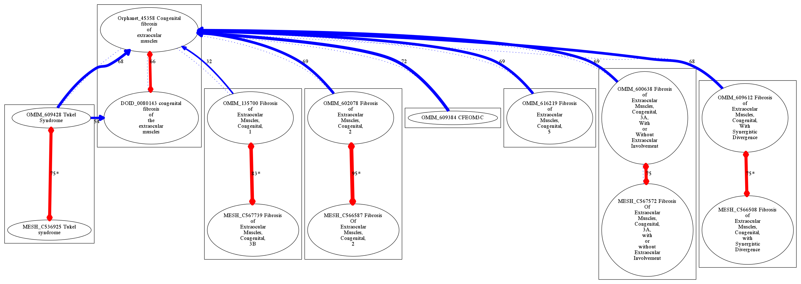

## Congenital ptosis -> Congenital fibrosis of extraocular muscles

 * [Congenital ptosis](http://purl.obolibrary.org/obo/Orphanet_91411) __SubClassOf__ [Congenital fibrosis of extraocular muscles](http://purl.obolibrary.org/obo/Orphanet_45358)

## Metaphyseal anadysplasia -> Spondyloepimetaphyseal dysplasia, Missouri type

 * [Metaphyseal anadysplasia](http://purl.obolibrary.org/obo/Orphanet_1040) __SubClassOf__ [Spondyloepimetaphyseal dysplasia, Missouri type](http://purl.obolibrary.org/obo/Orphanet_93356)

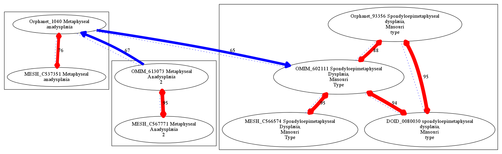

## Colobomatous optic disc-macular atrophy-chorioretinopathy syndrome -> Nanophthalmia

 * [Colobomatous optic disc-macular atrophy-chorioretinopathy syndrome](http://purl.obolibrary.org/obo/Orphanet_435930) __SubClassOf__ [Nanophthalmia](http://purl.obolibrary.org/obo/Orphanet_35612)

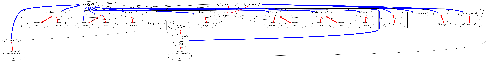

## Colobomatous optic disc-macular atrophy-chorioretinopathy syndrome -> Isolated anophthalmia-microphthalmia syndrome

 * [Colobomatous optic disc-macular atrophy-chorioretinopathy syndrome](http://purl.obolibrary.org/obo/Orphanet_435930) __SubClassOf__ [Isolated anophthalmia-microphthalmia syndrome](http://purl.obolibrary.org/obo/Orphanet_2542)

## Recessive dystrophic epidermolysis bullosa inversa -> Severe generalized recessive dystrophic epidermolysis bullosa

 * [Recessive dystrophic epidermolysis bullosa inversa](http://purl.obolibrary.org/obo/Orphanet_79409) __SubClassOf__ [Severe generalized recessive dystrophic epidermolysis bullosa](http://purl.obolibrary.org/obo/Orphanet_79408)

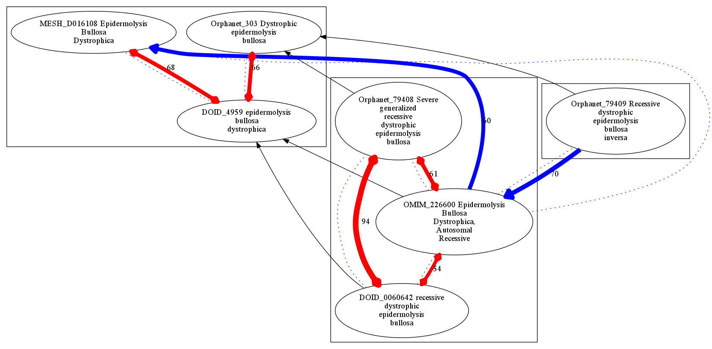

## Pancreatic colipase deficiency -> Pancreatic triacylglycerol lipase deficiency

 * [Pancreatic colipase deficiency](http://purl.obolibrary.org/obo/Orphanet_309108) __SubClassOf__ [Pancreatic triacylglycerol lipase deficiency](http://purl.obolibrary.org/obo/Orphanet_309031)

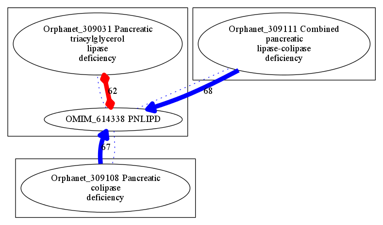

## Combined pancreatic lipase-colipase deficiency -> Pancreatic triacylglycerol lipase deficiency

 * [Combined pancreatic lipase-colipase deficiency](http://purl.obolibrary.org/obo/Orphanet_309111) __SubClassOf__ [Pancreatic triacylglycerol lipase deficiency](http://purl.obolibrary.org/obo/Orphanet_309031)

## Ehlers-Danlos syndrome, kyphoscoliotic type -> Brittle cornea syndrome

 * [Ehlers-Danlos syndrome, kyphoscoliotic type](http://purl.obolibrary.org/obo/Orphanet_1900) __SubClassOf__ [Brittle cornea syndrome](http://purl.obolibrary.org/obo/Orphanet_90354)

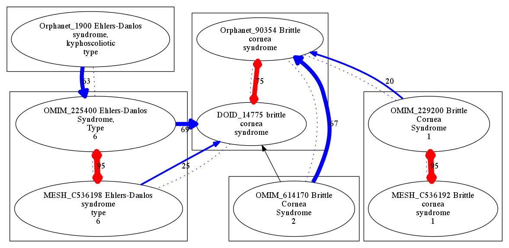

## Rare bone tumor -> Genetic bone tumor

 * [Rare bone tumor](http://purl.obolibrary.org/obo/Orphanet_68411) __SubClassOf__ [Genetic bone tumor](http://purl.obolibrary.org/obo/Orphanet_183527)

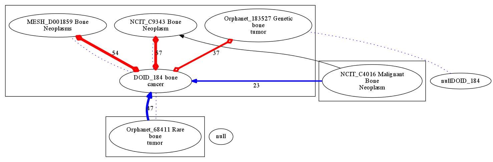

## FRAXE intellectual disability -> Fragile X syndrome

 * [FRAXE intellectual disability](http://purl.obolibrary.org/obo/Orphanet_100973) __SubClassOf__ [Fragile X syndrome](http://purl.obolibrary.org/obo/Orphanet_908)

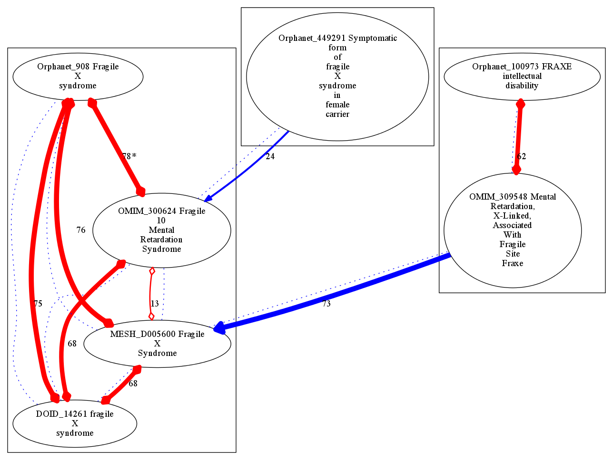

## Symptomatic form of fragile X syndrome in female carrier -> Fragile X syndrome

 * [Symptomatic form of fragile X syndrome in female carrier](http://purl.obolibrary.org/obo/Orphanet_449291) __SubClassOf__ [Fragile X syndrome](http://purl.obolibrary.org/obo/Orphanet_908)

## Refsum disease -> Infantile Refsum disease

 * [Refsum disease](http://purl.obolibrary.org/obo/Orphanet_773) __SubClassOf__ [Infantile Refsum disease](http://purl.obolibrary.org/obo/Orphanet_772)

## Saethre-Chotzen syndrome -> Apert syndrome

 * [Saethre-Chotzen syndrome](http://purl.obolibrary.org/obo/Orphanet_794) __SubClassOf__ [Apert syndrome](http://purl.obolibrary.org/obo/Orphanet_87)

## Synpolydactyly type 3 -> Polydactyly

 * [Synpolydactyly type 3](http://purl.obolibrary.org/obo/Orphanet_295199) __SubClassOf__ [Polydactyly](http://purl.obolibrary.org/obo/Orphanet_2913)

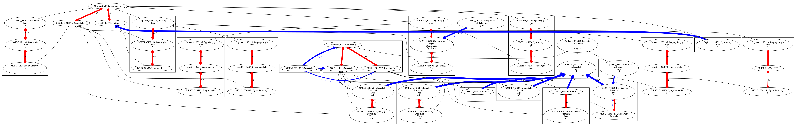

## Postaxial polydactyly type B -> Postaxial polydactyly type A

 * [Postaxial polydactyly type B](http://purl.obolibrary.org/obo/Orphanet_93335) __SubClassOf__ [Postaxial polydactyly type A](http://purl.obolibrary.org/obo/Orphanet_93334)

## Craniosynostosis, Philadelphia type -> Syndactyly type 1

 * [Craniosynostosis, Philadelphia type](http://purl.obolibrary.org/obo/Orphanet_1527) __SubClassOf__ [Syndactyly type 1](http://purl.obolibrary.org/obo/Orphanet_93402)

## Craniosynostosis, Philadelphia type -> Syndactyly

 * [Craniosynostosis, Philadelphia type](http://purl.obolibrary.org/obo/Orphanet_1527) __SubClassOf__ [Syndactyly](http://purl.obolibrary.org/obo/Orphanet_90025)

## Fish-eye disease -> Familial LCAT deficiency

 * [Fish-eye disease](http://purl.obolibrary.org/obo/Orphanet_79292) __SubClassOf__ [Familial LCAT deficiency](http://purl.obolibrary.org/obo/Orphanet_79293)

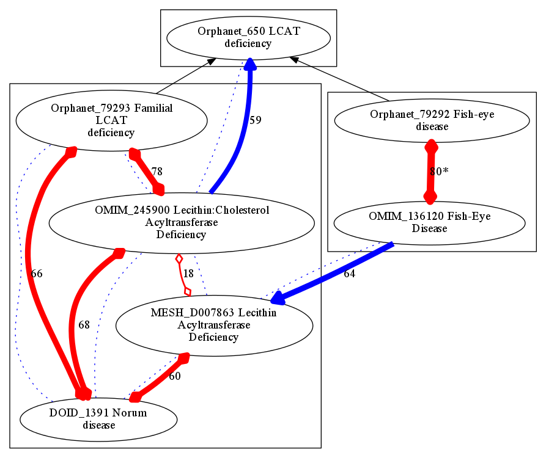

## Mitochondrial neurogastrointestinal encephalomyopathy -> Mitochondrial DNA depletion syndrome, encephalomyopathic form with renal tubulopathy

 * [Mitochondrial neurogastrointestinal encephalomyopathy](http://purl.obolibrary.org/obo/Orphanet_298) __SubClassOf__ [Mitochondrial DNA depletion syndrome, encephalomyopathic form with renal tubulopathy](http://purl.obolibrary.org/obo/Orphanet_255235)

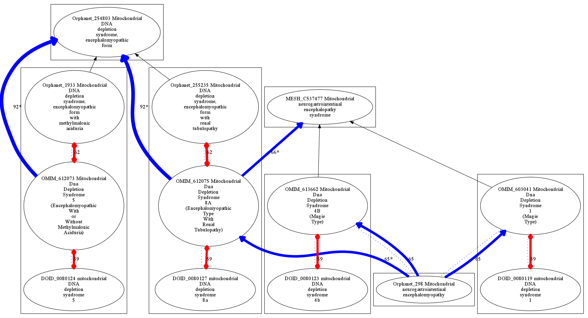

## Immunodeficiency with factor H anomaly -> Non-immunoglobulin-mediated membranoproliferative glomerulonephritis

 * [Immunodeficiency with factor H anomaly](http://purl.obolibrary.org/obo/Orphanet_200421) __SubClassOf__ [Non-immunoglobulin-mediated membranoproliferative glomerulonephritis](http://purl.obolibrary.org/obo/Orphanet_329918)

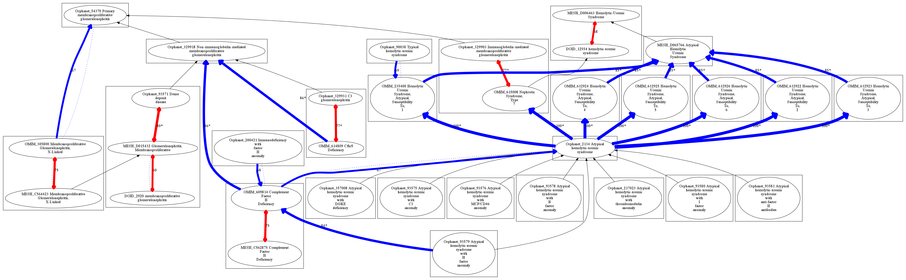

## Immunodeficiency with factor H anomaly -> Primary membranoproliferative glomerulonephritis

 * [Immunodeficiency with factor H anomaly](http://purl.obolibrary.org/obo/Orphanet_200421) __SubClassOf__ [Primary membranoproliferative glomerulonephritis](http://purl.obolibrary.org/obo/Orphanet_54370)

## Immunodeficiency with factor H anomaly -> Immunoglobulin-mediated membranoproliferative glomerulonephritis

 * [Immunodeficiency with factor H anomaly](http://purl.obolibrary.org/obo/Orphanet_200421) __SubClassOf__ [Immunoglobulin-mediated membranoproliferative glomerulonephritis](http://purl.obolibrary.org/obo/Orphanet_329903)

## Immunodeficiency with factor H anomaly -> Atypical hemolytic-uremic syndrome

 * [Immunodeficiency with factor H anomaly](http://purl.obolibrary.org/obo/Orphanet_200421) __SubClassOf__ [Atypical hemolytic-uremic syndrome](http://purl.obolibrary.org/obo/Orphanet_2134)

## Hereditary continuous muscle fiber activity -> Episodic ataxia type 1

 * [Hereditary continuous muscle fiber activity](http://purl.obolibrary.org/obo/Orphanet_972) __SubClassOf__ [Episodic ataxia type 1](http://purl.obolibrary.org/obo/Orphanet_37612)

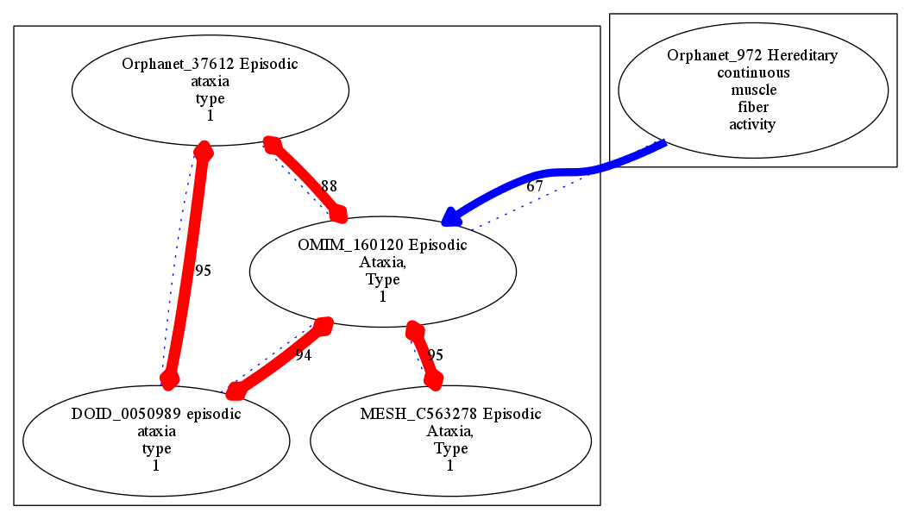

## Colobomatous microphthalmia -> Matthew-Wood syndrome

 * [Colobomatous microphthalmia](http://purl.obolibrary.org/obo/Orphanet_98938) __SubClassOf__ [Matthew-Wood syndrome](http://purl.obolibrary.org/obo/Orphanet_2470)

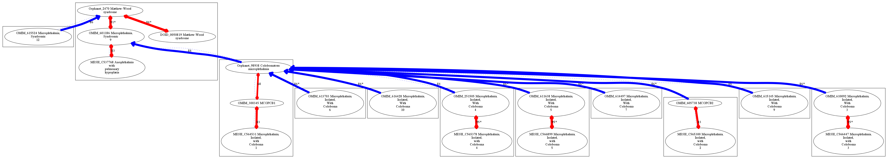

## Isolated osteopoikilosis -> Buschke-Ollendorff syndrome

 * [Isolated osteopoikilosis](http://purl.obolibrary.org/obo/Orphanet_166119) __SubClassOf__ [Buschke-Ollendorff syndrome](http://purl.obolibrary.org/obo/Orphanet_1306)

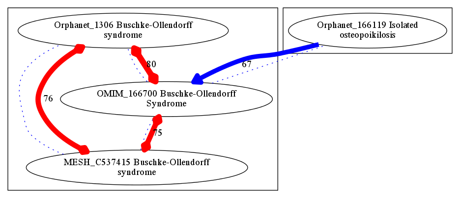

## Hereditary sensory and autonomic neuropathy type 2 -> Channelopathy-associated congenital insensitivity to pain

 * [Hereditary sensory and autonomic neuropathy type 2](http://purl.obolibrary.org/obo/Orphanet_970) __SubClassOf__ [Channelopathy-associated congenital insensitivity to pain](http://purl.obolibrary.org/obo/Orphanet_88642)

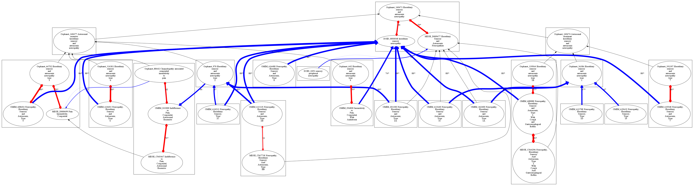

## Hereditary sensory and autonomic neuropathy type 2 -> Hereditary sensory and autonomic neuropathy type 5

 * [Hereditary sensory and autonomic neuropathy type 2](http://purl.obolibrary.org/obo/Orphanet_970) __SubClassOf__ [Hereditary sensory and autonomic neuropathy type 5](http://purl.obolibrary.org/obo/Orphanet_64752)

## Channelopathy-associated congenital insensitivity to pain -> Hereditary sensory and autonomic neuropathy type 5

 * [Channelopathy-associated congenital insensitivity to pain](http://purl.obolibrary.org/obo/Orphanet_88642) __SubClassOf__ [Hereditary sensory and autonomic neuropathy type 5](http://purl.obolibrary.org/obo/Orphanet_64752)

## Familial visceral myopathy -> Megacystis-microcolon-intestinal hypoperistalsis syndrome

 * [Familial visceral myopathy](http://purl.obolibrary.org/obo/Orphanet_2604) __SubClassOf__ [Megacystis-microcolon-intestinal hypoperistalsis syndrome](http://purl.obolibrary.org/obo/Orphanet_2241)

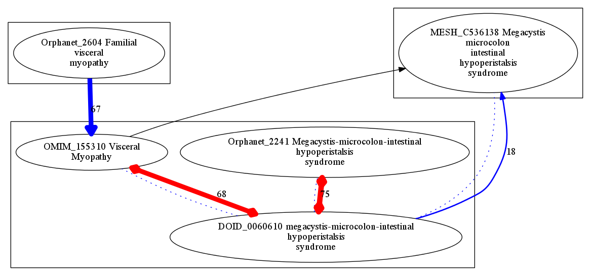

## Crisponi syndrome -> Cold-induced sweating syndrome

 * [Crisponi syndrome](http://purl.obolibrary.org/obo/Orphanet_1545) __SubClassOf__ [Cold-induced sweating syndrome](http://purl.obolibrary.org/obo/Orphanet_157820)

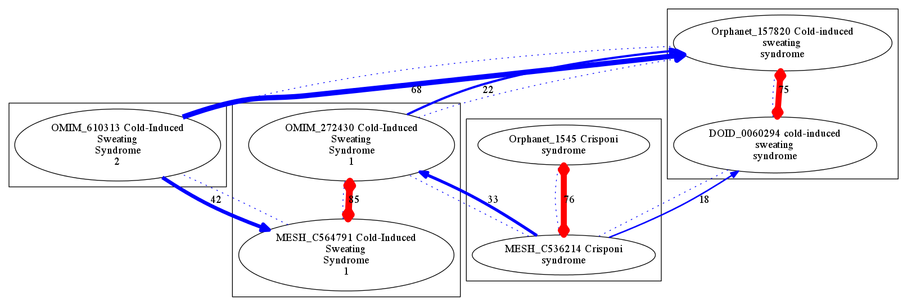

## Bilateral multicystic dysplastic kidney -> Congenital hydronephrosis

 * [Bilateral multicystic dysplastic kidney](http://purl.obolibrary.org/obo/Orphanet_97364) __SubClassOf__ [Congenital hydronephrosis](http://purl.obolibrary.org/obo/Orphanet_2190)

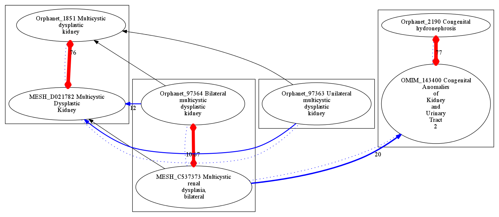

## Syndromic microphthalmia type 5 -> Patterned dystrophy of the retinal pigment epithelium

 * [Syndromic microphthalmia type 5](http://purl.obolibrary.org/obo/Orphanet_178364) __SubClassOf__ [Patterned dystrophy of the retinal pigment epithelium](http://purl.obolibrary.org/obo/Orphanet_63454)

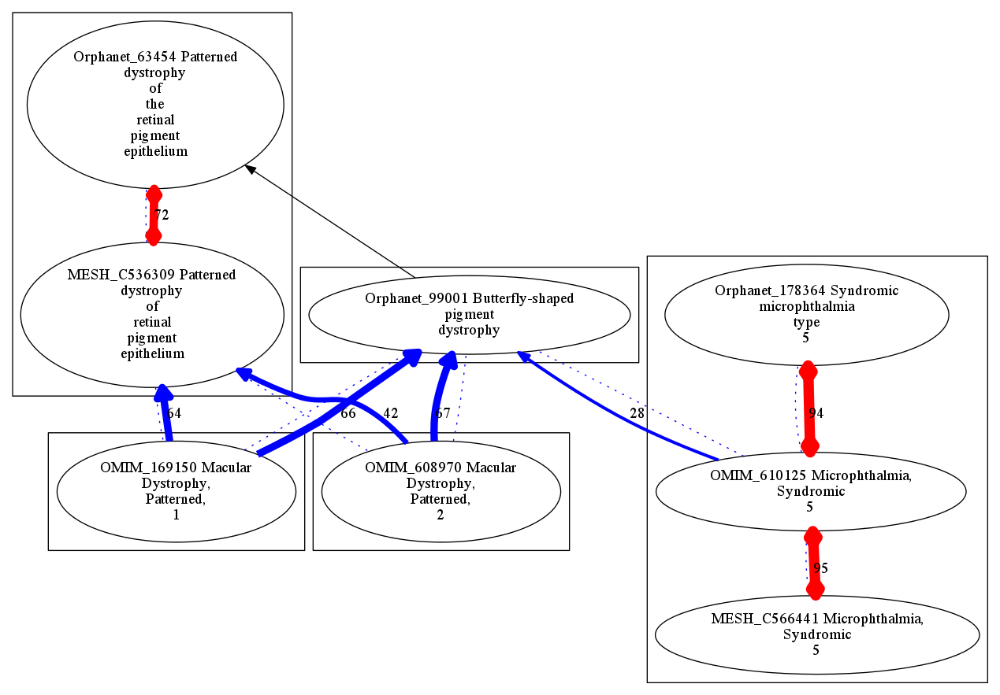

## Syndromic microphthalmia type 5 -> Butterfly-shaped pigment dystrophy

 * [Syndromic microphthalmia type 5](http://purl.obolibrary.org/obo/Orphanet_178364) __SubClassOf__ [Butterfly-shaped pigment dystrophy](http://purl.obolibrary.org/obo/Orphanet_99001)

## Terminal transverse defects of arm -> Constriction rings syndrome

 * [Terminal transverse defects of arm](http://purl.obolibrary.org/obo/Orphanet_93937) __SubClassOf__ [Constriction rings syndrome](http://purl.obolibrary.org/obo/Orphanet_295000)

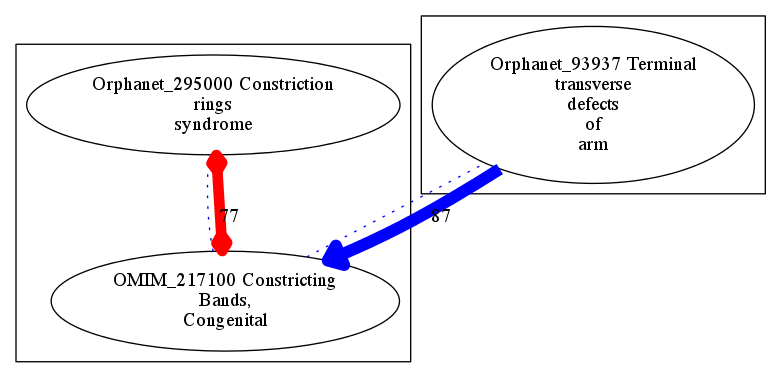

## Maternal phenylketonuria -> Phenylketonuria

 * [Maternal phenylketonuria](http://purl.obolibrary.org/obo/Orphanet_2209) __SubClassOf__ [Phenylketonuria](http://purl.obolibrary.org/obo/Orphanet_716)

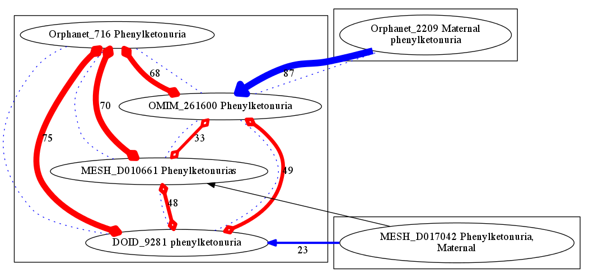

## Hereditary cryohydrocytosis with normal stomatin -> Familial pseudohyperkalemia

 * [Hereditary cryohydrocytosis with normal stomatin](http://purl.obolibrary.org/obo/Orphanet_398088) __SubClassOf__ [Familial pseudohyperkalemia](http://purl.obolibrary.org/obo/Orphanet_90044)

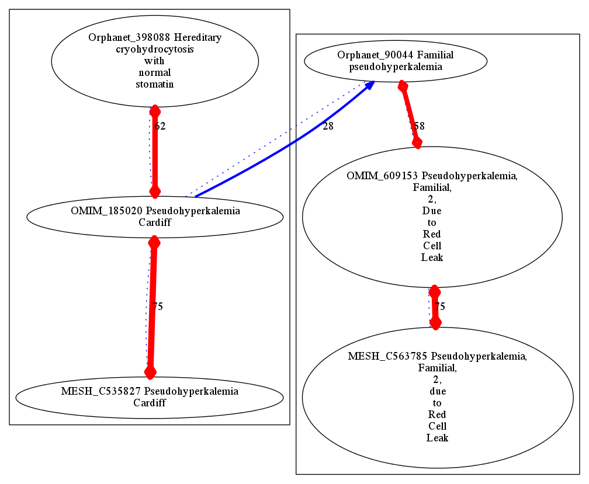

## Familial medullary thyroid carcinoma -> Medullary thyroid carcinoma

 * [Familial medullary thyroid carcinoma](http://purl.obolibrary.org/obo/Orphanet_99361) __SubClassOf__ [Medullary thyroid carcinoma](http://purl.obolibrary.org/obo/Orphanet_1332)

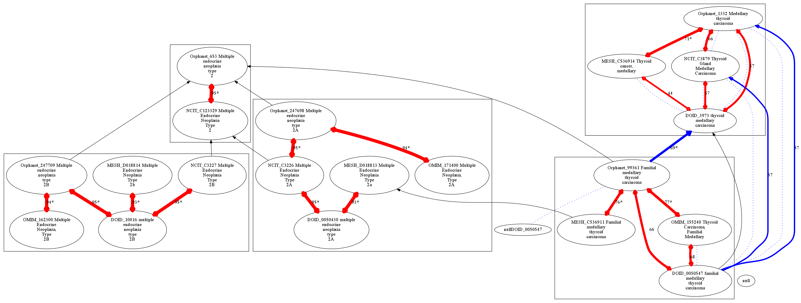

## Short rib-polydactyly syndrome, Saldino-Noonan type -> Short rib-polydactyly syndrome, Verma-Naumoff type

 * [Short rib-polydactyly syndrome, Saldino-Noonan type](http://purl.obolibrary.org/obo/Orphanet_93270) __SubClassOf__ [Short rib-polydactyly syndrome, Verma-Naumoff type](http://purl.obolibrary.org/obo/Orphanet_93271)

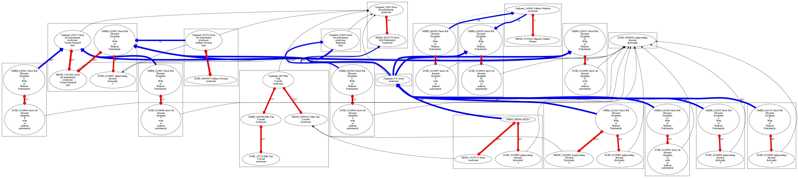

## MRCS syndrome -> Autosomal dominant vitreoretinochoroidopathy

 * [MRCS syndrome](http://purl.obolibrary.org/obo/Orphanet_263347) __SubClassOf__ [Autosomal dominant vitreoretinochoroidopathy](http://purl.obolibrary.org/obo/Orphanet_3086)

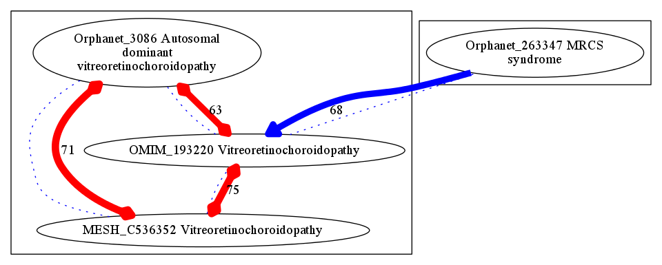

## Salla disease -> Sialuria

 * [Salla disease](http://purl.obolibrary.org/obo/Orphanet_309334) __SubClassOf__ [Sialuria](http://purl.obolibrary.org/obo/Orphanet_3166)

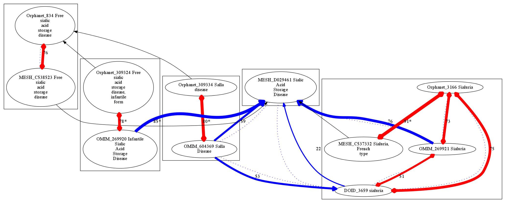

## Axenfeld anomaly -> Axenfeld-Rieger syndrome

 * [Axenfeld anomaly](http://purl.obolibrary.org/obo/Orphanet_98978) __SubClassOf__ [Axenfeld-Rieger syndrome](http://purl.obolibrary.org/obo/Orphanet_782)

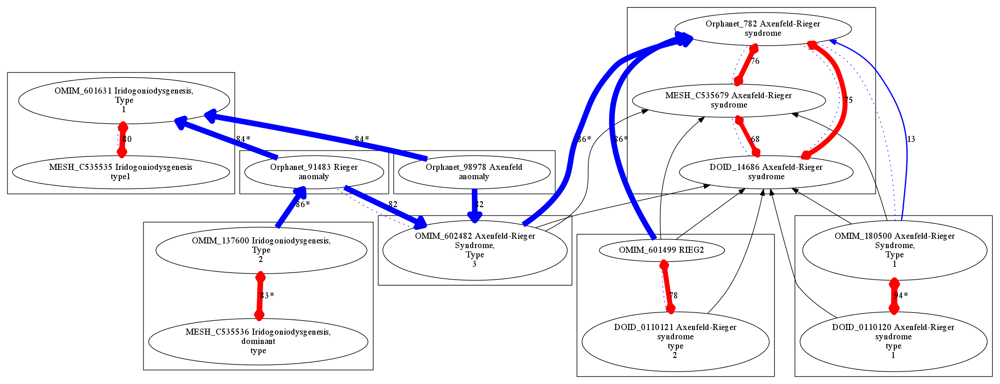

## Rieger anomaly -> Axenfeld-Rieger syndrome

 * [Rieger anomaly](http://purl.obolibrary.org/obo/Orphanet_91483) __SubClassOf__ [Axenfeld-Rieger syndrome](http://purl.obolibrary.org/obo/Orphanet_782)

## Familial osteochondritis dissecans -> Osteochondritis dissecans

 * [Familial osteochondritis dissecans](http://purl.obolibrary.org/obo/Orphanet_251262) __SubClassOf__ [Osteochondritis dissecans](http://purl.obolibrary.org/obo/Orphanet_2764)

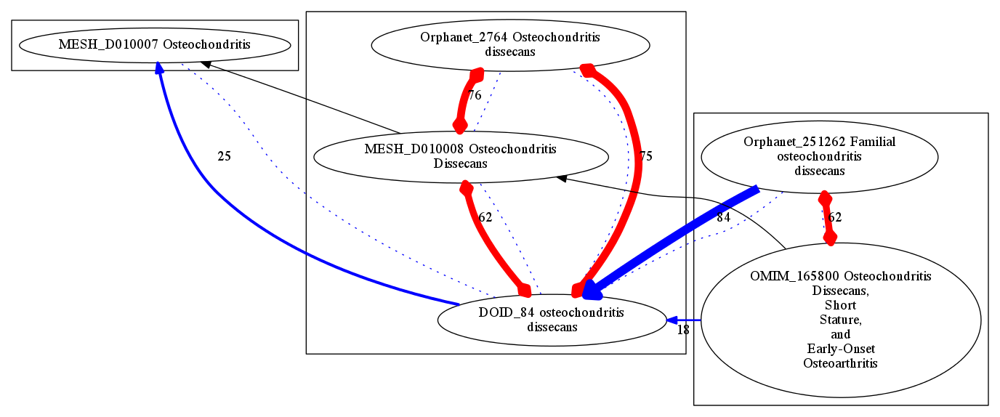

## Atypical dentin dysplasia due to SMOC2 deficiency -> Dentin dysplasia type I

 * [Atypical dentin dysplasia due to SMOC2 deficiency](http://purl.obolibrary.org/obo/Orphanet_314721) __SubClassOf__ [Dentin dysplasia type I](http://purl.obolibrary.org/obo/Orphanet_99789)

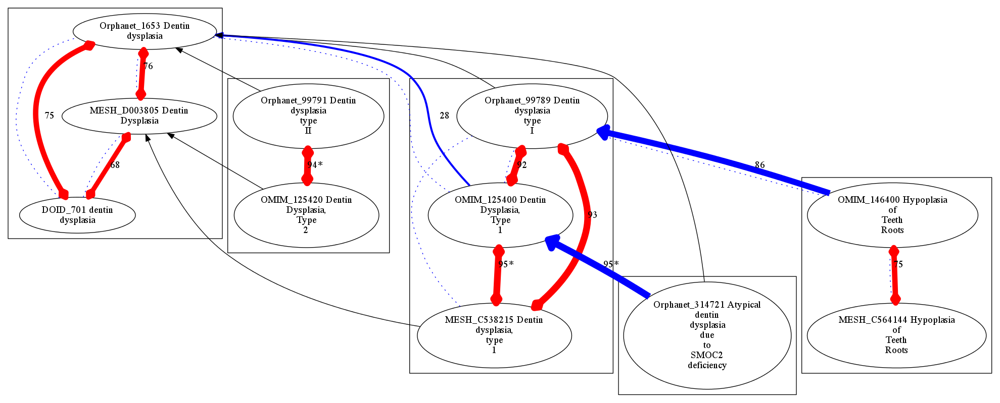

## Cap myopathy -> Nemaline myopathy

 * [Cap myopathy](http://purl.obolibrary.org/obo/Orphanet_171881) __SubClassOf__ [Nemaline myopathy](http://purl.obolibrary.org/obo/Orphanet_607)

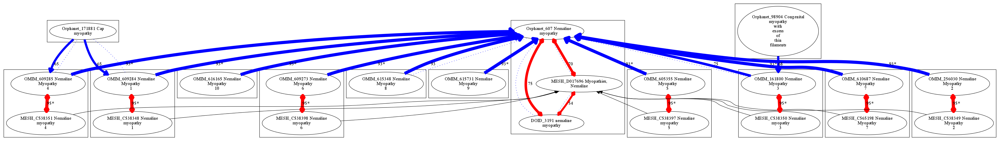

## Congenital myopathy with excess of thin filaments -> Nemaline myopathy

 * [Congenital myopathy with excess of thin filaments](http://purl.obolibrary.org/obo/Orphanet_98904) __SubClassOf__ [Nemaline myopathy](http://purl.obolibrary.org/obo/Orphanet_607)

## AL amyloidosis -> Multiple myeloma

 * [AL amyloidosis](http://purl.obolibrary.org/obo/Orphanet_85443) __SubClassOf__ [Multiple myeloma](http://purl.obolibrary.org/obo/Orphanet_29073)

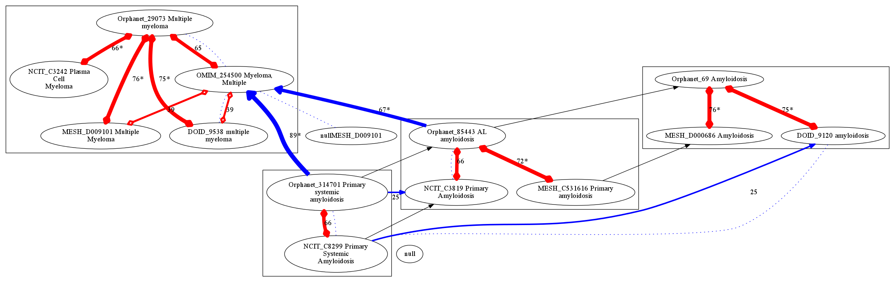

## Primary systemic amyloidosis -> Multiple myeloma

 * [Primary systemic amyloidosis](http://purl.obolibrary.org/obo/Orphanet_314701) __SubClassOf__ [Multiple myeloma](http://purl.obolibrary.org/obo/Orphanet_29073)

## 2q23.1 microdeletion syndrome -> Autosomal dominant non-syndromic intellectual disability

 * [2q23.1 microdeletion syndrome](http://purl.obolibrary.org/obo/Orphanet_228402) __SubClassOf__ [Autosomal dominant non-syndromic intellectual disability](http://purl.obolibrary.org/obo/Orphanet_178469)

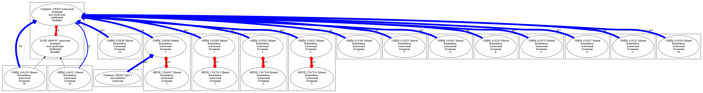

## Waterhouse-Friderichsen syndrome -> Acquired purpura fulminans

 * [Waterhouse-Friderichsen syndrome](http://purl.obolibrary.org/obo/Orphanet_100067) __SubClassOf__ [Acquired purpura fulminans](http://purl.obolibrary.org/obo/Orphanet_49566)

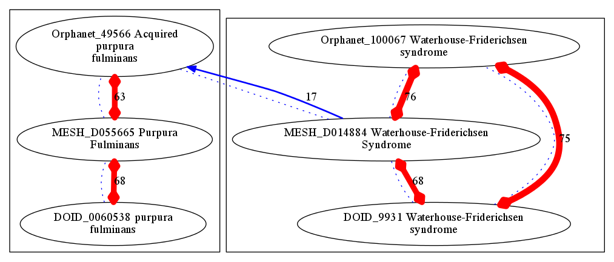

## Tracheal agenesis -> Congenital tracheal stenosis

 * [Tracheal agenesis](http://purl.obolibrary.org/obo/Orphanet_3346) __SubClassOf__ [Congenital tracheal stenosis](http://purl.obolibrary.org/obo/Orphanet_141127)

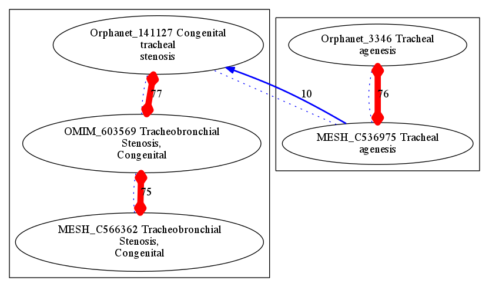

## Ocular pemphigoid -> Mucous membrane pemphigoid

 * [Ocular pemphigoid](http://purl.obolibrary.org/obo/Orphanet_99922) __SubClassOf__ [Mucous membrane pemphigoid](http://purl.obolibrary.org/obo/Orphanet_46486)

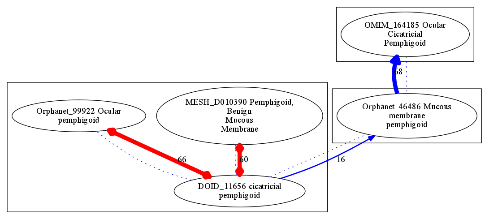

## Familial hypodysfibrinogenemia -> Familial dysfibrinogenemia

 * [Familial hypodysfibrinogenemia](http://purl.obolibrary.org/obo/Orphanet_248408) __SubClassOf__ [Familial dysfibrinogenemia](http://purl.obolibrary.org/obo/Orphanet_98881)

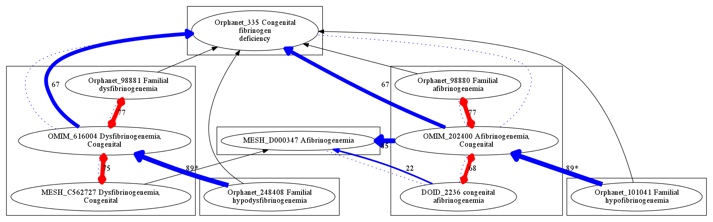

## Familial hypofibrinogenemia -> Familial afibrinogenemia

 * [Familial hypofibrinogenemia](http://purl.obolibrary.org/obo/Orphanet_101041) __SubClassOf__ [Familial afibrinogenemia](http://purl.obolibrary.org/obo/Orphanet_98880)

## Benign recurrent intrahepatic cholestasis type 1 -> Progressive familial intrahepatic cholestasis type 1

 * [Benign recurrent intrahepatic cholestasis type 1](http://purl.obolibrary.org/obo/Orphanet_99960) __SubClassOf__ [Progressive familial intrahepatic cholestasis type 1](http://purl.obolibrary.org/obo/Orphanet_79306)

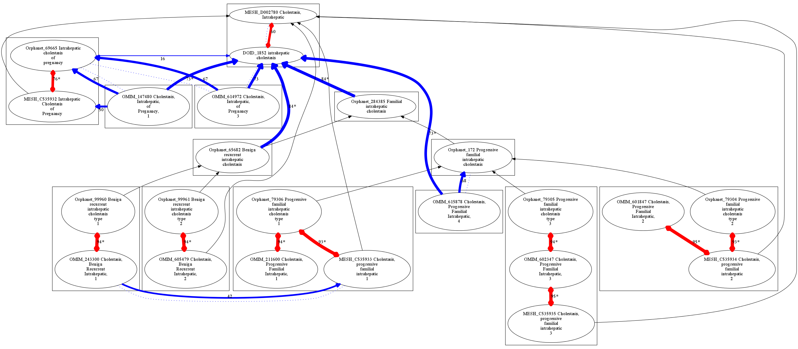

## Benign recurrent intrahepatic cholestasis type 1 -> Progressive familial intrahepatic cholestasis

 * [Benign recurrent intrahepatic cholestasis type 1](http://purl.obolibrary.org/obo/Orphanet_99960) __SubClassOf__ [Progressive familial intrahepatic cholestasis](http://purl.obolibrary.org/obo/Orphanet_172)

## Autosomal dominant rhegmatogenous retinal detachment -> Stickler syndrome

 * [Autosomal dominant rhegmatogenous retinal detachment](http://purl.obolibrary.org/obo/Orphanet_209867) __SubClassOf__ [Stickler syndrome](http://purl.obolibrary.org/obo/Orphanet_828)

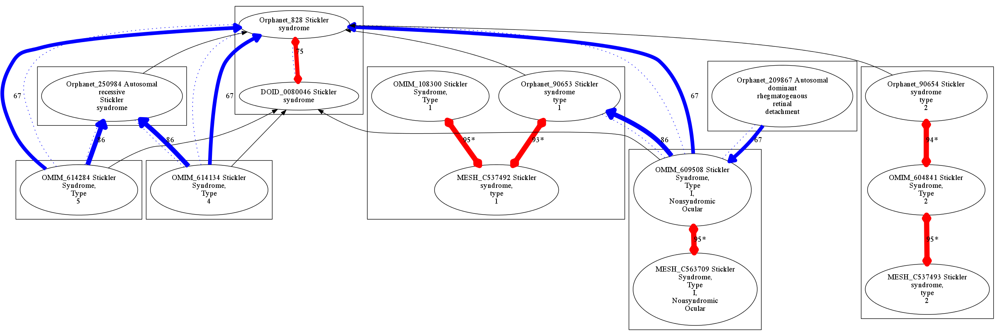

## Autosomal dominant rhegmatogenous retinal detachment -> Stickler syndrome type 1

 * [Autosomal dominant rhegmatogenous retinal detachment](http://purl.obolibrary.org/obo/Orphanet_209867) __SubClassOf__ [Stickler syndrome type 1](http://purl.obolibrary.org/obo/Orphanet_90653)

## X-linked mixed deafness with perilymphatic gusher -> X-linked non-syndromic sensorineural deafness type DFN

 * [X-linked mixed deafness with perilymphatic gusher](http://purl.obolibrary.org/obo/Orphanet_383) __SubClassOf__ [X-linked non-syndromic sensorineural deafness type DFN](http://purl.obolibrary.org/obo/Orphanet_90625)

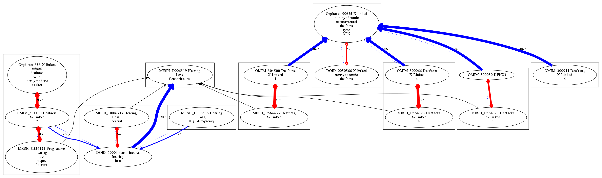

## Waardenburg-Shah syndrome -> Waardenburg syndrome

 * [Waardenburg-Shah syndrome](http://purl.obolibrary.org/obo/Orphanet_897) __SubClassOf__ [Waardenburg syndrome](http://purl.obolibrary.org/obo/Orphanet_3440)

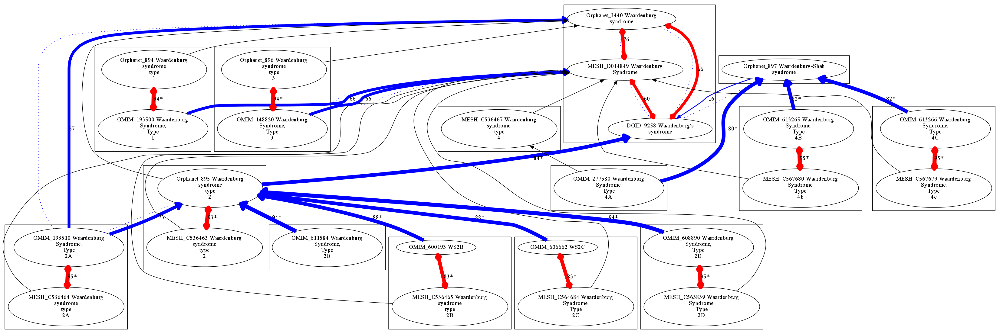

## 46,XY gonadal dysgenesis-motor and sensory neuropathy syndrome -> 46,XY complete gonadal dysgenesis

 * [46,XY gonadal dysgenesis-motor and sensory neuropathy syndrome](http://purl.obolibrary.org/obo/Orphanet_168563) __SubClassOf__ [46,XY complete gonadal dysgenesis](http://purl.obolibrary.org/obo/Orphanet_242)

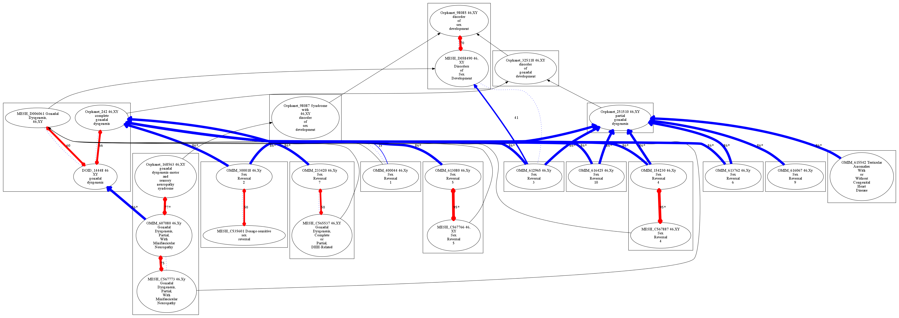

## 46,XY gonadal dysgenesis-motor and sensory neuropathy syndrome -> 46,XY disorder of gonadal development

 * [46,XY gonadal dysgenesis-motor and sensory neuropathy syndrome](http://purl.obolibrary.org/obo/Orphanet_168563) __SubClassOf__ [46,XY disorder of gonadal development](http://purl.obolibrary.org/obo/Orphanet_325118)

## Hyperimmunoglobulinemia D with periodic fever -> Mevalonic aciduria

 * [Hyperimmunoglobulinemia D with periodic fever](http://purl.obolibrary.org/obo/Orphanet_343) __SubClassOf__ [Mevalonic aciduria](http://purl.obolibrary.org/obo/Orphanet_29)

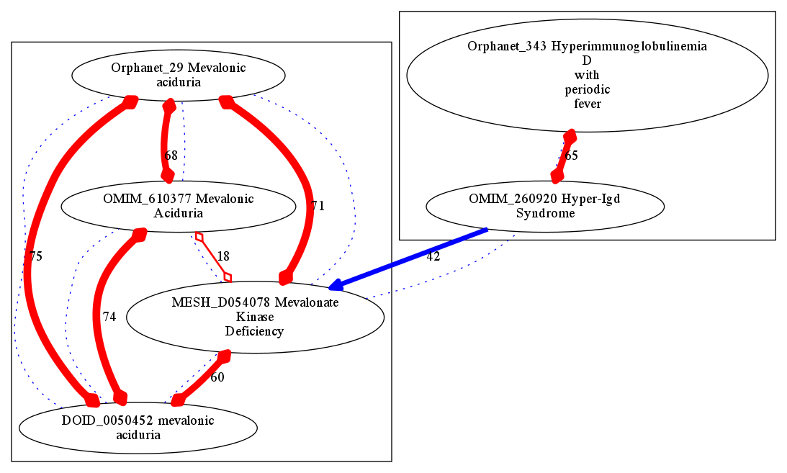

## Familial progressive hyper- and hypopigmentation -> Familial progressive hyperpigmentation

 * [Familial progressive hyper- and hypopigmentation](http://purl.obolibrary.org/obo/Orphanet_280628) __SubClassOf__ [Familial progressive hyperpigmentation](http://purl.obolibrary.org/obo/Orphanet_79146)

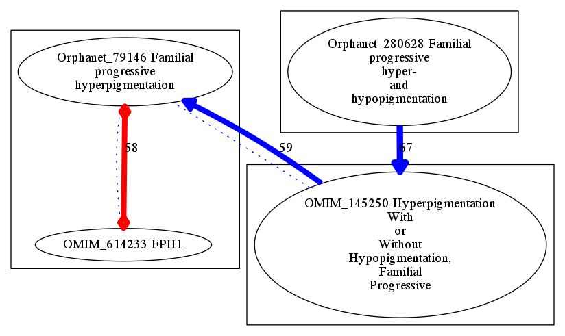

## Autosomal dominant osteosclerosis, Worth type -> Osteopetrosis

 * [Autosomal dominant osteosclerosis, Worth type](http://purl.obolibrary.org/obo/Orphanet_2790) __SubClassOf__ [Osteopetrosis](http://purl.obolibrary.org/obo/Orphanet_2781)

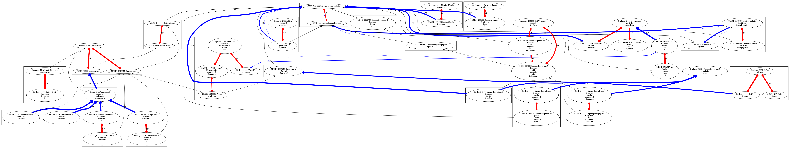

## Triphalangeal thumb-polysyndactyly syndrome -> Polydactyly of a triphalangeal thumb

 * [Triphalangeal thumb-polysyndactyly syndrome](http://purl.obolibrary.org/obo/Orphanet_2950) __SubClassOf__ [Polydactyly of a triphalangeal thumb](http://purl.obolibrary.org/obo/Orphanet_93336)

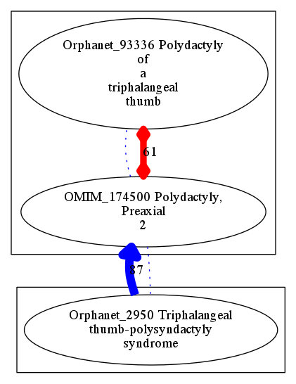

## Familial aortic dissection -> Familial thoracic aortic aneurysm and aortic dissection

 * [Familial aortic dissection](http://purl.obolibrary.org/obo/Orphanet_229) __SubClassOf__ [Familial thoracic aortic aneurysm and aortic dissection](http://purl.obolibrary.org/obo/Orphanet_91387)

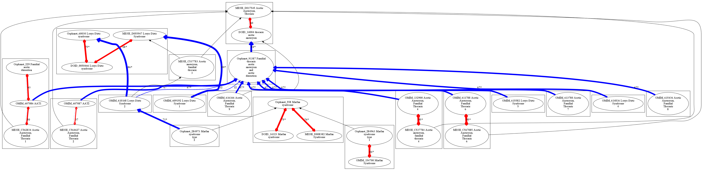

## Marfan syndrome type 2 -> Familial thoracic aortic aneurysm and aortic dissection

 * [Marfan syndrome type 2](http://purl.obolibrary.org/obo/Orphanet_284973) __SubClassOf__ [Familial thoracic aortic aneurysm and aortic dissection](http://purl.obolibrary.org/obo/Orphanet_91387)

## Roussy-LC)vy syndrome -> Charcot-Marie-Tooth disease

 * [Roussy-LC)vy syndrome](http://purl.obolibrary.org/obo/Orphanet_3115) __SubClassOf__ [Charcot-Marie-Tooth disease](http://purl.obolibrary.org/obo/Orphanet_166)

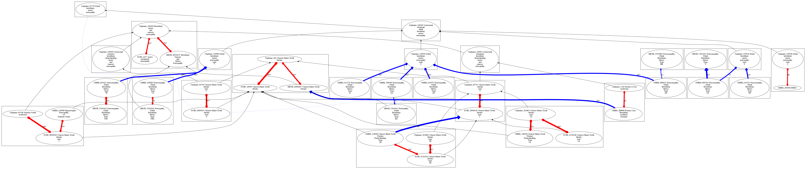

## Juvenile Huntington disease -> Huntington disease

 * [Juvenile Huntington disease](http://purl.obolibrary.org/obo/Orphanet_248111) __SubClassOf__ [Huntington disease](http://purl.obolibrary.org/obo/Orphanet_399)

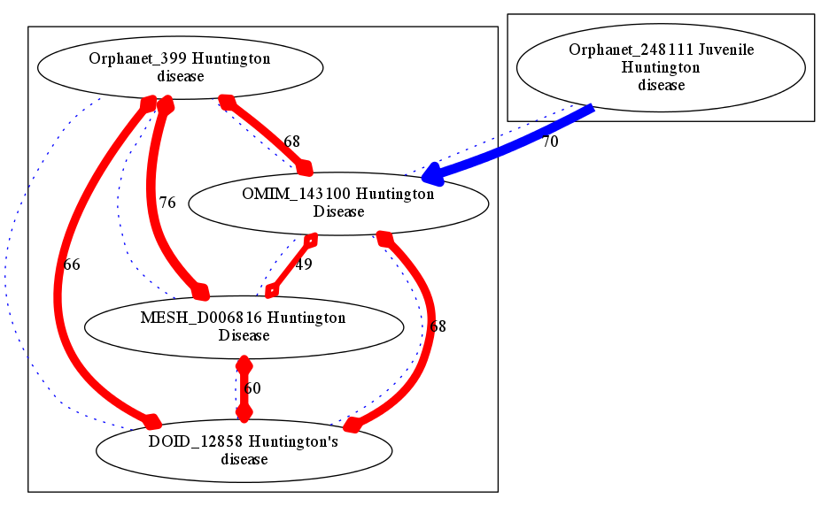

## Truncus arteriosus -> Double outlet right ventricle

 * [Truncus arteriosus](http://purl.obolibrary.org/obo/Orphanet_3384) __SubClassOf__ [Double outlet right ventricle](http://purl.obolibrary.org/obo/Orphanet_3426)

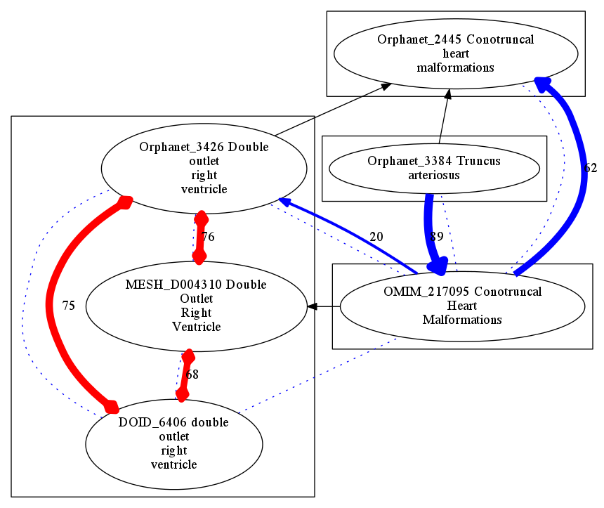

## Syndromic X-linked ichthyosis -> Recessive X-linked ichthyosis

 * [Syndromic X-linked ichthyosis](http://purl.obolibrary.org/obo/Orphanet_281090) __SubClassOf__ [Recessive X-linked ichthyosis](http://purl.obolibrary.org/obo/Orphanet_461)

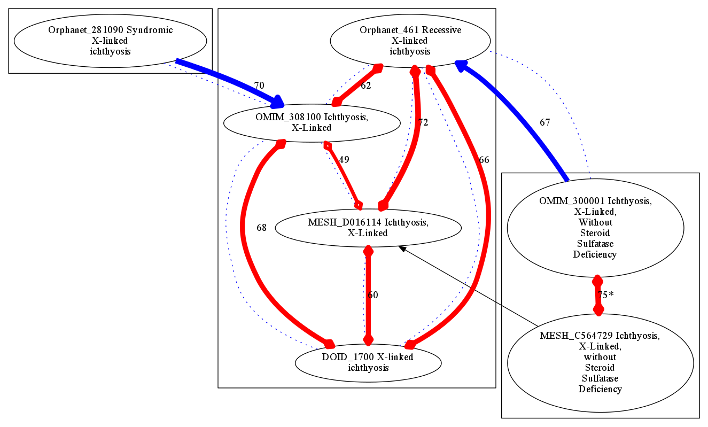

## Maternally-inherited Leigh syndrome -> Leigh syndrome

 * [Maternally-inherited Leigh syndrome](http://purl.obolibrary.org/obo/Orphanet_255210) __SubClassOf__ [Leigh syndrome](http://purl.obolibrary.org/obo/Orphanet_506)

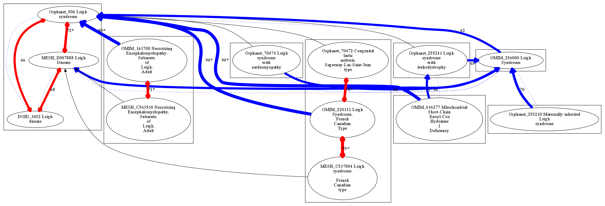

## Baller-Gerold syndrome -> Balantidiasis

 * [Baller-Gerold syndrome](http://purl.obolibrary.org/obo/Orphanet_1225) __SubClassOf__ [Balantidiasis](http://purl.obolibrary.org/obo/Orphanet_1223)

## ATTRV122I amyloidosis -> ATTRV30M amyloidosis

 * [ATTRV122I amyloidosis](http://purl.obolibrary.org/obo/Orphanet_85451) __SubClassOf__ [ATTRV30M amyloidosis](http://purl.obolibrary.org/obo/Orphanet_85447)

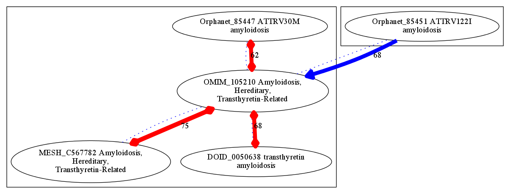

## Moynahan syndrome -> Noonan syndrome with multiple lentigines

 * [Moynahan syndrome](http://purl.obolibrary.org/obo/Orphanet_2574) __SubClassOf__ [Noonan syndrome with multiple lentigines](http://purl.obolibrary.org/obo/Orphanet_500)

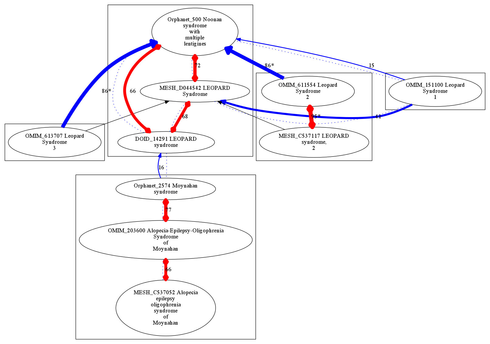

## Amaurosis-hypertrichosis syndrome -> Jalili syndrome

 * [Amaurosis-hypertrichosis syndrome](http://purl.obolibrary.org/obo/Orphanet_1021) __SubClassOf__ [Jalili syndrome](http://purl.obolibrary.org/obo/Orphanet_1873)

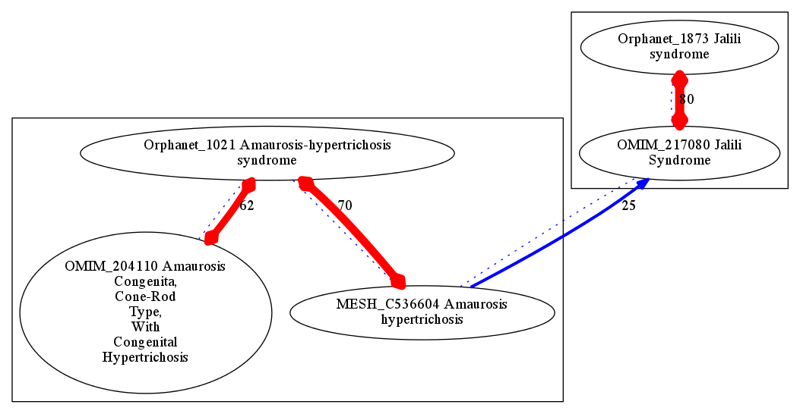

## CADDS -> Severe motor and intellectual disabilities-sensorineural deafness-dystonia syndrome

 * [CADDS](http://purl.obolibrary.org/obo/Orphanet_369942) __SubClassOf__ [Severe motor and intellectual disabilities-sensorineural deafness-dystonia syndrome](http://purl.obolibrary.org/obo/Orphanet_369939)

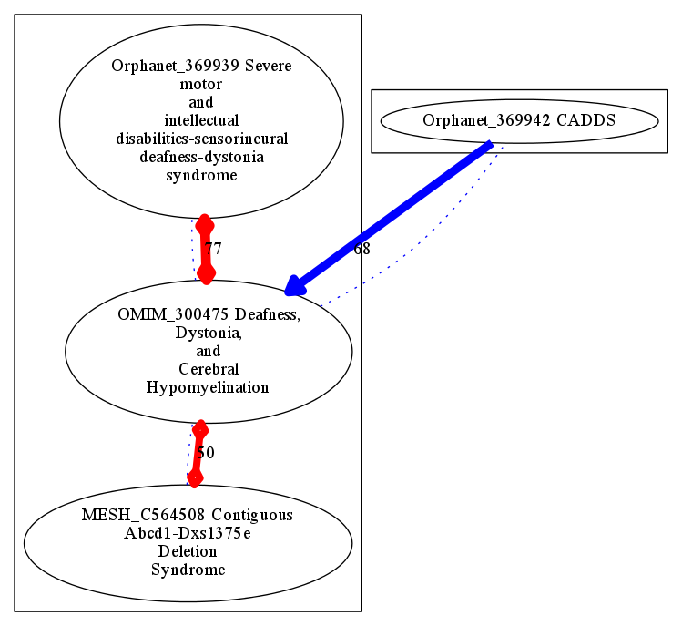

## Multiple intestinal atresia -> Combined immunodeficiency-enteropathy spectrum

 * [Multiple intestinal atresia](http://purl.obolibrary.org/obo/Orphanet_2300) __SubClassOf__ [Combined immunodeficiency-enteropathy spectrum](http://purl.obolibrary.org/obo/Orphanet_436252)

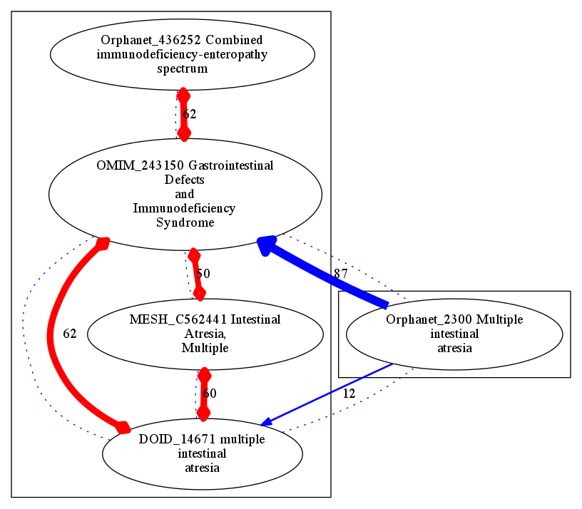

## Sodium channelopathy-related small fiber neuropathy -> Primary erythermalgia

 * [Sodium channelopathy-related small fiber neuropathy](http://purl.obolibrary.org/obo/Orphanet_306577) __SubClassOf__ [Primary erythermalgia](http://purl.obolibrary.org/obo/Orphanet_90026)

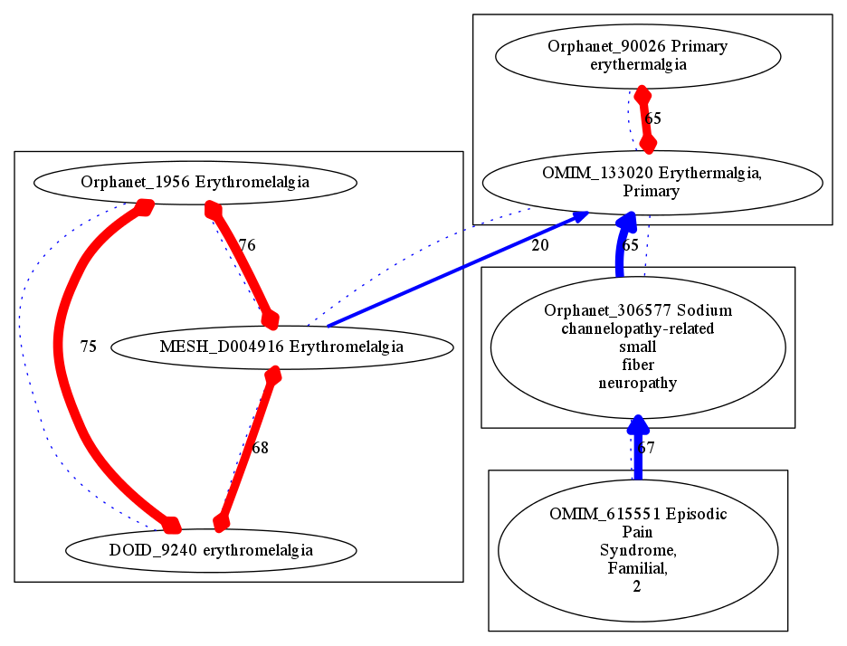

## Erythromelalgia -> Primary erythermalgia

 * [Erythromelalgia](http://purl.obolibrary.org/obo/Orphanet_1956) __SubClassOf__ [Primary erythermalgia](http://purl.obolibrary.org/obo/Orphanet_90026)

## Inclusion body myositis -> Hereditary inclusion body myopathy-joint contractures-ophthalmoplegia syndrome

 * [Inclusion body myositis](http://purl.obolibrary.org/obo/Orphanet_611) __SubClassOf__ [Hereditary inclusion body myopathy-joint contractures-ophthalmoplegia syndrome](http://purl.obolibrary.org/obo/Orphanet_79091)

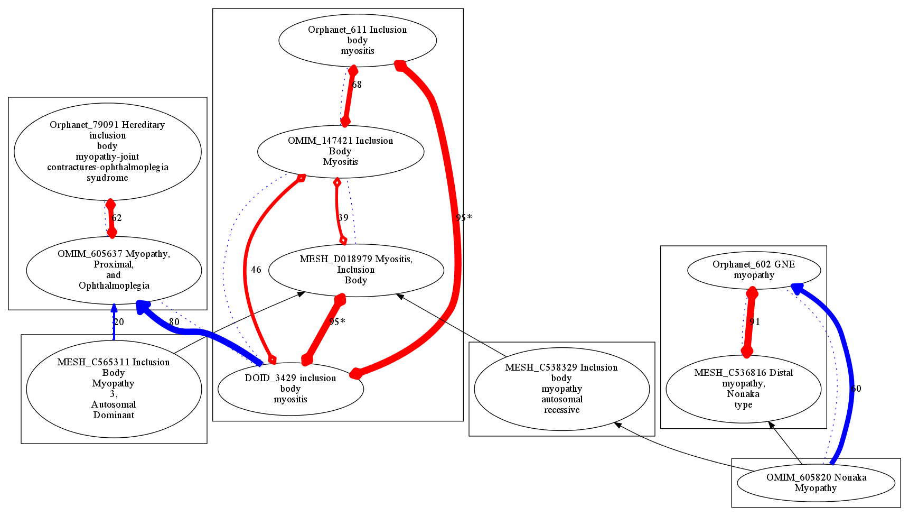

## Autosomal dominant spondylocostal dysostosis -> Autosomal recessive spondylocostal dysostosis

 * [Autosomal dominant spondylocostal dysostosis](http://purl.obolibrary.org/obo/Orphanet_1797) __SubClassOf__ [Autosomal recessive spondylocostal dysostosis](http://purl.obolibrary.org/obo/Orphanet_2311)

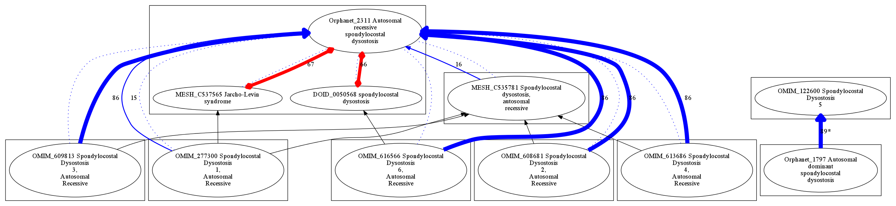

## Nasolacrimal duct cyst -> Familial congenital nasolacrimal duct obstruction

 * [Nasolacrimal duct cyst](http://purl.obolibrary.org/obo/Orphanet_141083) __SubClassOf__ [Familial congenital nasolacrimal duct obstruction](http://purl.obolibrary.org/obo/Orphanet_451612)

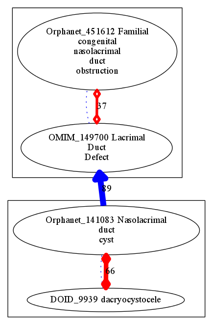

## H syndrome -> RosaC/-Dorfman disease

 * [H syndrome](http://purl.obolibrary.org/obo/Orphanet_168569) __SubClassOf__ [RosaC/-Dorfman disease](http://purl.obolibrary.org/obo/Orphanet_158014)

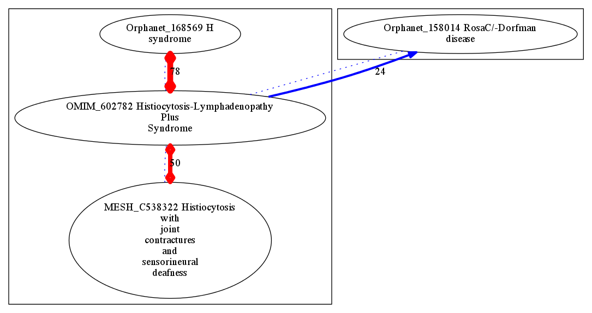

## Hepatoblastoma -> Hepatocellular carcinoma

 * [Hepatoblastoma](http://purl.obolibrary.org/obo/Orphanet_449) __SubClassOf__ [Hepatocellular carcinoma](http://purl.obolibrary.org/obo/Orphanet_88673)

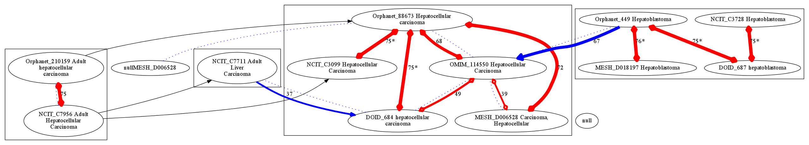

## Anotia -> Microtia

 * [Anotia](http://purl.obolibrary.org/obo/Orphanet_93976) __SubClassOf__ [Microtia](http://purl.obolibrary.org/obo/Orphanet_83463)

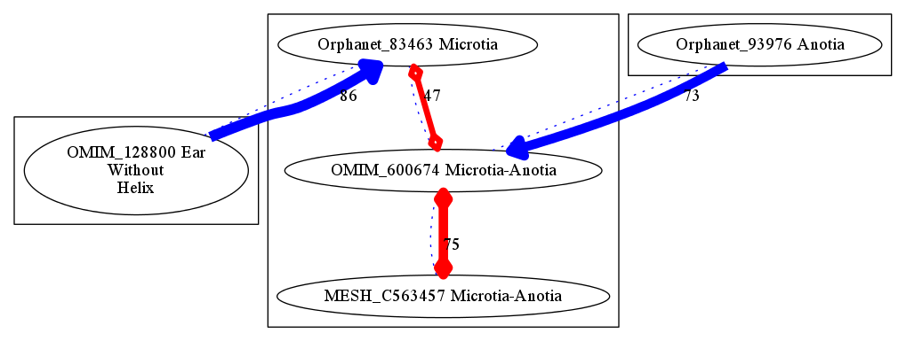

## Dravet syndrome -> Early myoclonic encephalopathy

 * [Dravet syndrome](http://purl.obolibrary.org/obo/Orphanet_33069) __SubClassOf__ [Early myoclonic encephalopathy](http://purl.obolibrary.org/obo/Orphanet_1935)

## Dravet syndrome -> Early infantile epileptic encephalopathy

 * [Dravet syndrome](http://purl.obolibrary.org/obo/Orphanet_33069) __SubClassOf__ [Early infantile epileptic encephalopathy](http://purl.obolibrary.org/obo/Orphanet_1934)

## Female restricted epilepsy with intellectual disability -> Early infantile epileptic encephalopathy

 * [Female restricted epilepsy with intellectual disability](http://purl.obolibrary.org/obo/Orphanet_101039) __SubClassOf__ [Early infantile epileptic encephalopathy](http://purl.obolibrary.org/obo/Orphanet_1934)

## Thymic carcinoma -> Thymoma

 * [Thymic carcinoma](http://purl.obolibrary.org/obo/Orphanet_99868) __SubClassOf__ [Thymoma](http://purl.obolibrary.org/obo/Orphanet_99867)

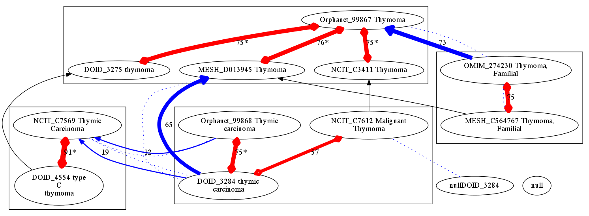

## Autosomal dominant Charcot-Marie-Tooth disease type 2M -> Autosomal dominant intermediate Charcot-Marie-Tooth disease type B

 * [Autosomal dominant Charcot-Marie-Tooth disease type 2M](http://purl.obolibrary.org/obo/Orphanet_228179) __SubClassOf__ [Autosomal dominant intermediate Charcot-Marie-Tooth disease type B](http://purl.obolibrary.org/obo/Orphanet_100044)

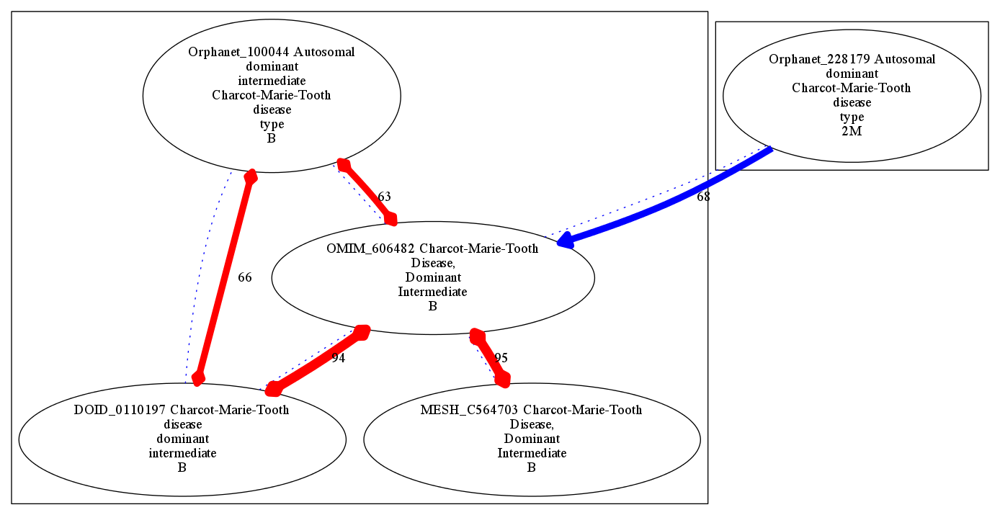

## Madelung deformity -> LC)ri-Weill dyschondrosteosis

 * [Madelung deformity](http://purl.obolibrary.org/obo/Orphanet_35688) __SubClassOf__ [LC)ri-Weill dyschondrosteosis](http://purl.obolibrary.org/obo/Orphanet_240)

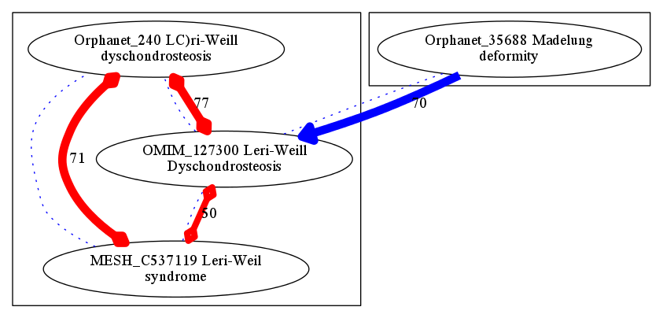

## Primary Fanconi syndrome -> Cystinosis

 * [Primary Fanconi syndrome](http://purl.obolibrary.org/obo/Orphanet_3337) __SubClassOf__ [Cystinosis](http://purl.obolibrary.org/obo/Orphanet_213)

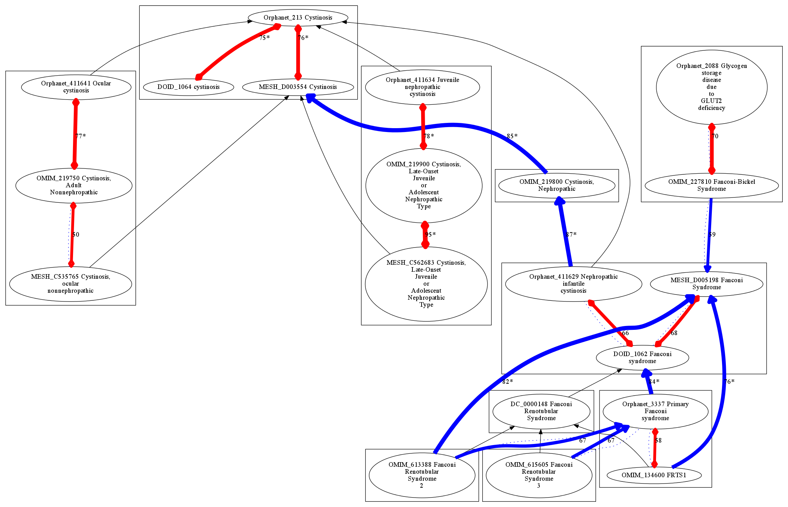

## Primary Fanconi syndrome -> Nephropathic infantile cystinosis

 * [Primary Fanconi syndrome](http://purl.obolibrary.org/obo/Orphanet_3337) __SubClassOf__ [Nephropathic infantile cystinosis](http://purl.obolibrary.org/obo/Orphanet_411629)

## Glycogen storage disease due to GLUT2 deficiency -> Cystinosis

 * [Glycogen storage disease due to GLUT2 deficiency](http://purl.obolibrary.org/obo/Orphanet_2088) __SubClassOf__ [Cystinosis](http://purl.obolibrary.org/obo/Orphanet_213)

## Glycogen storage disease due to GLUT2 deficiency -> Nephropathic infantile cystinosis

 * [Glycogen storage disease due to GLUT2 deficiency](http://purl.obolibrary.org/obo/Orphanet_2088) __SubClassOf__ [Nephropathic infantile cystinosis](http://purl.obolibrary.org/obo/Orphanet_411629)

## Ocular albinism with congenital sensorineural deafness -> Ocular albinism with late-onset sensorineural deafness

 * [Ocular albinism with congenital sensorineural deafness](http://purl.obolibrary.org/obo/Orphanet_352740) __SubClassOf__ [Ocular albinism with late-onset sensorineural deafness](http://purl.obolibrary.org/obo/Orphanet_1000)

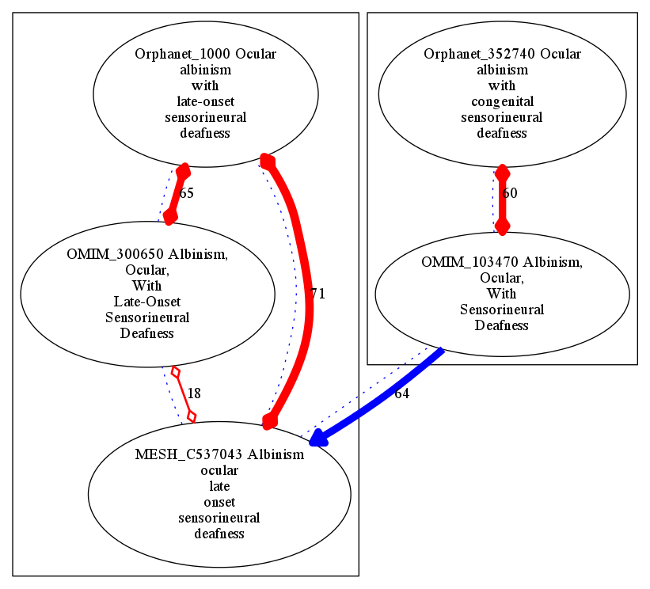

## Annular epidermolytic ichthyosis -> Epidermolytic ichthyosis

 * [Annular epidermolytic ichthyosis](http://purl.obolibrary.org/obo/Orphanet_281139) __SubClassOf__ [Epidermolytic ichthyosis](http://purl.obolibrary.org/obo/Orphanet_312)

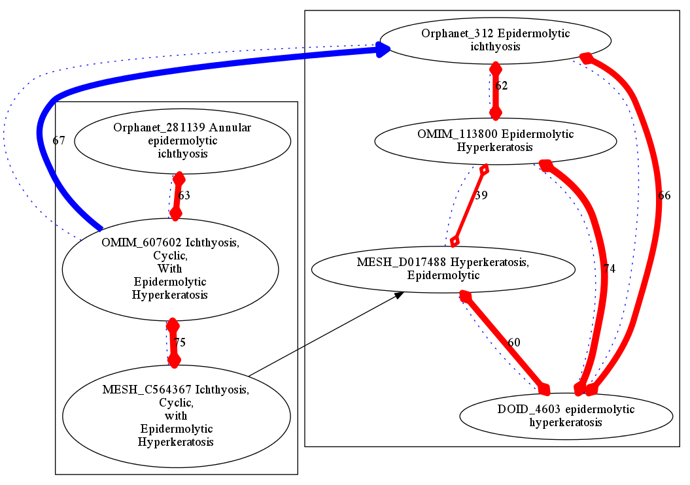

## Methylcobalamin deficiency type cblDv1 -> Vitamin B12-responsive methylmalonic acidemia

 * [Methylcobalamin deficiency type cblDv1](http://purl.obolibrary.org/obo/Orphanet_308380) __SubClassOf__ [Vitamin B12-responsive methylmalonic acidemia](http://purl.obolibrary.org/obo/Orphanet_28)

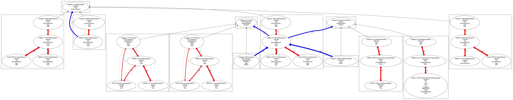

## Vitamin B12-responsive methylmalonic acidemia, type cblDv2 -> Homocystinuria without methylmalonic aciduria

 * [Vitamin B12-responsive methylmalonic acidemia, type cblDv2](http://purl.obolibrary.org/obo/Orphanet_308442) __SubClassOf__ [Homocystinuria without methylmalonic aciduria](http://purl.obolibrary.org/obo/Orphanet_622)

## Methylmalonic acidemia with homocystinuria, type cblD -> Vitamin B12-responsive methylmalonic acidemia

 * [Methylmalonic acidemia with homocystinuria, type cblD](http://purl.obolibrary.org/obo/Orphanet_79283) __SubClassOf__ [Vitamin B12-responsive methylmalonic acidemia](http://purl.obolibrary.org/obo/Orphanet_28)

## Methylmalonic acidemia with homocystinuria, type cblD -> Homocystinuria without methylmalonic aciduria

 * [Methylmalonic acidemia with homocystinuria, type cblD](http://purl.obolibrary.org/obo/Orphanet_79283) __SubClassOf__ [Homocystinuria without methylmalonic aciduria](http://purl.obolibrary.org/obo/Orphanet_622)

## Essential thrombocythemia -> Familial thrombocytosis

 * [Essential thrombocythemia](http://purl.obolibrary.org/obo/Orphanet_3318) __SubClassOf__ [Familial thrombocytosis](http://purl.obolibrary.org/obo/Orphanet_71493)

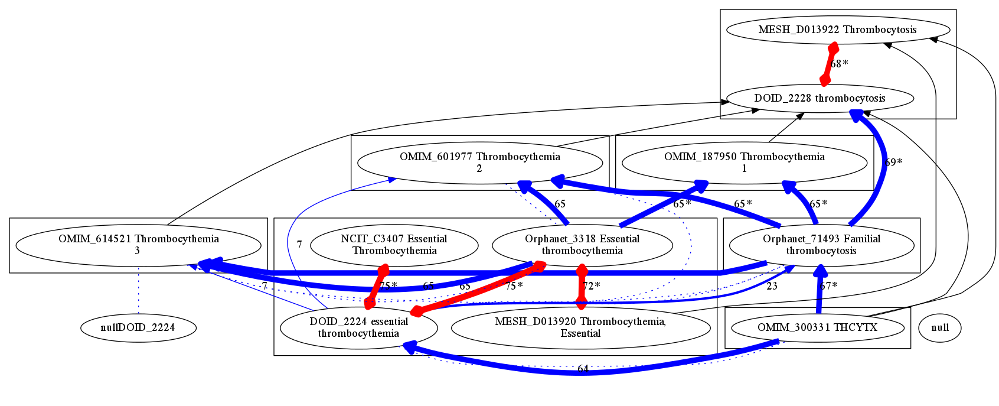

## X-linked Emery-Dreifuss muscular dystrophy -> Autosomal recessive Emery-Dreifuss muscular dystrophy

 * [X-linked Emery-Dreifuss muscular dystrophy](http://purl.obolibrary.org/obo/Orphanet_98863) __SubClassOf__ [Autosomal recessive Emery-Dreifuss muscular dystrophy](http://purl.obolibrary.org/obo/Orphanet_98855)

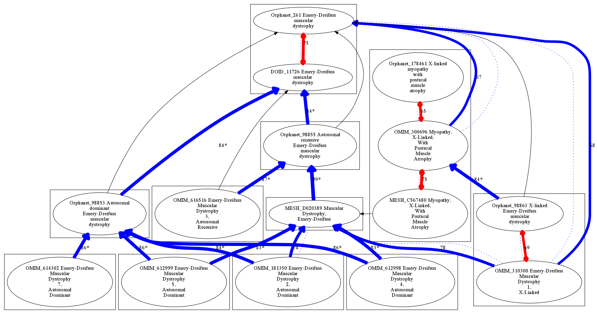

## X-linked Emery-Dreifuss muscular dystrophy -> X-linked myopathy with postural muscle atrophy

 * [X-linked Emery-Dreifuss muscular dystrophy](http://purl.obolibrary.org/obo/Orphanet_98863) __SubClassOf__ [X-linked myopathy with postural muscle atrophy](http://purl.obolibrary.org/obo/Orphanet_178461)

## X-linked myopathy with postural muscle atrophy -> Autosomal recessive Emery-Dreifuss muscular dystrophy

 * [X-linked myopathy with postural muscle atrophy](http://purl.obolibrary.org/obo/Orphanet_178461) __SubClassOf__ [Autosomal recessive Emery-Dreifuss muscular dystrophy](http://purl.obolibrary.org/obo/Orphanet_98855)

## X-linked myopathy with postural muscle atrophy -> Emery-Dreifuss muscular dystrophy

 * [X-linked myopathy with postural muscle atrophy](http://purl.obolibrary.org/obo/Orphanet_178461) __SubClassOf__ [Emery-Dreifuss muscular dystrophy](http://purl.obolibrary.org/obo/Orphanet_261)

## Pitt-Hopkins-like syndrome -> Cortical dysplasia-focal epilepsy syndrome

 * [Pitt-Hopkins-like syndrome](http://purl.obolibrary.org/obo/Orphanet_221150) __SubClassOf__ [Cortical dysplasia-focal epilepsy syndrome](http://purl.obolibrary.org/obo/Orphanet_163681)

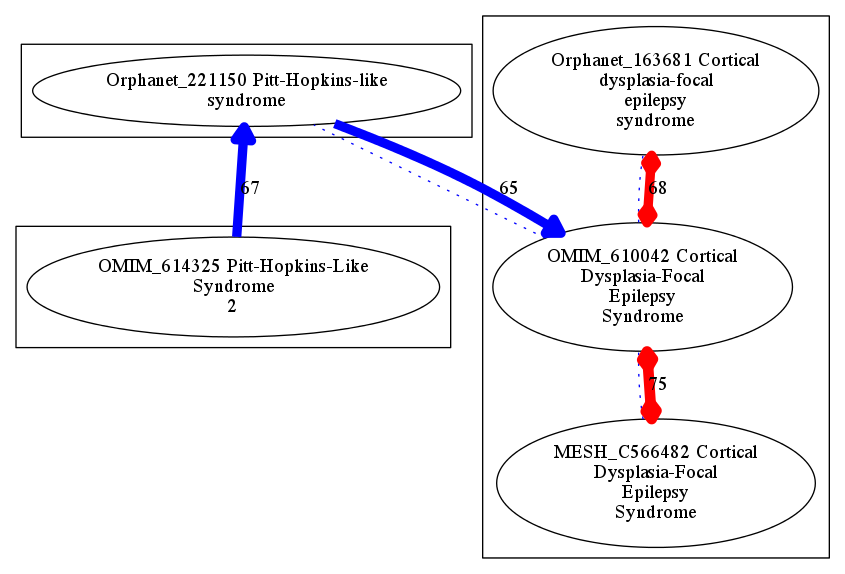

## Autosomal dominant Charcot-Marie-Tooth disease type 2K -> Autosomal recessive Charcot-Marie-Tooth disease with hoarseness

 * [Autosomal dominant Charcot-Marie-Tooth disease type 2K](http://purl.obolibrary.org/obo/Orphanet_99944) __SubClassOf__ [Autosomal recessive Charcot-Marie-Tooth disease with hoarseness](http://purl.obolibrary.org/obo/Orphanet_101097)

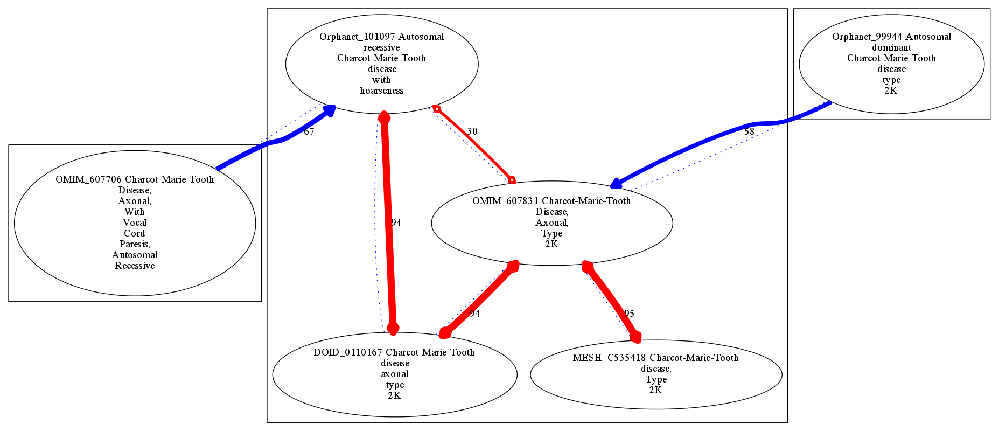

## 46,XY disorder of sex development due to isolated 17,20-lyase deficiency -> Congenital adrenal hyperplasia due to 17-alpha-hydroxylase deficiency

 * [46,XY disorder of sex development due to isolated 17,20-lyase deficiency](http://purl.obolibrary.org/obo/Orphanet_90796) __SubClassOf__ [Congenital adrenal hyperplasia due to 17-alpha-hydroxylase deficiency](http://purl.obolibrary.org/obo/Orphanet_90793)

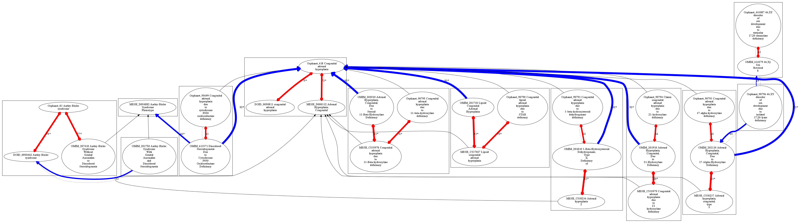

## 46,XY disorder of sex development due to isolated 17,20-lyase deficiency -> 46,XY disorder of sex development due to testicular 17,20-desmolase deficiency

 * [46,XY disorder of sex development due to isolated 17,20-lyase deficiency](http://purl.obolibrary.org/obo/Orphanet_90796) __SubClassOf__ [46,XY disorder of sex development due to testicular 17,20-desmolase deficiency](http://purl.obolibrary.org/obo/Orphanet_443087)

## 46,XY disorder of sex development due to isolated 17,20-lyase deficiency -> Congenital adrenal hyperplasia

 * [46,XY disorder of sex development due to isolated 17,20-lyase deficiency](http://purl.obolibrary.org/obo/Orphanet_90796) __SubClassOf__ [Congenital adrenal hyperplasia](http://purl.obolibrary.org/obo/Orphanet_418)

## Mediterranean macrothrombocytopenia -> Sitosterolemia

 * [Mediterranean macrothrombocytopenia](http://purl.obolibrary.org/obo/Orphanet_101022) __SubClassOf__ [Sitosterolemia](http://purl.obolibrary.org/obo/Orphanet_2882)

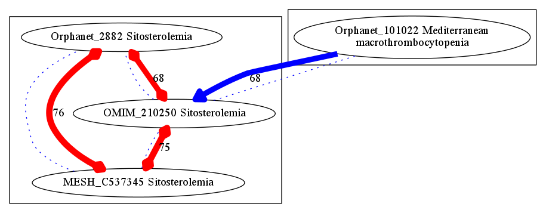

## X-linked erythropoietic protoporphyria -> Autosomal erythropoietic protoporphyria

 * [X-linked erythropoietic protoporphyria](http://purl.obolibrary.org/obo/Orphanet_443197) __SubClassOf__ [Autosomal erythropoietic protoporphyria](http://purl.obolibrary.org/obo/Orphanet_79278)

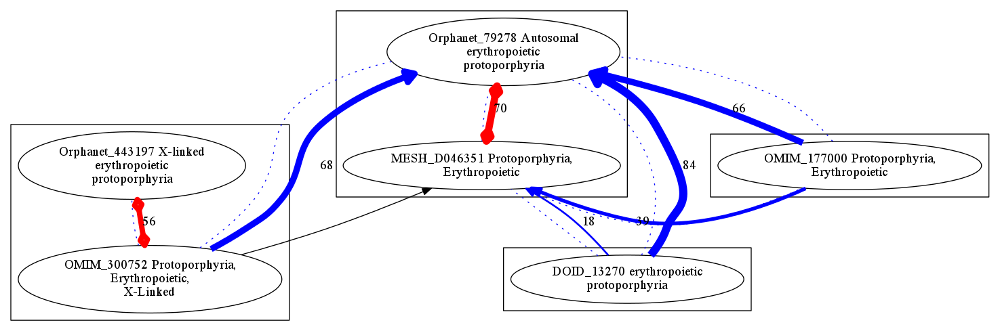

## Thiamine-responsive encephalopathy -> Biotin-responsive basal ganglia disease

 * [Thiamine-responsive encephalopathy](http://purl.obolibrary.org/obo/Orphanet_199348) __SubClassOf__ [Biotin-responsive basal ganglia disease](http://purl.obolibrary.org/obo/Orphanet_65284)

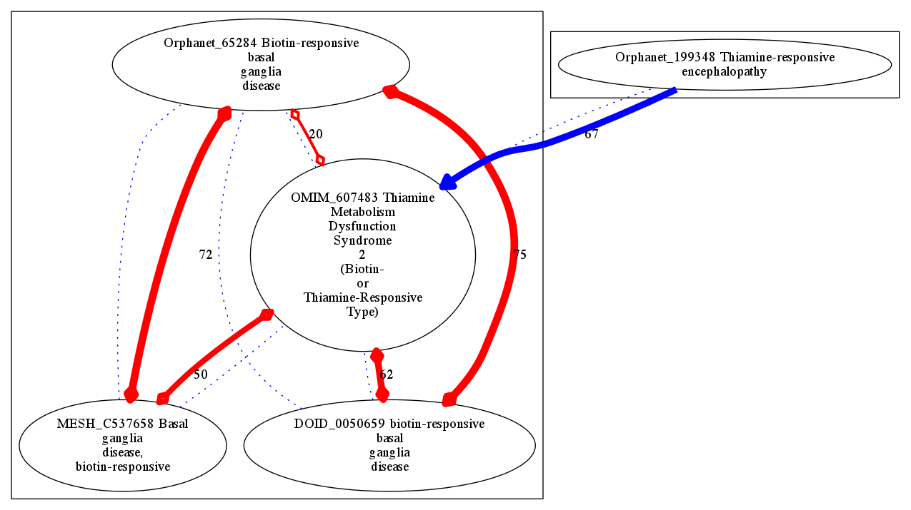

## Meige disease -> Meigs syndrome

 * [Meige disease](http://purl.obolibrary.org/obo/Orphanet_90186) __SubClassOf__ [Meigs syndrome](http://purl.obolibrary.org/obo/Orphanet_314451)

## Meige disease -> Milroy disease

 * [Meige disease](http://purl.obolibrary.org/obo/Orphanet_90186) __SubClassOf__ [Milroy disease](http://purl.obolibrary.org/obo/Orphanet_79452)

## Skin vascular disease -> Genetic skin vascular disorder

 * [Skin vascular disease](http://purl.obolibrary.org/obo/Orphanet_79379) __SubClassOf__ [Genetic skin vascular disorder](http://purl.obolibrary.org/obo/Orphanet_183478)

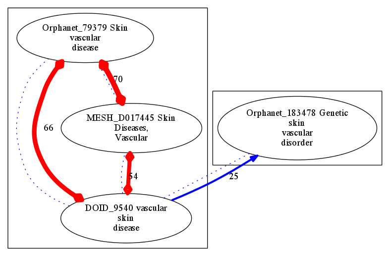

## DEND syndrome -> Permanent neonatal diabetes mellitus

 * [DEND syndrome](http://purl.obolibrary.org/obo/Orphanet_79134) __SubClassOf__ [Permanent neonatal diabetes mellitus](http://purl.obolibrary.org/obo/Orphanet_99885)

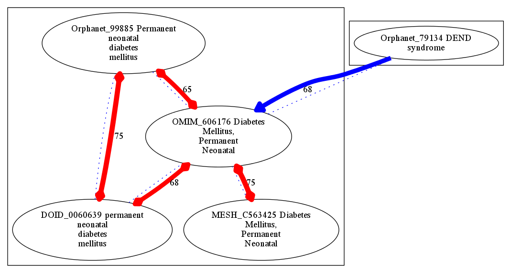

## Interstitial lung disease due to SP-C deficiency -> Hereditary pulmonary alveolar proteinosis

 * [Interstitial lung disease due to SP-C deficiency](http://purl.obolibrary.org/obo/Orphanet_440392) __SubClassOf__ [Hereditary pulmonary alveolar proteinosis](http://purl.obolibrary.org/obo/Orphanet_264675)

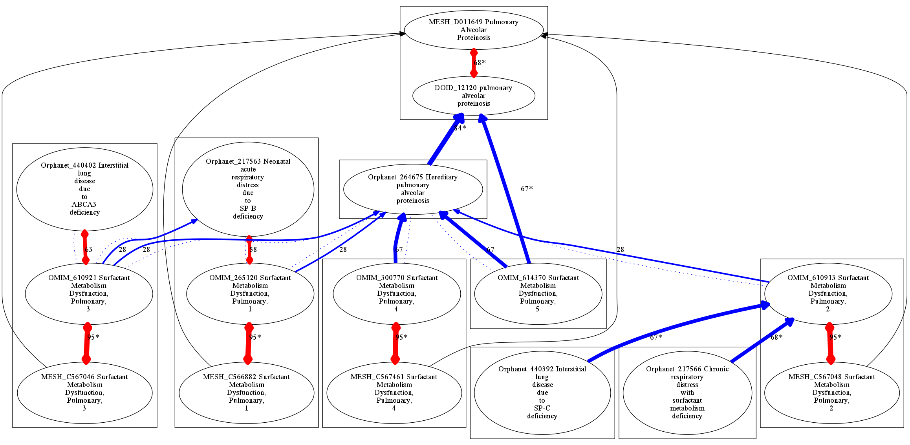

## Chronic respiratory distress with surfactant metabolism deficiency -> Hereditary pulmonary alveolar proteinosis

 * [Chronic respiratory distress with surfactant metabolism deficiency](http://purl.obolibrary.org/obo/Orphanet_217566) __SubClassOf__ [Hereditary pulmonary alveolar proteinosis](http://purl.obolibrary.org/obo/Orphanet_264675)

## Interstitial lung disease due to ABCA3 deficiency -> Hereditary pulmonary alveolar proteinosis

 * [Interstitial lung disease due to ABCA3 deficiency](http://purl.obolibrary.org/obo/Orphanet_440402) __SubClassOf__ [Hereditary pulmonary alveolar proteinosis](http://purl.obolibrary.org/obo/Orphanet_264675)

## Interstitial lung disease due to ABCA3 deficiency -> Neonatal acute respiratory distress due to SP-B deficiency

 * [Interstitial lung disease due to ABCA3 deficiency](http://purl.obolibrary.org/obo/Orphanet_440402) __SubClassOf__ [Neonatal acute respiratory distress due to SP-B deficiency](http://purl.obolibrary.org/obo/Orphanet_217563)

## Neonatal acute respiratory distress due to SP-B deficiency -> Hereditary pulmonary alveolar proteinosis

 * [Neonatal acute respiratory distress due to SP-B deficiency](http://purl.obolibrary.org/obo/Orphanet_217563) __SubClassOf__ [Hereditary pulmonary alveolar proteinosis](http://purl.obolibrary.org/obo/Orphanet_264675)

## Retinitis punctata albescens -> Fundus albipunctatus

 * [Retinitis punctata albescens](http://purl.obolibrary.org/obo/Orphanet_52427) __SubClassOf__ [Fundus albipunctatus](http://purl.obolibrary.org/obo/Orphanet_227796)

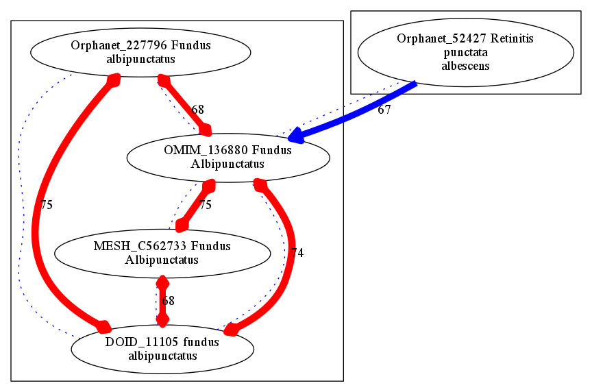

## Junctional epidermolysis bullosa inversa -> Junctional epidermolysis bullosa, non-Herlitz type

 * [Junctional epidermolysis bullosa inversa](http://purl.obolibrary.org/obo/Orphanet_79405) __SubClassOf__ [Junctional epidermolysis bullosa, non-Herlitz type](http://purl.obolibrary.org/obo/Orphanet_89840)

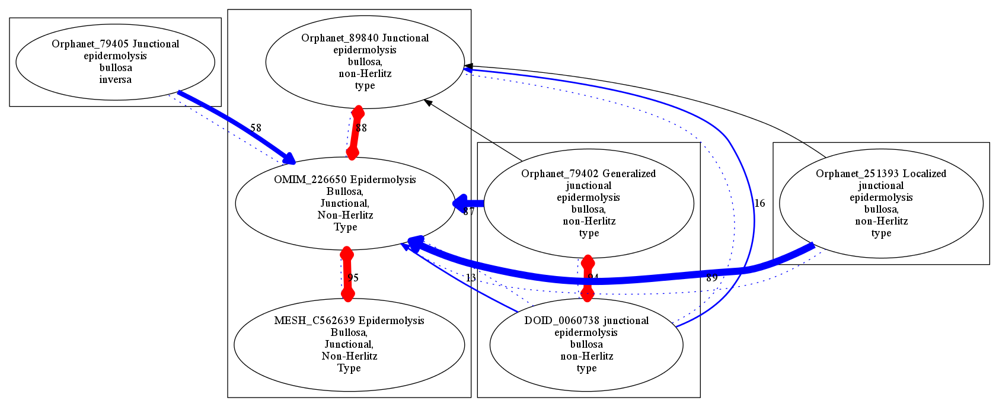

## CREST syndrome -> Limited systemic sclerosis

 * [CREST syndrome](http://purl.obolibrary.org/obo/Orphanet_90290) __SubClassOf__ [Limited systemic sclerosis](http://purl.obolibrary.org/obo/Orphanet_220407)

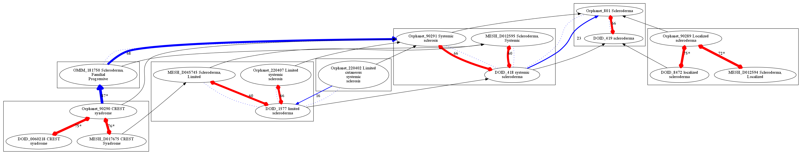

## Limited cutaneous systemic sclerosis -> Limited systemic sclerosis

 * [Limited cutaneous systemic sclerosis](http://purl.obolibrary.org/obo/Orphanet_220402) __SubClassOf__ [Limited systemic sclerosis](http://purl.obolibrary.org/obo/Orphanet_220407)

## Early-onset myopathy-areflexia-respiratory distress-dysphagia syndrome -> Spinal muscular atrophy with respiratory distress type 1

 * [Early-onset myopathy-areflexia-respiratory distress-dysphagia syndrome](http://purl.obolibrary.org/obo/Orphanet_439212) __SubClassOf__ [Spinal muscular atrophy with respiratory distress type 1](http://purl.obolibrary.org/obo/Orphanet_98920)

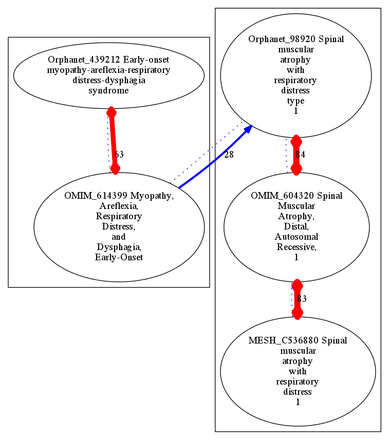

## Reticulate acropigmentation of Kitamura -> Dowling-Degos disease

 * [Reticulate acropigmentation of Kitamura](http://purl.obolibrary.org/obo/Orphanet_178307) __SubClassOf__ [Dowling-Degos disease](http://purl.obolibrary.org/obo/Orphanet_79145)

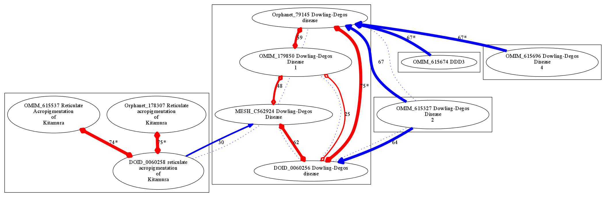

## Bosley-Salih-Alorainy syndrome -> Athabaskan brainstem dysgenesis syndrome

 * [Bosley-Salih-Alorainy syndrome](http://purl.obolibrary.org/obo/Orphanet_69737) __SubClassOf__ [Athabaskan brainstem dysgenesis syndrome](http://purl.obolibrary.org/obo/Orphanet_69739)

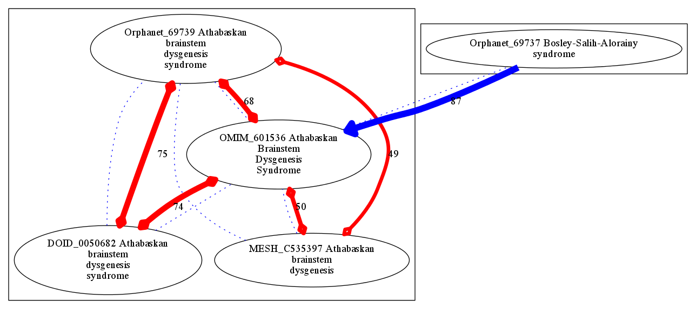

## 19p13.3 microduplication syndrome -> 19p13.13 microdeletion syndrome

 * [19p13.3 microduplication syndrome](http://purl.obolibrary.org/obo/Orphanet_447980) __SubClassOf__ [19p13.13 microdeletion syndrome](http://purl.obolibrary.org/obo/Orphanet_357001)

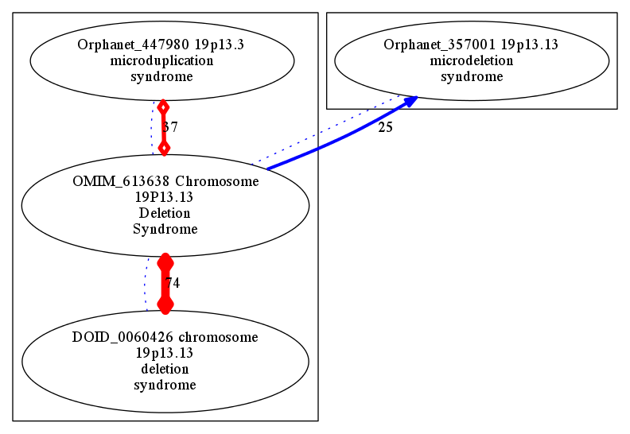

## Gangliocytoma -> Ganglioneuroma

 * [Gangliocytoma](http://purl.obolibrary.org/obo/Orphanet_251937) __SubClassOf__ [Ganglioneuroma](http://purl.obolibrary.org/obo/Orphanet_251992)

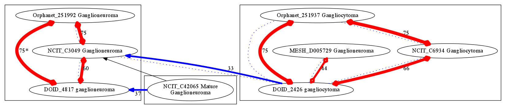

## Hepatoerythropoietic porphyria -> Porphyria cutanea tarda

 * [Hepatoerythropoietic porphyria](http://purl.obolibrary.org/obo/Orphanet_95159) __SubClassOf__ [Porphyria cutanea tarda](http://purl.obolibrary.org/obo/Orphanet_101330)

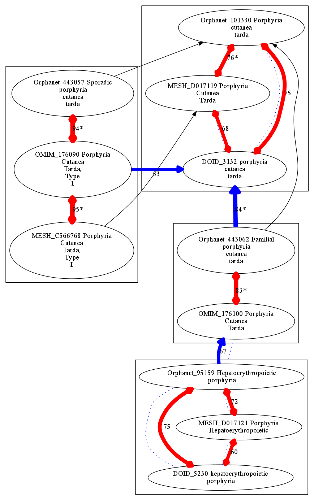

## Hepatoerythropoietic porphyria -> Familial porphyria cutanea tarda

 * [Hepatoerythropoietic porphyria](http://purl.obolibrary.org/obo/Orphanet_95159) __SubClassOf__ [Familial porphyria cutanea tarda](http://purl.obolibrary.org/obo/Orphanet_443062)

## Premature chromosome condensation with microcephaly and intellectual disability -> Autosomal recessive primary microcephaly

 * [Premature chromosome condensation with microcephaly and intellectual disability](http://purl.obolibrary.org/obo/Orphanet_52183) __SubClassOf__ [Autosomal recessive primary microcephaly](http://purl.obolibrary.org/obo/Orphanet_2512)

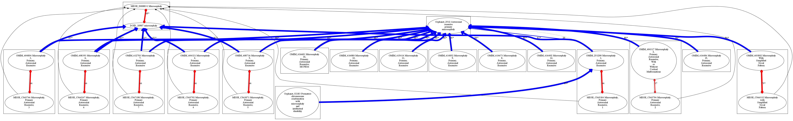

## Spinocerebellar ataxia with epilepsy -> Sensory ataxic neuropathy-dysarthria-ophthalmoparesis syndrome

 * [Spinocerebellar ataxia with epilepsy](http://purl.obolibrary.org/obo/Orphanet_254881) __SubClassOf__ [Sensory ataxic neuropathy-dysarthria-ophthalmoparesis syndrome](http://purl.obolibrary.org/obo/Orphanet_70595)

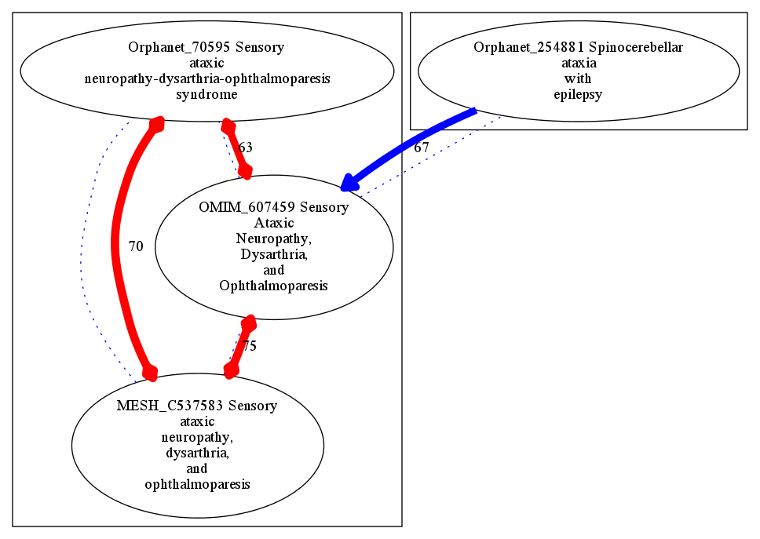

## Deficiency in anterior pituitary function-variable immunodeficiency syndrome -> Common variable immunodeficiency

 * [Deficiency in anterior pituitary function-variable immunodeficiency syndrome](http://purl.obolibrary.org/obo/Orphanet_293978) __SubClassOf__ [Common variable immunodeficiency](http://purl.obolibrary.org/obo/Orphanet_1572)

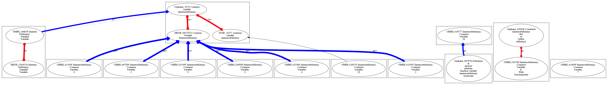

## Combined immunodeficiency due to LRBA deficiency -> Common variable immunodeficiency

 * [Combined immunodeficiency due to LRBA deficiency](http://purl.obolibrary.org/obo/Orphanet_445018) __SubClassOf__ [Common variable immunodeficiency](http://purl.obolibrary.org/obo/Orphanet_1572)

## Aromatase excess syndrome -> Aromatase deficiency

 * [Aromatase excess syndrome](http://purl.obolibrary.org/obo/Orphanet_178345) __SubClassOf__ [Aromatase deficiency](http://purl.obolibrary.org/obo/Orphanet_91)

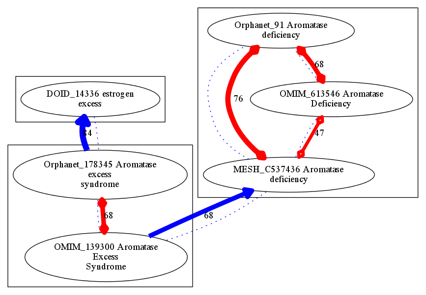

## Protein S acquired deficiency -> Hereditary thrombophilia due to congenital protein S deficiency

 * [Protein S acquired deficiency](http://purl.obolibrary.org/obo/Orphanet_26349) __SubClassOf__ [Hereditary thrombophilia due to congenital protein S deficiency](http://purl.obolibrary.org/obo/Orphanet_743)

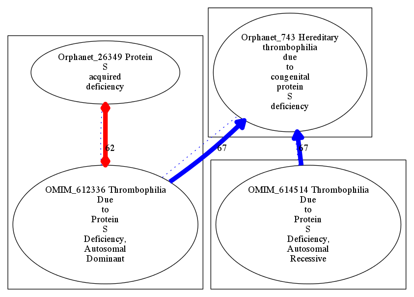

## 46,XX testicular disorder of sex development -> 46,XX gonadal dysgenesis

 * [46,XX testicular disorder of sex development](http://purl.obolibrary.org/obo/Orphanet_393) __SubClassOf__ [46,XX gonadal dysgenesis](http://purl.obolibrary.org/obo/Orphanet_243)

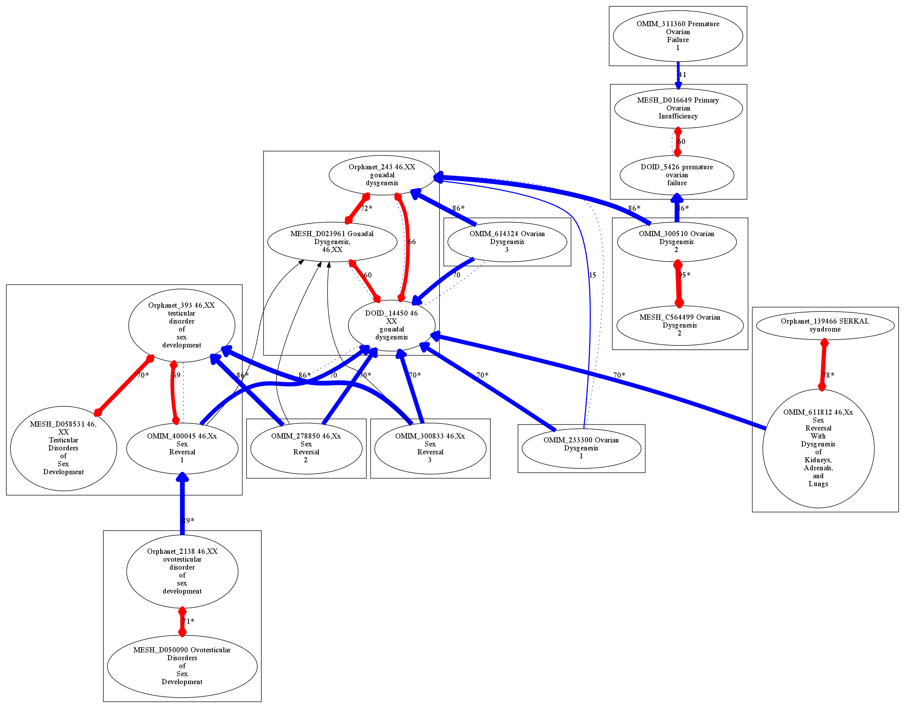

## SERKAL syndrome -> 46,XX gonadal dysgenesis

 * [SERKAL syndrome](http://purl.obolibrary.org/obo/Orphanet_139466) __SubClassOf__ [46,XX gonadal dysgenesis](http://purl.obolibrary.org/obo/Orphanet_243)

## 46,XX ovotesticular disorder of sex development -> 46,XX testicular disorder of sex development

 * [46,XX ovotesticular disorder of sex development](http://purl.obolibrary.org/obo/Orphanet_2138) __SubClassOf__ [46,XX testicular disorder of sex development](http://purl.obolibrary.org/obo/Orphanet_393)

## Parkes Weber syndrome -> Sturge-Weber syndrome

 * [Parkes Weber syndrome](http://purl.obolibrary.org/obo/Orphanet_90307) __SubClassOf__ [Sturge-Weber syndrome](http://purl.obolibrary.org/obo/Orphanet_3205)

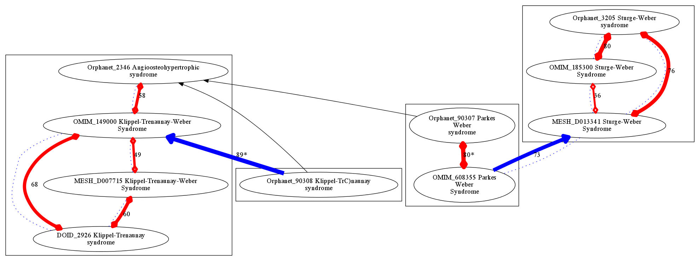

## Retinopathy of prematurity -> Familial exudative vitreoretinopathy

 * [Retinopathy of prematurity](http://purl.obolibrary.org/obo/Orphanet_90050) __SubClassOf__ [Familial exudative vitreoretinopathy](http://purl.obolibrary.org/obo/Orphanet_891)

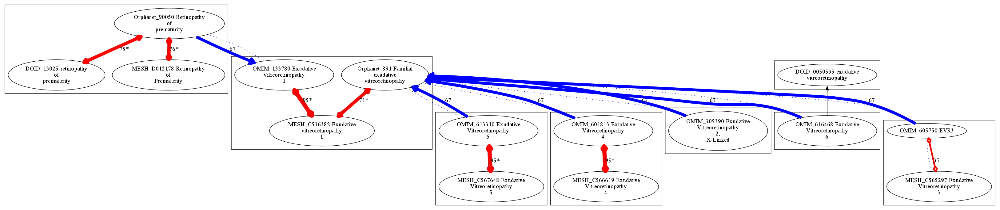

## Oculootodental syndrome -> Otodental syndrome

 * [Oculootodental syndrome](http://purl.obolibrary.org/obo/Orphanet_99806) __SubClassOf__ [Otodental syndrome](http://purl.obolibrary.org/obo/Orphanet_2791)

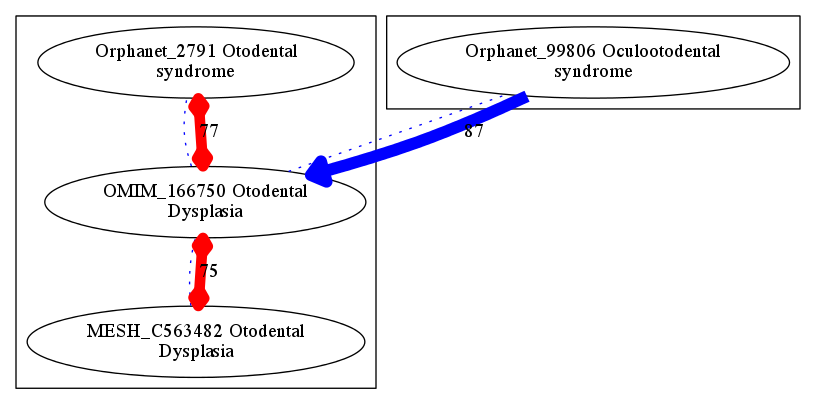

## Oligoastrocytoma -> Ependymal tumor

 * [Oligoastrocytoma](http://purl.obolibrary.org/obo/Orphanet_251656) __SubClassOf__ [Ependymal tumor](http://purl.obolibrary.org/obo/Orphanet_301)

## Oligoastrocytoma -> Astrocytoma

 * [Oligoastrocytoma](http://purl.obolibrary.org/obo/Orphanet_251656) __SubClassOf__ [Astrocytoma](http://purl.obolibrary.org/obo/Orphanet_94)

## Oligoastrocytoma -> Oligodendroglial tumor

 * [Oligoastrocytoma](http://purl.obolibrary.org/obo/Orphanet_251656) __SubClassOf__ [Oligodendroglial tumor](http://purl.obolibrary.org/obo/Orphanet_46484)

## Oligoastrocytoma -> Oligodendroglioma

 * [Oligoastrocytoma](http://purl.obolibrary.org/obo/Orphanet_251656) __SubClassOf__ [Oligodendroglioma](http://purl.obolibrary.org/obo/Orphanet_251627)

## McCune-Albright syndrome -> Polyostotic fibrous dysplasia

 * [McCune-Albright syndrome](http://purl.obolibrary.org/obo/Orphanet_562) __SubClassOf__ [Polyostotic fibrous dysplasia](http://purl.obolibrary.org/obo/Orphanet_93276)

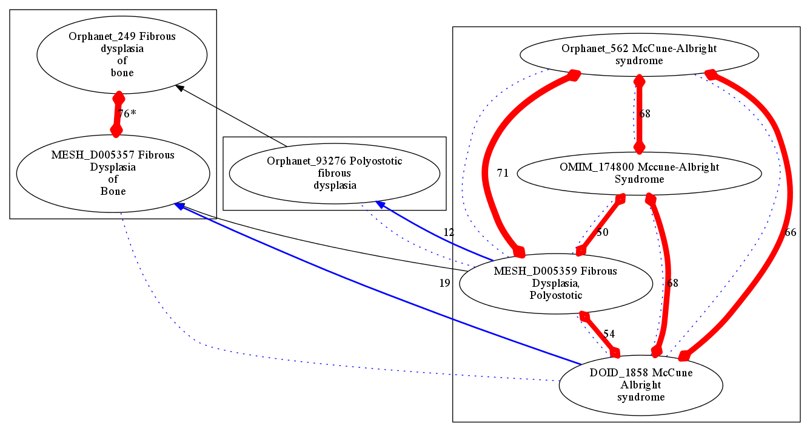

## McCune-Albright syndrome -> Fibrous dysplasia of bone

 * [McCune-Albright syndrome](http://purl.obolibrary.org/obo/Orphanet_562) __SubClassOf__ [Fibrous dysplasia of bone](http://purl.obolibrary.org/obo/Orphanet_249)

## 2p21 microdeletion syndrome -> Hypotonia-cystinuria syndrome

 * [2p21 microdeletion syndrome](http://purl.obolibrary.org/obo/Orphanet_163693) __SubClassOf__ [Hypotonia-cystinuria syndrome](http://purl.obolibrary.org/obo/Orphanet_163690)

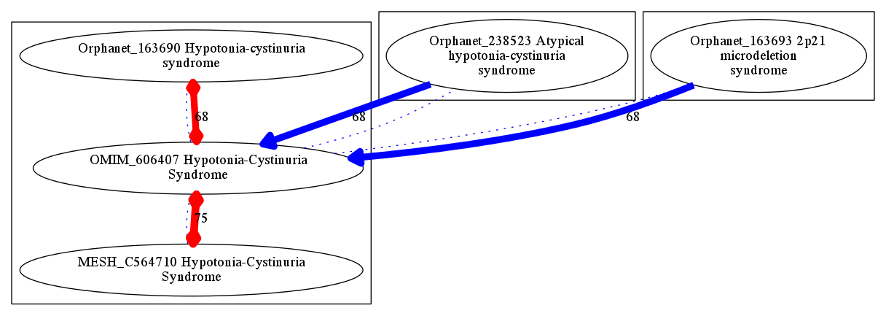

## Atypical hypotonia-cystinuria syndrome -> Hypotonia-cystinuria syndrome

 * [Atypical hypotonia-cystinuria syndrome](http://purl.obolibrary.org/obo/Orphanet_238523) __SubClassOf__ [Hypotonia-cystinuria syndrome](http://purl.obolibrary.org/obo/Orphanet_163690)

## Adult-onset autosomal dominant leukodystrophy -> Pelizaeus-Merzbacher disease

 * [Adult-onset autosomal dominant leukodystrophy](http://purl.obolibrary.org/obo/Orphanet_99027) __SubClassOf__ [Pelizaeus-Merzbacher disease](http://purl.obolibrary.org/obo/Orphanet_702)

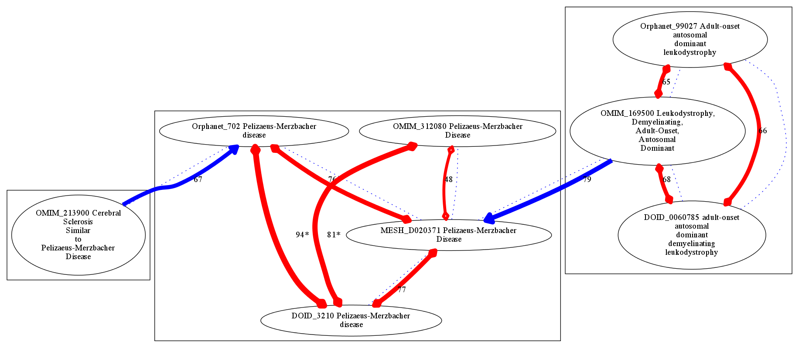

